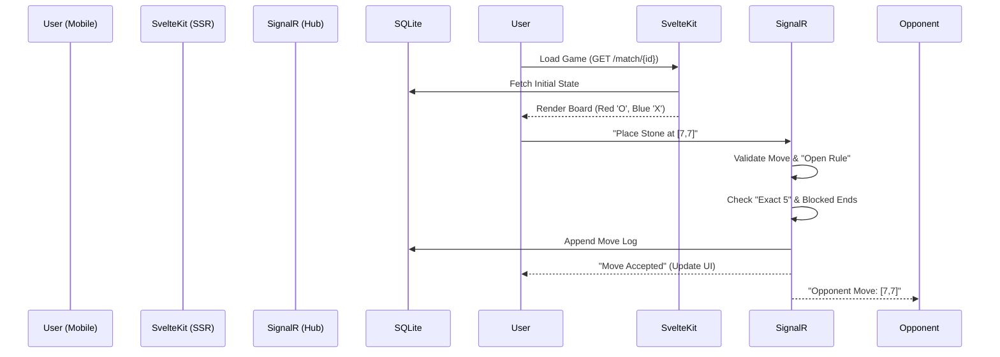

# Project Design Doc: Caro 15x15 (Mobile-First)

## 1. Project Overview
A real-time, mobile-first web implementation of "Caro" (Gomoku variant).
*   **Release Target:** Late 2025 (Post .NET 10 launch).
*   **Architecture:** Clean separation between a high-performance SSR frontend and a real-time event-driven backend.

## 2. Tech Stack (2025 Standards)
*   **Frontend:** SvelteKit (TypeScript) + Skeleton UI.
    *   *Rendering:* SSR enabled for initial load, then client-side hydration for game interactivity.
    *   *State:* Svelte 5 "Runes" for local reactivity (assuming Svelte 5+ is standard by late 2025).
*   **Backend:** ASP.NET Core 10 Web API.
    *   *Language:* C# 14 / .NET 10 (LTS).
    *   *Real-time:* **SignalR** (Hubs) for move synchronization and latency compensation.
    *   *Database:* **SQLite** with Entity Framework Core 10.
    *   *Performance:* NativeAOT compilation enabled for faster server cold starts (standard in .NET 10).

## 3. Game Rules (Caro Variation)
*   **Board:** 15x15 Grid.
*   **Players:**
    *   Player 1 (Red 'O') vs Player 2 (Blue 'X').
    *   **Initiative:** Loser of prev match > Lower ELO > Random.
*   **Visual Logic:**
    *   **The "Open Rule":** The second 'O' (Move #3 overall) cannot be placed in the 3x3 zone surrounding the center 'O'. *UI must highlight this restricted zone during that specific turn.*
*   **Winning:** Exact 5 in a row.
    *   Overlines (6+) = No win.
    *   Blocked ends = No win (If `X O O O O O X`, Red does not win).
*   **Time:** 7 minutes + 5 seconds increment (Fisher Control).

## 4. Mobile-First UX Strategy
*   **Interaction:**
    *   **Offset Ghost Stone:** When dragging a finger, the stone renders ~50px *above* the touch point so the user sees the intersection.
    *   **Zoom/Pan:** Pinch-to-zoom support for the 15x15 grid on small screens.
    *   **Confirm Mode:** Optional toggle to "Tap to Select -> Tap checkmark to Confirm" (prevents misclicks in ranked play).
*   **Haptic Feedback:** Tiny vibration on valid stone drop (using Web Vibration API).

## 5. Core Systems Implementation

### A. Real-Time Logic (SignalR Hub)
Instead of simple REST, we use a WebSocket Hub (`GameHub.cs`).
*   **Server Authority:** The server holds the "True Clock".
*   **Latency Compensation:**
    1.  Client sends move with local timestamp `T_client`.
    2.  Server receives at `T_now`.
    3.  Server validates `(T_now - T_client)` is within acceptable lag threshold (e.g., <500ms).
    4.  Broadcasts `MoveAccepted` event to all clients.

### B. ELO System (Service Layer)
Formula: Standard Rating Updates.
```csharp
// Simple C# 14 Concept
public void UpdateRatings(Player p1, Player p2, GameResult result) {
    int kFactor = 30; // High volatility for faster settling
    // ...standard implementation
}
```

### C. Database Schema (SQLite)
Minimalist schema designed for fast queries.
*   **Matches Reference:** `Id`, `RedPlayerId`, `BluePlayerId`, `WinnerId`, `MovesHistory` (Stored as BLOB/JSON for replay efficiency).
*   **ActiveSessions:** `SessionId` (Guid), `BoardState` (Bitmask or 2D massive array), `LastMoveTime`.

## 6. Architecture & Data Flow



## 7. Next Steps
*  **First Task:** Build the `Board.svelte` component with the "Offset Ghost Stone" logic to prove mobile usability immediately.
