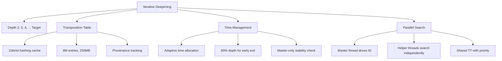
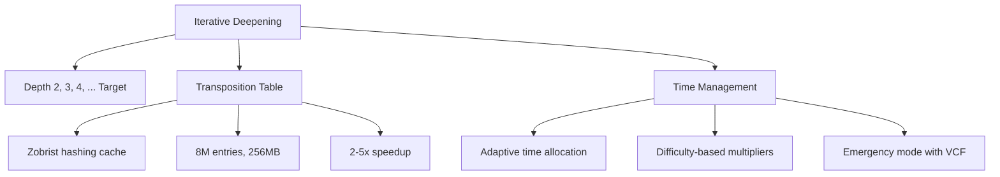
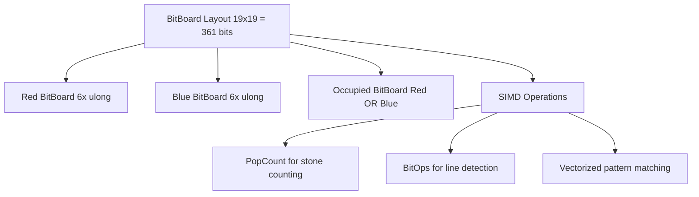
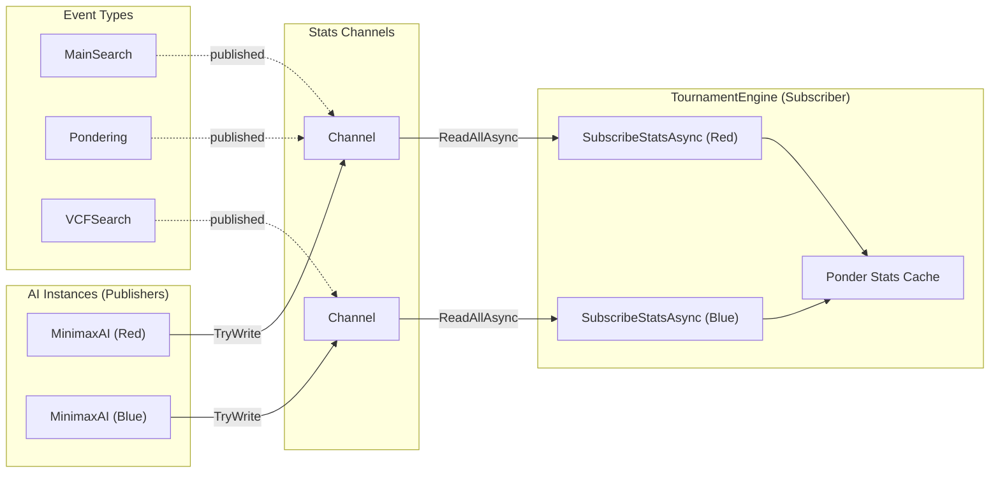
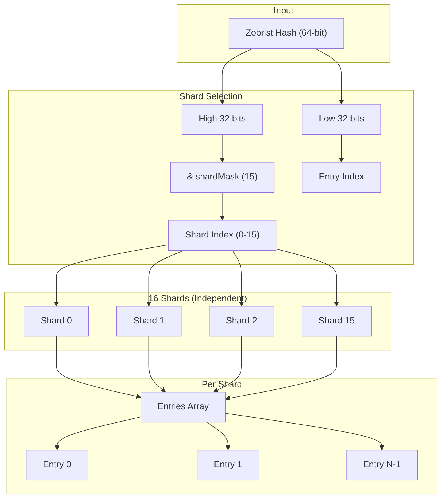
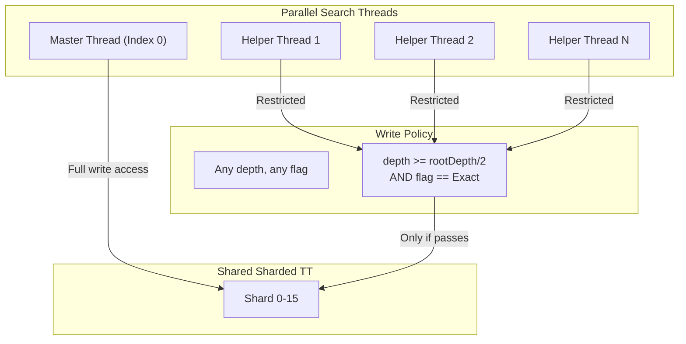
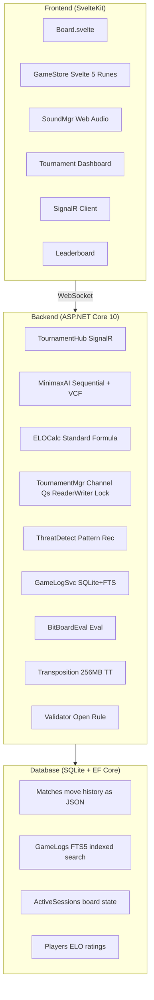
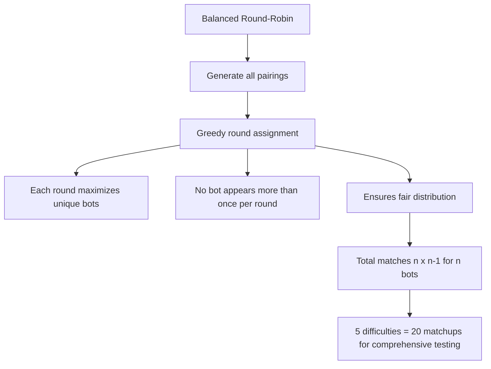

# Caro AI PvP - Tournament-Strength Caro with Modern Web Stack

[Table of Contents](#table-of-contents)

A mobile-first real-time implementation of Caro (Gomoku variant) with grandmaster-level AI powered by 15+ advanced search optimizations.

Built with .NET 10 and SvelteKit 5, representing cutting-edge 2025 web development standards.

---

## Table of Contents

1. [Overview](#overview)
2. [Features](#features)
3. [AI Engine Deep Dive](#ai-engine-deep-dive)
4. [Concurrency Optimizations](#concurrency-optimizations)
5. [Architecture](#architecture)
6. [Tech Stack](#tech-stack)
7. [Testing](#testing)
8. [Getting Started](#getting-started)
9. [Tournament Mode](#tournament-mode)
10. [Game Rules](#game-rules)
11. [Project Structure](#project-structure)
12. [Roadmap](#roadmap)
13. [Achievements](#achievements)
14. [License](#license)

[Back to Table of Contents](#table-of-contents)

---

## Overview

Caro is a sophisticated 19x19 board game implementation featuring:

- Grandmaster-level AI with Lazy SMP parallel search (depth 11 capable in 7+5 time control)
- Real-time multiplayer with WebSocket support (SignalR)
- AI tournament mode with balanced scheduling and ELO tracking
- Mobile-first UX with ghost stone positioning and haptic feedback
- Comprehensive testing with 280+ automated tests including integration tests with snapshot verification
- Production-ready concurrency with .NET 10 best practices and adversarial testing

[Back to Table of Contents](#table-of-contents)

---

## Features

### Grandmaster-Level AI Engine

Our AI employs state-of-the-art algorithms from computer chess, achieving 100-500x performance improvement over naive minimax.

Core Search Optimizations:

- Principal Variation Search (PVS) - Null window searches for non-PV moves (20-40% speedup)
- Late Move Reduction (LMR) - Reduce late moves, re-search if promising (30-50% speedup)
- Quiescence Search - Extend search in tactical positions to prevent blunders
- Enhanced Move Ordering - Tactical pattern detection (15-25% speedup)
- Transposition Table - 256MB Zobrist hashing cache (~8M entries, 2-5x speedup)
- History Heuristic - Track moves causing cutoffs across all depths (10-20% speedup)
- Aspiration Windows - Narrow search windows around estimated score (10-30% speedup)

Advanced Features:

- Lazy SMP Parallel Search - Multi-threaded search for Hard/Grandmaster (Line 589: ParallelMinimaxSearch.cs)
- VCF Solver (Grandmaster only) - Victory by Continuous Four tactical solver
- Threat Space Search - Focus search on critical threats only
- BitBoard Representation - Board evaluation with bit manipulation (6x ulong for 19x19)
- Adaptive Time Management - Smart time allocation per move (80% depth requirement before early termination)
- Pondering - Think on opponent's time (Medium and above)
- Critical Defense - Automatic threat detection (scales with difficulty)

Difficulty Levels (D1-D5):

- D1 Braindead: Depth 1-2 with 20% error rate. Suitable for complete beginners.
- D2 Easy: Depth 3-4 with basic lookahead. No advanced optimizations.
- D3 Medium: Depth 5-6. Sequential search with pondering enabled.
- D4 Hard: Depth 7-8. Lazy SMP parallel search with (N/2)-1 threads, pondering enabled.
- D5 Grandmaster: Adaptive depth 9-11. Lazy SMP with maximum threads, VCF solver, pondering enabled.

Parallel Search Architecture:

Hard and Grandmaster use Lazy SMP (Lazy Split-Point Multi-Processing) for parallel search:
- Master thread (ThreadIndex=0) drives iterative deepening
- Helper threads search independently and share transposition table
- TT provenance tracking: master entries protected from helper overwrites
- Early termination requires 80% of target depth (master thread only)

### Tournament Mode

- 22 AI bots competing in balanced round-robin format
- ELO tracking with standard rating calculation
- Fair scheduling - each bot plays at most once per round
- Live standings with win rates and rating changes
- SQLite logging with FTS5 full-text search for game analysis
- SignalR broadcasts via Channel-based async queues (no fire-and-forget)

### Game Features

Core Gameplay:

- 19x19 board (361 intersections) with exact 5-in-row winning condition
- Open Rule enforcement (Red's second move must be at least 3 intersections away from first move)
- Blocked ends detection (6+ or both ends blocked don't count as win)
- Chess clock with Fisher control (7min + 5sec increment)

Polish Features:

- Sound Effects - Synthesized audio (no external files) with mute toggle
- Move History - Scrollable chronological move display
- Winning Line Animation - SVG stroke animation with color coding
- Undo Functionality - Revert moves with time restoration
- ELO/Ranking System - Standard ELO calculation with leaderboard

[Back to Table of Contents](#table-of-contents)

---

## AI Engine Deep Dive

### Search Architecture

Sequential (Braindead, Easy, Medium) and Lazy SMP Parallel (Hard, Grandmaster):





### BitBoard Representation



### Threat Detection

Threat Classification:

- Threat Level 5: Five in row (WIN)
- Threat Level 4: Open Four (unstoppable)
- Threat Level 3: Closed Four / Open Three
- Threat Level 2: Closed Three / Open Two
- Threat Level 1: Closed Two / Open One

Threat Space Search:

- Only search threat moves
- Prune non-threat candidates
- 10-100x reduction in search space

### Performance Metrics

| Difficulty | Search Type | Threads | Avg Time | Positions/S | TT Hit Rate | Max Depth (7+5) | VCF Access |
|------------|-------------|---------|----------|-------------|-------------|-----------------|------------|
| D1 Braindead | Sequential | 1 | <50ms | ~10K | N/A | 1-2 | No |
| D2 Easy | Sequential | 1 | <200ms | ~50K | 15% | 3-4 | No |
| D3 Medium | Sequential | 1 | <1s | ~100K | 30% | 5-6 | No |
| D4 Hard | Lazy SMP | 3 | <3s | ~500K | 45% | 7-8 | No |
| D5 Grandmaster | Lazy SMP | (N/2)-1 | <10s | ~1M | 55%+ | 9-11 | Yes |

Note: Max depths shown are for 7+5 (7min+5sec) time control. Parallel search uses thread pool with (N/2)-1 helper threads where N is logical CPU count. VCF is exclusive to Grandmaster (D5).

Combined Optimization Impact: 100-500x faster than naive minimax.

[Back to Table of Contents](#table-of-contents)

---

## Concurrency Optimizations

### Overview

The codebase has been hardened with production-grade concurrency improvements following .NET 10 / C# 13 best practices. All concurrency decisions are validated by adversarial tests designed to surface race conditions, deadlocks, and data corruption under high contention.

### Key Improvements

#### 1. AsyncQueue Utility (System.Threading.Channels)

File: `backend/src/Caro.Core/Concurrency/AsyncQueue.cs`

Replaced all fire-and-forget `Task.Run` patterns with Channel-based async queues:

```csharp
// Channel-based queue for fire-and-forget operations
public sealed class AsyncQueue<T> : IDisposable where T : notnull
{
    private readonly Channel<T> _channel;
    private readonly Func<T, ValueTask> _processAsync;

    // Bounded capacity provides backpressure
    // DropOldest mode prevents unbounded growth
    public AsyncQueue(Func<T, ValueTask> processAsync, int capacity = 100,
                     string queueName = "AsyncQueue", bool dropOldest = true)
    {
        _channel = Channel.CreateBounded<T>(new BoundedChannelOptions(capacity)
        {
            FullMode = dropOldest ? BoundedChannelFullMode.DropOldest
                                   : BoundedChannelFullMode.Wait
        });
    }
}
```

Benefits:

- No unobserved task exceptions
- Built-in backpressure via bounded channels
- Graceful shutdown support
- Exception handling with continuation

#### 2. TournamentManager (Channel-Based Broadcasts)

File: `backend/src/Caro.Api/TournamentManager.cs`

Before:

```csharp
// Fire-and-forget - unobserved exceptions!
Task.Run(async () =>
{
    await _hub.Clients.All.MoveMadeAsync(move);
});
```

After:

```csharp
// Channel-based broadcast queue
private readonly AsyncQueue<MoveBroadcast> _moveQueue;

// Constructor
_moveQueue = new AsyncQueue<MoveBroadcast>(
    ProcessMoveBroadcastAsync,
    capacity: 100,
    queueName: "MoveBroadcast",
    dropOldest: true
);

// Enqueue without blocking
_moveQueue.TryEnqueue(new MoveBroadcast { ... });
```

Additional Improvements:

- ReaderWriterLockSlim for GetState() - allows multiple concurrent readers
- Interlocked.CompareExchange for atomic status transitions
- No nested locks (prevents deadlock)

#### 3. Program.cs (ConcurrentDictionary + Per-Game Locks)

File: `backend/src/Caro.Api/Program.cs`

Before:

```csharp
// Single global lock blocks ALL game requests
var games = new Dictionary<string, GameState>();
var gamesLock = new object();

lock (gamesLock)
{
    // AI calculation here blocks everything for seconds
    var (x, y) = ai.GetBestMove(game.Board, ...);
}
```

After:

```csharp
// ConcurrentDictionary allows concurrent game access
var games = new ConcurrentDictionary<string, GameSession>();

// Per-game locks - games don't block each other
public sealed class GameSession
{
    private readonly object _lock = new();

    // Extract data for AI calculation OUTSIDE lock
    public (Board BoardClone, Player CurrentPlayer, bool IsGameOver) ExtractForAI()
    {
        lock (_lock)
        {
            return (_game.Board.Clone(), _game.CurrentPlayer, _game.IsGameOver);
        }
    }
}

// AI calculation happens on cloned board, doesn't block other games
var (boardClone, currentPlayer, isGameOver) = session.ExtractForAI();
var (x, y) = ai.GetBestMove(boardClone, currentPlayer, difficulty);
```

Benefits:

- 100+ concurrent games can proceed independently
- AI calculation (which takes seconds) doesn't block other requests
- No global lock bottleneck

#### 4. ParallelMinimaxSearch (CancellationTokenSource)

File: `backend/src/Caro.Core/GameLogic/ParallelMinimaxSearch.cs`

Before:

```csharp
// Volatile flag insufficient for cross-thread coordination
private volatile bool _searchShouldStop;

// Check-then-act pattern has race condition
if (_searchShouldStop) break;
```

After:

```csharp
// CancellationTokenSource for proper cancellation
private CancellationTokenSource? _searchCts;

// Pass token to all tasks
var token = _searchCts.Token;
Task.Run(() => SearchWithIteration(..., token), token);

// Graceful exception handling
try
{
    Task.WaitAll(tasks.ToArray());
}
catch (AggregateException ae)
{
    // Filter expected TaskCanceledException
    var unexpected = ae.InnerExceptions.Where(e => e is not TaskCanceledException);
    if (unexpected.Any()) throw;
}
```

Benefits:

- Coordinated cancellation across all threads
- No race conditions in stop signal
- Proper exception propagation

#### 5. Ponderer (Lock-Only Synchronization)

File: `backend/src/Caro.Core/GameLogic/Pondering/Ponderer.cs`

Before:

```csharp
// Mixed volatile/lock - race condition!
private volatile PonderState _state;
private readonly object _stateLock = new();

public PonderState State => _state;  // Volatile read without lock
```

After:

```csharp
// Lock-only access - no mixed synchronization
private PonderState _state;
private readonly object _stateLock = new();

public PonderState State
{
    get
    {
        lock (_stateLock) { return _state; }
    }
}
```

Benefits:

- No race between volatile read and lock-protected data
- Consistent state visibility across threads
- Proper memory semantics

#### 6. Stats Publisher-Subscriber Pattern

File: `backend/src/Caro.Core/Tournament/StatsChannel.cs`

Replaced callback-based stats reporting with typed Channel-based pub-sub:

```csharp
// Publisher interface
public interface IStatsPublisher
{
    Channel<MoveStatsEvent> StatsChannel { get; }
    string PublisherId { get; }
}

// Event with comprehensive metrics
public class MoveStatsEvent
{
    public required string PublisherId { get; init; }
    public required Player Player { get; init; }
    public required StatsType Type { get; init; }  // MainSearch, Pondering, VCFSearch
    public int DepthAchieved { get; init; }
    public long NodesSearched { get; init; }
    public double NodesPerSecond { get; init; }
    // ... full statistics
}

// MinimaxAI implements IStatsPublisher
public class MinimaxAI : IStatsPublisher
{
    private readonly Channel<MoveStatsEvent> _statsChannel;

    public void PublishSearchStats(Player player, StatsType type, long moveTimeMs)
    {
        _statsChannel.Writer.TryWrite(new MoveStatsEvent { /* ... */ });
    }
}
```

Subscriber in TournamentEngine:

```csharp
// Subscribe to both AI channels
_redStatsTask = Task.Run(() => SubscribeStatsAsync(_redAI, _redAI.StatsChannel, Player.Red, _cts.Token));
_blueStatsTask = Task.Run(() => SubscribeStatsAsync(_blueAI, _blueAI.StatsChannel, Player.Blue, _cts.Token));

private async Task SubscribeStatsAsync(MinimaxAI ai, Channel<MoveStatsEvent> channel, Player player, CancellationToken token)
{
    await foreach (var statsEvent in channel.Reader.ReadAllAsync(token))
    {
        if (statsEvent.Type == StatsType.Pondering)
        {
            // Cache ponder stats for post-move reporting
            _ponderNodes[player] = statsEvent.NodesSearched;
            _ponderNps[player] = statsEvent.NodesPerSecond;
        }
    }
}
```

Benefits:

- Type-safe stats communication
- No callback hell or unobserved exceptions
- Separate tracking for MainSearch, Pondering, VCFSearch
- Ponder stats available immediately after opponent moves



#### 7. Transposition Table Sharding

File: `backend/src/Caro.Core/GameLogic/LockFreeTranspositionTable.cs`

Converted single array to 16 sharded segments:

```csharp
// Before: Single array causes cache line contention
private readonly TranspositionEntry?[] _table;

// After: 16 independent segments
private readonly TranspositionEntry?[][] _shards;
private readonly int _shardCount = 16;
private readonly int _shardMask = 15;
private readonly int _sizePerShard;

public LockFreeTranspositionTable(int sizeMB = 256, int shardCount = 16)
{
    _shards = new TranspositionEntry[shardCount][];
    for (int i = 0; i < shardCount; i++)
    {
        _shards[i] = new TranspositionEntry[_sizePerShard];
    }
}

private (int shardIndex, int entryIndex) GetShardAndIndex(ulong hash)
{
    // High bits for shard, low bits for index - good distribution
    int shardIndex = (int)(hash >> 32) & _shardMask;
    int entryIndex = (int)(hash % (ulong)_sizePerShard);
    return (shardIndex, entryIndex);
}
```

Helper Thread Write Policy (prevents TT pollution):

```csharp
public void Store(ulong hash, sbyte depth, short score, /* ... */, byte threadIndex, int rootDepth)
{
    // ... entry lookup logic ...

    // STRICT HELPER WRITE POLICY
    if (threadIndex > 0)
    {
        // Helper threads only store if:
        // 1. Depth is at least rootDepth/2 (not too shallow)
        // 2. Score is exact (not upper/lower bound which can be misleading)

        if (depth < (sbyte)(rootDepth / 2))
            return; // Skip shallow helper entries

        if (flag != EntryFlag.Exact)
            return; // Skip bound entries from helpers
    }

    // Store entry
    shard[entryIndex] = newEntry;
}
```

Benefits:

- 16x reduction in cache coherency traffic
- Helper threads can't pollute TT with shallow/misleading entries
- Master thread results protected from helper interference
- Better parallel search scaling





### Adversarial Testing

Test Files:

- ConcurrencyStressTests.cs - 100+ concurrent operations
- AdversarialConcurrencyTests.cs - CHESS-like delay injection
- DeadlockDetectionTests.cs - Timeout-based deadlock detection
- AsyncQueueTests.cs - Channel queue verification

Results:

- 32/32 concurrency tests passing
- Tests validate: no deadlocks, no data races, no data corruption

### Best Practices Applied

| Practice | Implementation |
|----------|----------------|
| Channel over Task.Run | AsyncQueue for fire-and-forget |
| Publisher-Subscriber | StatsChannel for AI telemetry |
| ReaderWriterLockSlim | GetState() allows concurrent readers |
| ConcurrentDictionary | Per-game locking for scalability |
| CancellationTokenSource | Coordinated search cancellation |
| Lock-only (no mixed) | Ponderer state consistency |
| Interlocked operations | Atomic status transitions |
| ConfigureAwait(false) | Avoid async deadlocks |
| Bounded channels | Backpressure for producer-consumer |
| Array sharding | TT segments reduce cache contention |
| Helper write policy | Stricter rules prevent TT pollution |

[Back to Table of Contents](#table-of-contents)

---

## Architecture

### System Design



[Back to Table of Contents](#table-of-contents)

---

## Tech Stack

### Frontend

- SvelteKit 5 with TypeScript
- Svelte 5 Runes ($state, $props, $derived) for modern reactivity
- Skeleton UI v4 for accessible component library
- TailwindCSS v4 for utility-first styling
- SignalR client for real-time communication
- Vitest v4 for unit testing

### Backend

- .NET 10 / C# 13 (LTS)
- ASP.NET Core 10 Web API
- SignalR for real-time WebSocket communication
- System.Threading.Channels for async queues
- ReaderWriterLockSlim for concurrent reads
- ConcurrentDictionary for thread-safe collections
- SQLite with FTS5 full-text search
- xUnit v3.1 for testing

### AI/ML

- Custom Minimax with alpha-beta pruning
- Zobrist hashing with transposition tables (256MB)
- BitBoard representation for efficient board operations
- VCF solver (Legend difficulty only)
- Threat space search and DFPN solver
- Opening book with pre-computed positions
- Adaptive time management with difficulty multipliers

[Back to Table of Contents](#table-of-contents)

---

## Testing

### Test Coverage Summary

| Category | Tests | Focus |
|----------|-------|-------|
| Backend Unit | 200+ | AI algorithms, board logic |
| Statistical Tests | 38 | LOS, Elo CI, binomial tests, SPRT |
| AI Strength Validation | 19 | 4-phase statistical validation |
| Concurrency | 32 | Race conditions, deadlocks, data corruption |
| Integration | 13 | Tournament with snapshots |
| Frontend Unit | 19+ | Components, stores |
| E2E Tests | 17+ | Full user flows |
| TOTAL | 330+ | Full coverage |

### Concurrency Tests

The adversarial concurrency tests validate thread-safety under high contention:

| Test Type | Description | Validates |
|-----------|-------------|-----------|
| Stress Tests | 100+ concurrent operations | No data loss, scalability |
| Adversarial | CHESS-like delay injection | Race conditions |
| Deadlock Detection | Timeout-based detection | No deadlocks |
| AsyncQueue | Channel queue verification | Producer-consumer |

### Integration Tests with Snapshots

Tests run real AI games and save JSON snapshots for regression detection:

```
Tournament/Snapshots/
├── RunSingleGame_BasicVsMedium_SavesSnapshot.json
├── RunThreeGames_EasyVsHard_LogsDepthStatistics.json
├── RunGame_VeryHardVsExpert_ParallelSearchReportsCorrectDepth.json
├── RunMiniTournament_FourBots_BalancedSchedule.json
└── RunGame_BeginnerVsBeginner_WithShortTimeControl.json
```

Each snapshot contains:

- Per-move statistics (depth, nodes, NPS)
- Game result metadata
- Raw logs for inspection

### Running Tests

```bash
# Backend
cd backend
dotnet test --verbosity quiet

# Concurrency tests only
dotnet test --filter "FullyQualifiedName~Concurrency"

# Integration tests only
dotnet test --filter "FullyQualifiedName~TournamentIntegration"

# Statistical analyzer tests (38 tests, fast)
dotnet test --filter "FullyQualifiedName~StatisticalAnalyzerTests"

# AI Strength Validation Suite (slow, runs actual AI games)
dotnet test --filter "FullyQualifiedName~AIStrengthValidationSuite"

# Frontend
cd frontend
npm run test -- --run
```

### AI Strength Validation Test Suite

The project includes a comprehensive statistical validation framework for verifying AI difficulty levels are correctly ordered.

**Features:**

- Statistical analysis with LOS (Likelihood of Superiority), Elo difference with 95% CI, binomial tests, SPRT
- Color advantage detection using paired game design
- HTML report generation with summary statistics and Elo ranking
- CLI runner with configurable parameters

**Running Validation:**

```bash
cd backend/src/Caro.TournamentRunner

# Full validation suite (25 games per matchup, ~30-60 minutes)
dotnet run -- --validate-strength

# Quick validation (10 games per matchup, ~10-15 minutes)
dotnet run -- --quick-validate

# Custom configuration
dotnet run -- --validate-strength --games 50 --verbose
dotnet run -- --validate-strength --games 100 --time 180 --inc 2
```

**Test Phases:**

| Phase | Purpose | Matchups | Games per matchup |
|-------|---------|----------|-------------------|
| Phase 1 | Adjacent difficulty testing | 10 (D11 vs D10, D10 vs D9, etc.) | 25 |
| Phase 2 | Cross-level testing (large gaps) | 4 (D11 vs D9, D11 vs D8, etc.) | 25 |
| Phase 3 | Color advantage detection | 4 symmetric matchups | 50 |
| Phase 4 | Round-robin Elo ranking | All difficulties | 10 |

**Statistical Methods:**

- Elo Difference: Standard chess rating system (400-point scale)
- 95% Confidence Intervals: Delta method approximation
- LOS: Based on Abramowitz & Stegun error function approximation
- Binomial Test: For win rate significance (p < 0.05)
- SPRT: Sequential Probability Ratio Test for early termination

[Back to Table of Contents](#table-of-contents)

---

## Getting Started

### Prerequisites

- .NET 10 SDK
- Node.js 20+
- PowerShell or Bash

### Installation

```bash
# Clone the repository
git clone https://github.com/yourusername/caro-ai-pvp.git
cd caro-ai-pvp

# Backend setup
cd backend
dotnet restore
dotnet build

# Frontend setup
cd ../frontend
npm install
```

### Running the Application

Terminal 1 - Backend:

```bash
cd backend/src/Caro.Api
dotnet run
```

API runs on: http://localhost:5207

Terminal 2 - Frontend:

```bash
cd frontend
npm run dev
```

Frontend runs on: http://localhost:5173

[Back to Table of Contents](#table-of-contents)

---

## Tournament Mode

AI vs AI tournaments with balanced scheduling:

### Features

- 5 AI difficulty levels (Braindead, Easy, Medium, Hard, Grandmaster)
- Round-robin format - each bot plays every other bot twice
- Balanced scheduling - each bot plays at most once per round
- ELO tracking - ratings update after each match
- SQLite logging - all games logged with full statistics
- SignalR broadcasts - Real-time updates via Channel-based async queues

### Scheduling Algorithm



[Back to Table of Contents](#table-of-contents)

---

## Game Rules

### Board Setup

- 19x19 grid (361 intersections)
- Red (O) moves first
- Blue (X) moves second

### The Open Rule

Red's second move (move #3 overall) must be at least 3 intersections away from the first red stone in either direction. Specifically, |x2 - x1| >= 3 OR |y2 - y1| >= 3.

Implementation: The open rule filter (MinimaxAI.cs:130-177) finds the first red stone and filters candidates by relative distance.

### Winning Conditions

- Exactly 5 stones in a row (horizontal, vertical, diagonal)
- Overlines (6+ stones) are not wins
- Lines blocked on both ends are not wins (the "sandwich rule")

### Time Control

Fisher timing: 7 minutes initial + 5 seconds increment per move

[Back to Table of Contents](#table-of-contents)

---

## Project Structure

```
caro-ai-pvp/
├── backend/
│   ├── src/Caro.Core/
│   │   ├── Entities/
│   │   │   ├── Board.cs              # 19x19 game board
│   │   │   ├── Cell.cs               # Intersection state
│   │   │   └── GameState.cs          # Game state + undo
│   │   ├── Concurrency/
│   │   │   └── AsyncQueue.cs         # Channel-based async queue
│   │   ├── GameLogic/
│   │   │   ├── MinimaxAI.cs          # Main AI engine
│   │   │   ├── ParallelMinimaxSearch.cs  # Lazy SMP
│   │   │   ├── BitBoard.cs           # Bit board rep
│   │   │   ├── BitBoardEvaluator.cs  # SIMD evaluation
│   │   │   ├── ThreatDetector.cs     # Threat detection
│   │   │   ├── ThreatSpaceSearch.cs  # TSS algorithm
│   │   │   ├── DFPNSearch.cs         # Proof number search
│   │   │   ├── OpeningBook.cs        # Opening positions
│   │   │   ├── Pondering/            # Think on opp time
│   │   │   ├── TimeManagement/       # Adaptive timing
│   │   │   ├── TranspositionTable.cs # Single-threaded TT (used by MinimaxAI)
│   │   │   ├── LockFreeTranspositionTable.cs  # Thread-safe TT (used by ParallelMinimaxSearch)
│   │   │   ├── BoardEvaluator.cs     # Static eval
│   │   │   ├── WinDetector.cs        # Win detection
│   │   │   └── AIDifficulty.cs       # D1-D11 levels
│   │   └── Tournament/
│   │       ├── TournamentEngine.cs   # Game runner + stats subscriber
│   │       ├── TournamentMatch.cs    # Match scheduling
│   │       ├── AIBot.cs              # Bot factory
│   │       ├── StatisticalAnalyzer.cs # Statistical analysis (LOS, Elo, SPRT)
│   │       ├── MatchupStatistics.cs   # Matchup data model
│   │       ├── StatsChannel.cs       # Pub-sub for AI statistics
│   │       └── IStatsPublisher.cs    # Stats publisher interface
│   ├── src/Caro.TournamentRunner/
│   │   ├── Program.cs                # CLI entry point
│   │   ├── QuickTest.cs              # Legacy quick tests
│   │   ├── AIStrengthTestRunner.cs   # Validation runner
│   │   └── ReportGenerators/
│   │       └── HtmlReportGenerator.cs # HTML reports
│   ├── src/Caro.Api/
│   │   ├── TournamentHub.cs          # SignalR hub
│   │   ├── TournamentManager.cs      # Tournament state (Channel-based)
│   │   └── Logging/
│   │       └── GameLogService.cs     # SQLite + FTS5
│   └── tests/Caro.Core.Tests/
├── test_diagnostic.csx             # Quick AI strength validation
└── frontend/
│       ├── Concurrency/              # 32 adversarial tests
│       │   ├── ConcurrencyStressTests.cs
│       │   ├── AdversarialConcurrencyTests.cs
│       │   ├── DeadlockDetectionTests.cs
│       │   └── AsyncQueueTests.cs
│       ├── Tournament/
│       │   ├── TournamentIntegrationTests.cs
│       │   ├── SavedLogVerifierTests.cs
│       │   ├── BalancedSchedulerTests.cs
│       │   ├── TournamentLogCapture.cs
│       │   ├── StatisticalAnalyzerTests.cs
│       │   └── AIStrengthValidationSuite.cs
│       └── GameLogic/               # 200+ unit tests
├── frontend/
│   ├── src/routes/
│   │   └── tournament/              # Tournament UI
│   └── src/lib/
│       ├── stores/
│       │   └── tournamentStore.svelte.ts
│       └── components/
└── README.md
```

[Back to Table of Contents](#table-of-contents)

---

## Roadmap

### Completed

- Core game logic (board, win detection, Open Rule)
- Minimax AI with alpha-beta pruning
- All 8+ search optimizations (PVS, LMR, Quiescence, etc.)
- 11 difficulty levels (D1-D11) with verified strength ordering
- VCF solver restricted to Legend (D11) for tactical advantage
- Threat detection and Threat Space Search
- BitBoard representation
- Transposition table (256MB)
- Opening book
- Adaptive time management with difficulty multipliers
- Critical defense scaling by difficulty
- AI tournament mode with 22 bots
- Balanced round-robin scheduling
- SQLite logging with FTS5
- Integration tests with snapshot verification
- SignalR real-time updates
- 280+ automated tests
- Production-grade concurrency (.NET 10 best practices)
- Channel-based async queues (no fire-and-forget)
- Per-game locking (concurrent games)
- Adversarial concurrency tests (32 tests)
- AI strength ordering verification (v0.0.1)
- AI Strength Validation Test Suite with statistical analysis (v0.0.2)

### In Progress

- User authentication
- Matchmaking system for PvP
- Replay system (move history as JSON)

### Planned

- MDAP (Move-Dependent Adaptive Pruning)
- Fully adaptive time management (PID controller)
- Progressive Web App (PWA)
- Mobile app stores (iOS/Android)
- Endgame tablebase
- Machine learning evaluation function

See [CHANGELOG.md](CHANGELOG.md) for detailed release notes.

[Back to Table of Contents](#table-of-contents)

---

## Achievements

- 100-500x AI speedup through advanced search optimizations
- 330+ automated tests with snapshot-based regression detection
- 38 statistical tests validating mathematical functions
- 19 AI strength validation tests across 4 phases
- 32 concurrency tests validating thread-safety
- Sequential search reaching depth 9+ in 7+5 time control
- Lazy SMP parallel search for Hard/Grandmaster difficulties
- Statistical validation framework with LOS, Elo CI, and SPRT
- BitBoard with 6x ulong for 19x19 board representation
- Threat Space Search for focused tactical calculation
- 22 AI tournament bots with balanced scheduling
- SQLite + FTS5 logging for game analysis
- Grandmaster-level AI (depth 11 capable with longer time controls)
- Production-ready concurrency with .NET 10 best practices
- Channel-based broadcasts (no unobserved exceptions)
- Per-game locking (100+ concurrent games)
- AI Strength Validation Test Suite with HTML report generation
- Transposition table with provenance tracking (master vs helper threads)

[Back to Table of Contents](#table-of-contents)

---

## License

This project is licensed under the MIT License.

[Back to Table of Contents](#table-of-contents)

---

Built with SvelteKit + .NET 10

Showcasing grandmaster-level AI with modern web development
