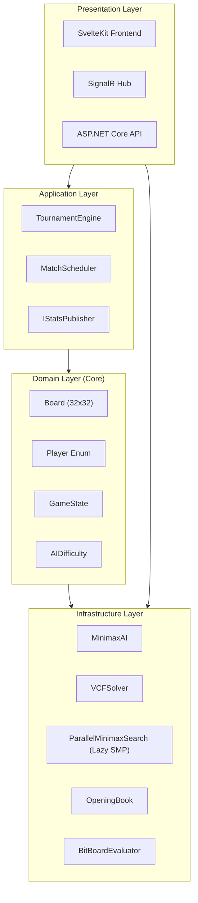

# Caro AI PvP

A tournament-strength Caro (Gomoku variant) with grandmaster-level AI, built with .NET 10, SvelteKit 2.49+ with Svelte 5 Runes.

---

## Overview

- **Grandmaster-level AI** - Lazy SMP parallel search reaching depth 11+
- **UCI Protocol Support** - Standalone engine compatible with UCI chess GUIs
- **Clean Architecture** - Separated Domain, Application, and Infrastructure layers
- **Real-time multiplayer** - WebSocket support via SignalR
- **Mobile-first UX** - Ghost stone positioning and haptic feedback
- **700+ automated tests** - Including adversarial concurrency tests

**Tournament & Testing:**
- Frontend tournament mode with balanced round-robin and live ELO tracking
- Matchup suites for AI strength validation (statistical analysis with color-swapping)
- Comprehensive test runners: 20 matchups, 10 games each, 3+2 time control

**Game Rules (Caro/Gomoku variant):**
- 32x32 board (1024 intersections)
- Open Rule: Red's second move must be at least 3 intersections away from first
- Win: Exactly 5 in a row (6+ or blocked ends don't count)
- Time Control: 1+0 (Bullet), 3+2 (Blitz), 7+5 (Rapid), 15+10 (Classical)

---

## Features

### AI Engine

Grandmaster-level engine achieving depth 11+ with 100-500x speedup over naive minimax:

| Category | Feature | Description |
|----------|---------|-------------|
| **Search** | Lazy SMP Parallel | Multi-threaded search with TT work sharing |
| | Principal Variation Search | Alpha-beta with null-window searches |
| | Aspiration Windows | Narrowed bounds near root |
| | Quiescence Search | Prevents horizon blunders |
| | Adaptive LMR | Dynamic depth reduction by position factors |
| | VCF Solver | Pre-search for forcing win sequences |
| | Threat Space Search | Tactical move generation |
| **Transposition Table** | Multi-Entry Clusters | 3 entries per bucket, 32-byte aligned |
| | Depth-Age Replacement | Smart entry eviction formula |
| | Evaluation Cache | Static eval stored with entries |
| **Move Ordering** | Staged Picker | TT → Block → Win → Threat → Killer/Counter → Quiet |
| | Hash Move | TT move searched unconditionally first |
| | Must Block | Mandatory defense against opponent's open four |
| | Winning Moves | Creates open four or double threat |
| | Threat Create | Creates open three or broken four |
| | Killer/Counter | Cutoff moves + opponent response patterns |
| | Continuation History | 6-ply move pair scoring |
| | Butterfly History | Long-term move statistics |
| **Evaluation** | BitKey Pattern System | O(1) pattern lookup with bit rotation |
| | Pattern4 Classification | 4-direction combined threat detection |
| | Contest Factor | Dynamic contempt (-200 to +200 cp) |
| **Time Control** | PID Time Management | Control theory for allocation |
| **Infrastructure** | SPSA Optimizer | Gradient-free parameter optimization |
| | Structured Logging | Async file-based logging with rotation |

### Difficulty Levels

| Level | Threads | Time Budget | Error | Book Depth | Features |
|-------|---------|-------------|-------|------------|----------|
| Braindead | 1 | 5% | 10% | 0 | Beginners |
| Easy | 2 | 20% | 0% | 8 plies | Parallel search + Opening book |
| Medium | 3 | 50% | 0% | 16 plies | Parallel + pondering + Opening book |
| Hard | 4 | 75% | 0% | 24 plies | Parallel + pondering + VCF + Opening book |
| Grandmaster | (N/2)-1 | 100% | 0% | 32 plies | Max parallel, VCF, pondering, Opening book |
| Experimental | (N/2)-1 | 100% | 0% | 40 plies | Full opening book, max features |

**Depth:** Dynamic calculation based on host machine NPS and time control. Formula: `depth = log(time * nps * timeMultiplier) / log(ebf)`

### UCI Protocol

Universal Chess Interface (UCI) protocol compatibility for standalone engine usage:

- **Standalone console engine** - Run as separate process like Stockfish
- **Standard UCI commands** - uci, isready, ucinewgame, position, go, stop, quit, setoption
- **Engine options** - Skill Level, Use Opening Book, Book Depth Limit, Threads, Hash, Ponder
- **WebSocket bridge** - Frontend can connect directly to UCI engine
- **Algebraic notation** - Double-letter coordinates aa-hd (columns), 1-32 (rows)

**Run standalone UCI engine:**
```bash
dotnet run --project backend/src/Caro.UCI
```

**Run UCI Mock Client (engine vs engine testing):**
```bash
dotnet run --project backend/src/Caro.UCIMockClient -- --games 4 --time 180 --inc 2
```

**Example UCI session:**
```
> uci
< id name Caro AI 1.48.0
< id author Caro AI Project
< option name Skill Level type spin default 3 min 1 max 6
< option name Use Opening Book type check default true
< uciok
> position startpos moves ea17
> go movetime 2000
< info depth 2 nodes 13524 time 1590 pv ea18
< bestmove ea18
```

### Opening Book

Precomputed opening positions with SQLite storage, symmetry reduction, and parallel generation:

- **All levels except Braindead** - Easy: 8 plies, Medium: 16 plies, Hard: 24 plies, Grandmaster: 32 plies, Experimental: 40 plies
- **Tiered continuation** - Response counts decrease with depth (4→3→2→1) ensuring coverage
- **Symmetry reduction** - 8-way transformations reduce storage by ~8x
- **Compound key storage** - Uses (CanonicalHash, DirectHash, Player) to avoid hash collision issues
- **Optimized generation** - 60-67 positions/minute through aggressive pruning (12-15x speedup)
  - Smart candidate pruning: 2-5 candidates evaluated per position
  - Depth 6 search cap with static eval threshold filtering
  - Resume capability - Incremental deepening of existing books

**Generate book:**
```bash
dotnet run --project backend/src/Caro.BookBuilder
```

**Custom output path:**
```bash
dotnet run --project backend/src/Caro.BookBuilder -- --output=custom_book.db
```

**Verify existing book:**
```bash
dotnet run --project backend/src/Caro.BookBuilder -- --verify-only --output=opening_book.db
```

**Book Structure (hardcoded 4-3-2-1 tapered beam):**
- Plies 0-14: 4 moves per position (early game + survival zone)
- Plies 15-24: 3 moves per position (Hard difficulty)
- Plies 25-32: 2 moves per position (Grandmaster)
- Plies 33-40: 1 move per position (Experimental)

**Book Builder Performance (typical on modern hardware):**

| Metric | Value |
|--------|-------|
| Average throughput | 80-100 positions/minute |
| Peak throughput (early depths) | 100+ positions/minute |
| Memory usage | 1.2-1.5 GB working set |
| Progress updates | Every 15 seconds |

**Throughput by depth:**
- Depths 0-8: 80-100 pos/min (simpler positions, fewer candidates)
- Depths 9-11: 70-90 pos/min (survival zone - more candidates evaluated)
- Depths 12+: 50-80 pos/min (deeper search required)

**Optimization metrics:**
- Candidate pruning rate: 96%+ (static eval filtering)
- Early exit rate: 25-35% (dominant move detection)
- Write buffer efficiency: 50 entries per flush

### Tournament Mode

- 5 AI levels in round-robin format
- ELO tracking with standard rating calculation
- Balanced scheduling (one game per bot per round)
- SQLite logging with FTS5 full-text search
- SignalR broadcasts via async queues

### Documentation

**Engine Features:** `ENGINE_FEATURES.md` - Comprehensive technical reference covering theoretical structures, algorithms, and patterns used in the AI engine. Includes search optimizations, transposition tables, move ordering systems, evaluation techniques, and time management strategies.

### Test Projects

Separate test projects for focused testing:

```bash
# Unit tests (fast, no integration/matchup tests)
cd backend/tests/Caro.Core.Tests && dotnet test

# Integration tests (opt-in, full AI searches - slower)
cd backend/tests/Caro.Core.IntegrationTests && dotnet test

# Matchup/integration tests (slower, AI vs AI matchups)
cd backend/tests/Caro.Core.MatchupTests && dotnet test
```

| Project | Tests | Duration |
|---------|-------|----------|
| Caro.Core.Tests | 515 unit tests | ~2 sec |
| Caro.Core.IntegrationTests | 153 | Opt-in, AI searches |
| Caro.Core.MatchupTests | ~57 | Variable |
| Caro.Core.Domain.Tests | 67 entity tests | ~1 sec |
| Caro.Core.Application.Tests | 8 service tests | ~1 sec |
| Caro.Core.Infrastructure.Tests | 72 tests | ~42 sec |

**Note:** Run `dotnet test` in Caro.Core.Tests for fast unit test feedback. IntegrationTests are excluded from default test runs (marked as `<IsTestProject>false</IsTestProject>`).

---

## Architecture

Clean Architecture with three core layers:



**Clean Architecture Projects:**

| Project | Purpose | Dependencies |
|---------|---------|--------------|
| `Caro.Core.Domain` | Core entities, value objects | None |
| `Caro.Core.Application` | Interfaces, application services | Domain |
| `Caro.Core.Infrastructure` | AI algorithms, external concerns | Domain, Application |

**Immutable Domain Model:**

All domain entities are fully immutable for thread safety:
- `Cell` - `readonly record struct` with `Player` property
- `GameState` - `sealed record` with `ImmutableStack<Board>` for undo history
- `Board` - Immutable via `PlaceStone()` returning new instances
- Operations return new state: `WithMove()`, `WithGameOver()`, `UndoMove()`

**Infrastructure Projects:**

| Project | Purpose |
|---------|---------|
| `Caro.Api` | Web API, SignalR hub, WebSocket UCI bridge |
| `Caro.BookBuilder` | CLI tool for offline book generation |
| `Caro.UCI` | Standalone UCI console engine |
| `Caro.UCIMockClient` | UCI protocol testing tool (engine vs engine) |

### Component Flow

**Move Request Flow:**
1. Frontend sends move via SignalR → TournamentHub
2. TournamentEngine calls `MinimaxAI.GetBestMove()`
3. Parallel search spawns N threads (based on difficulty)
4. Master thread selects best result, helpers explore with TT sharing

**Stats Pub-Sub Flow:**
1. MinimaxAI implements `IStatsPublisher` with `Channel<MoveStatsEvent>`
2. After each move, stats published to channel (MainSearch, Pondering, VCFSearch)
3. TournamentEngine runs async subscriber tasks for both AIs
4. Ponder stats cached separately for post-move reporting

**Transposition Table Sharding:**
- 16 segments with independent hash-based distribution
- `shardIndex = (hash >> 32) & shardMask`
- Reduces cache coherency traffic for parallel threads

**Helper Thread TT Write Policy:**
```
if (threadIndex > 0) {
    if (depth < rootDepth / 2) return;  // Too shallow
    if (flag != Exact) return;           // Misleading bounds
}
// Master threads (threadIndex=0) can store any entry
```

---

## Concurrency

Production-grade concurrency following .NET 10 best practices:

| Pattern | Purpose |
|---------|---------|
| Channel-based queues | No fire-and-forget exceptions |
| Per-game locks | 100+ concurrent games |
| CancellationTokenSource | Coordinated search cancellation |
| TT sharding (16 segments) | Reduced cache contention |
| Publisher-Subscriber | AI telemetry without callbacks |

**Testing:** 32 adversarial concurrency tests validate thread-safety under high contention.

---

## Performance

| Difficulty | Threads | Time Budget | Depth (7+5 TC) |
|------------|---------|-------------|----------------|
| Braindead | 1 | 5% | ~1-3 |
| Easy | 2 | 20% | ~3-5 |
| Medium | 3 | 50% | ~5-7 |
| Hard | 4 | 75% | ~7-9 |
| Grandmaster | (N/2)-1 | 100% | ~9-12+ |

**Depth varies by host machine** - calculated dynamically from NPS and time budget. Higher-spec machines achieve greater depth naturally.

---

## Tech Stack

**Frontend:** SvelteKit 2.49+ with Svelte 5 Runes, TypeScript 5.9, TailwindCSS 4.1, SignalR (@microsoft/signalr 8.0), Vitest 4.0, Playwright 1.57

**Backend:** .NET 10, ASP.NET Core 10, SignalR, System.Threading.Channels, SQLite + FTS5, xUnit 2.9.2 with xUnit Runner 3.1.4, Moq 4.20.72, FluentAssertions 7.0.0-8.8.0

**AI:** Custom Minimax, alpha-beta pruning, Zobrist hashing, BitBoard, VCF pre-search solver, Lazy SMP, Hash Move-first ordering, Opening book with symmetry reduction

---

## Testing

| Project | Tests | Focus |
|---------|-------|-------|
| Caro.Core.Tests | 515 | Unit tests (algorithms, evaluators, concurrency, immutable state, test helpers, AI improvements, symmetry) |
| Caro.Core.IntegrationTests | 153 | AI search integration (full depth searches, performance benchmarks, opening book edge cases + performance tests) |
| Caro.Core.MatchupTests | ~57 | AI matchups, integration, tournament, opening book verification |
| Caro.Core.Domain.Tests | 67 | Entities (Board, Cell, Player, GameState, Position) |
| Caro.Core.Application.Tests | 8 | Services, interfaces, DTOs, Mappers |
| Caro.Core.Infrastructure.Tests | 72 | AI algorithms, external concerns |
| Frontend Unit (Vitest) | 19 | Component tests |
| Frontend E2E (Playwright) | 17 | End-to-end gameplay |
| **TOTAL** | **790+** | |

### Frontend E2E Tests

Playwright end-to-end tests covering core gameplay mechanics:

| Feature | Tests |
|---------|-------|
| Basic Mechanics (move placement, open rule) | 4 |
| Sound Effects (valid/invalid moves) | 3 |
| Move History (tracking, display) | 3 |
| Winning Line Animation | 2 |
| Timer Functionality (Fisher time control) | 3 |
| Regression Tests (edge cases) | 2 |

Run E2E tests:
```bash
cd frontend && npm run test:e2e
```

---

## Getting Started

```bash
# Clone
git clone https://github.com/lavantien/caro-ai-pvp.git
cd caro-ai-pvp

# Backend
cd backend && dotnet restore && dotnet build
cd src/Caro.Api && dotnet run

# Frontend (new terminal)
cd frontend && npm install
npm run dev
```

Backend: http://localhost:5207 | Frontend: http://localhost:5173

---

## License

MIT

---

Built with SvelteKit + .NET 10
