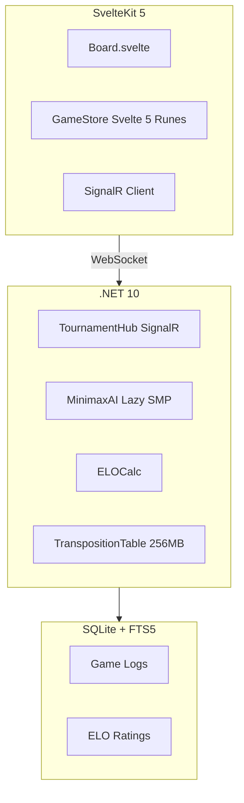

# Caro AI PvP

A tournament-strength Caro (Gomoku variant) with grandmaster-level AI, built with .NET 10 and SvelteKit 5.

---

## Overview

- **Grandmaster-level AI** - Lazy SMP parallel search reaching depth 11+
- **Real-time multiplayer** - WebSocket support via SignalR
- **AI tournament mode** - Balanced round-robin with ELO tracking
- **Mobile-first UX** - Ghost stone positioning and haptic feedback
- **330+ automated tests** - Including adversarial concurrency tests

---

## Features

### AI Engine

State-of-the-art algorithms from computer chess achieving 100-500x speedup over naive minimax:

| Optimization | Speedup |
|--------------|---------|
| Principal Variation Search (PVS) | 20-40% |
| Late Move Reduction (LMR) | 30-50% |
| Quiescence Search | Prevents blunders |
| Transposition Table (256MB) | 2-5x |
| History Heuristic | 10-20% |
| Aspiration Windows | 10-30% |

**Advanced Features:**
- Lazy SMP parallel search (Hard/Grandmaster)
- VCF Solver (Grandmaster only)
- Threat Space Search
- BitBoard representation (6x ulong for 19x19)
- Pondering (think on opponent's time)

### Difficulty Levels

| Level | Depth | Features |
|-------|-------|----------|
| Braindead | 1-2 | 20% error rate, beginners |
| Easy | 3-4 | Basic lookahead |
| Medium | 5-6 | Sequential + pondering |
| Hard | 7-8 | Lazy SMP, (N/2)-1 threads |
| Grandmaster | 9-11 | Lazy SMP, VCF solver |

### Tournament Mode

- 5 AI levels in round-robin format
- ELO tracking with standard rating calculation
- Balanced scheduling (one game per bot per round)
- SQLite logging with FTS5 full-text search
- SignalR broadcasts via async queues

---

## Architecture



---

## Concurrency

Production-grade concurrency following .NET 10 best practices:

| Pattern | Purpose |
|---------|---------|
| Channel-based queues | No fire-and-forget exceptions |
| Per-game locks | 100+ concurrent games |
| CancellationTokenSource | Coordinated search cancellation |
| TT sharding (16 segments) | Reduced cache contention |
| Publisher-Subscriber | AI telemetry without callbacks |

**Testing:** 32 adversarial concurrency tests validate thread-safety under high contention.

---

## Performance

| Difficulty | Search | Threads | Time | NPS | Max Depth |
|------------|--------|---------|------|-----|-----------|
| Braindead | Sequential | 1 | <50ms | ~10K | 1-2 |
| Easy | Sequential | 1 | <200ms | ~50K | 3-4 |
| Medium | Sequential | 1 | <1s | ~100K | 5-6 |
| Hard | Lazy SMP | 3+ | <3s | ~500K | 7-8 |
| Grandmaster | Lazy SMP | (N/2)-1 | <10s | ~1M | 9-11 |

---

## Tech Stack

**Frontend:** SvelteKit 5, TypeScript, Svelte 5 Runes, Skeleton UI v4, TailwindCSS v4, SignalR

**Backend:** .NET 10, ASP.NET Core 10, SignalR, System.Threading.Channels, SQLite + FTS5, xUnit v3.1

**AI:** Custom Minimax, alpha-beta pruning, Zobrist hashing, BitBoard, VCF solver, Threat space search

---

## Testing

| Category | Tests |
|----------|-------|
| Backend Unit | 200+ |
| Statistical | 38 |
| AI Strength Validation | 19 |
| Concurrency | 32 |
| Integration | 13 |
| Frontend Unit | 19+ |
| E2E | 17+ |
| **TOTAL** | **330+** |

---

## Getting Started

```bash
# Clone
git clone https://github.com/lavantien/caro-ai-pvp.git
cd caro-ai-pvp

# Backend
cd backend && dotnet restore && dotnet build
cd src/Caro.Api && dotnet run

# Frontend (new terminal)
cd frontend && npm install
npm run dev
```

Backend: http://localhost:5207 | Frontend: http://localhost:5173

---

## Game Rules

- **19x19 board** (361 intersections)
- **Open Rule:** Red's second move must be at least 3 intersections away from first
- **Win:** Exactly 5 in a row (6+ or blocked ends don't count)
- **Time Control:** 7min + 5sec increment (Fisher)

---

## License

MIT

---

Built with SvelteKit + .NET 10
