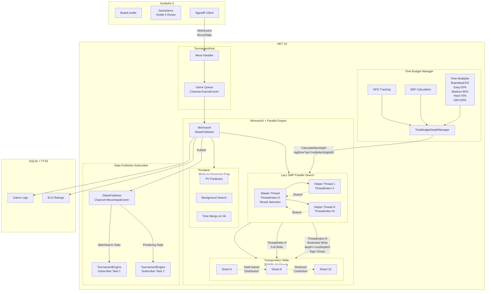

# Caro AI PvP

A tournament-strength Caro (Gomoku variant) with grandmaster-level AI, built with .NET 10 and SvelteKit 5.

---

## Overview

- **Grandmaster-level AI** - Lazy SMP parallel search reaching depth 11+
- **Real-time multiplayer** - WebSocket support via SignalR
- **AI tournament mode** - Balanced round-robin with ELO tracking
- **Mobile-first UX** - Ghost stone positioning and haptic feedback
- **500+ automated tests** - Including adversarial concurrency tests

---

## Features

### AI Engine

State-of-the-art algorithms from computer chess achieving 100-500x speedup over naive minimax:

| Optimization | Speedup |
|--------------|---------|
| Principal Variation Search (PVS) | 20-40% |
| Late Move Reduction (LMR) | 30-50% |
| Quiescence Search | Prevents blunders |
| Transposition Table (256MB) | 2-5x |
| History Heuristic | 10-20% |
| Aspiration Windows | 10-30% |

**Advanced Features:**
- Lazy SMP parallel search (Hard/Grandmaster)
- VCF Solver (Grandmaster only)
- Threat Space Search
- BitBoard representation (6x ulong for 19x19)
- Pondering (think on opponent's time)

### Difficulty Levels

| Level | Threads | Time Budget | Error | Features |
|-------|---------|-------------|-------|----------|
| Braindead | 1 | 5% | 10% | Beginners |
| Easy | 2 | 20% | 0% | Parallel search |
| Medium | 3 | 50% | 0% | Parallel + pondering |
| Hard | 4 | 75% | 0% | Parallel + pondering + VCF |
| Grandmaster | (N/2)-1 | 100% | 0% | Max parallel, VCF, pondering |

**Depth:** Dynamic calculation based on host machine NPS and time control. Formula: `depth = log(time * nps * timeMultiplier) / log(ebf)`

### Tournament Mode

- 5 AI levels in round-robin format
- ELO tracking with standard rating calculation
- Balanced scheduling (one game per bot per round)
- SQLite logging with FTS5 full-text search
- SignalR broadcasts via async queues

### Test Suites

Centralized AI testing framework for validating difficulty strength:

```bash
dotnet run --project backend/src/Caro.TournamentRunner -- --test-suite=<name>
```

| Suite | Description |
|-------|-------------|
| `braindead` | Self-play baseline (20 games) |
| `easy` | vs Braindead, self (20 games each) |
| `medium` | vs Braindead, Easy, self (20 games each) |
| `hard` | vs Braindead, Easy, Medium, self (20 games each) |
| `grandmaster` | vs All + self (20 games each) |
| `experimental` | Custom AI testing (10 games each) |
| `full` | Run all suites in series |

Results written to `backend/tournament_results.txt` with pass/fail thresholds.

---

## Architecture



### Component Flow

**Move Request Flow:**
1. Frontend sends move via SignalR → TournamentHub
2. TournamentEngine calls `MinimaxAI.GetBestMove()`
3. Parallel search spawns N threads (based on difficulty)
4. Master thread selects best result, helpers explore with TT sharing

**Stats Pub-Sub Flow:**
1. MinimaxAI implements `IStatsPublisher` with `Channel<MoveStatsEvent>`
2. After each move, stats published to channel (MainSearch, Pondering, VCFSearch)
3. TournamentEngine runs async subscriber tasks for both AIs
4. Ponder stats cached separately for post-move reporting

**Transposition Table Sharding:**
- 16 segments with independent hash-based distribution
- `shardIndex = (hash >> 32) & shardMask`
- Reduces cache coherency traffic for parallel threads

**Helper Thread TT Write Policy:**
```
if (threadIndex > 0) {
    if (depth < rootDepth / 2) return;  // Too shallow
    if (flag != Exact) return;           // Misleading bounds
}
// Master threads (threadIndex=0) can store any entry
```

---

## Concurrency

Production-grade concurrency following .NET 10 best practices:

| Pattern | Purpose |
|---------|---------|
| Channel-based queues | No fire-and-forget exceptions |
| Per-game locks | 100+ concurrent games |
| CancellationTokenSource | Coordinated search cancellation |
| TT sharding (16 segments) | Reduced cache contention |
| Publisher-Subscriber | AI telemetry without callbacks |

**Testing:** 32 adversarial concurrency tests validate thread-safety under high contention.

---

## Performance

| Difficulty | Threads | Time Budget | Depth (7+5 TC) |
|------------|---------|-------------|----------------|
| Braindead | 1 | 5% | ~1-3 |
| Easy | 2 | 20% | ~3-5 |
| Medium | 3 | 50% | ~5-7 |
| Hard | 4 | 75% | ~7-9 |
| Grandmaster | (N/2)-1 | 100% | ~9-12+ |

**Depth varies by host machine** - calculated dynamically from NPS and time budget. Higher-spec machines achieve greater depth naturally.

---

## Tech Stack

**Frontend:** SvelteKit 5, TypeScript, Svelte 5 Runes, Skeleton UI v4, TailwindCSS v4, SignalR

**Backend:** .NET 10, ASP.NET Core 10, SignalR, System.Threading.Channels, SQLite + FTS5, xUnit v3.1

**AI:** Custom Minimax, alpha-beta pruning, Zobrist hashing, BitBoard, VCF solver, Threat space search

---

## Testing

| Category | Tests |
|----------|-------|
| Backend Unit | 480+ |
| Statistical | 38 |
| AI Strength Validation | 19 |
| Concurrency | 32 |
| Integration | 13 |
| Frontend Unit | 26 |
| **TOTAL** | **500+** |

---

## Getting Started

```bash
# Clone
git clone https://github.com/lavantien/caro-ai-pvp.git
cd caro-ai-pvp

# Backend
cd backend && dotnet restore && dotnet build
cd src/Caro.Api && dotnet run

# Frontend (new terminal)
cd frontend && npm install
npm run dev
```

Backend: http://localhost:5207 | Frontend: http://localhost:5173

---

## Game Rules

- **19x19 board** (361 intersections)
- **Open Rule:** Red's second move must be at least 3 intersections away from first
- **Win:** Exactly 5 in a row (6+ or blocked ends don't count)
- **Time Control:** 7min + 5sec increment (Fisher)

---

## License

MIT

---

Built with SvelteKit + .NET 10
