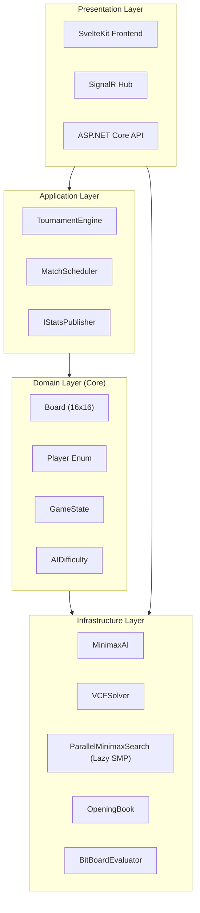

# Caro AI PvP

A tournament-strength Caro (Gomoku variant) with grandmaster-level AI, built with .NET 10, SvelteKit 2.49+ with Svelte 5 Runes.

---

## Overview

- **Grandmaster-level AI** - Lazy SMP parallel search
- **UCI Protocol Support** - Standalone engine compatible with UCI chess GUIs
- **Clean Architecture** - Separated Domain, Application, and Infrastructure layers
- **Real-time multiplayer** - WebSocket support via SignalR
- **Mobile-first UX** - Ghost stone positioning and haptic feedback
- **900+ automated tests** - Including adversarial concurrency tests

**Tournament & Testing:**
- Frontend tournament mode with balanced round-robin and live ELO tracking
- Matchup suites for AI strength validation (statistical analysis with color-swapping)
- Comprehensive test runners: 20 matchups, 10 games each, 3+2 time control

**Game Rules (Caro/Gomoku variant):**
- 16x16 board (256 intersections)
- Open Rule: Red's second move must be at least 3 intersections away from first
- Win: Exactly 5 in a row (6+ or blocked ends don't count)
- Time Control: 1+0 (Bullet), 3+2 (Blitz), 7+5 (Rapid), 15+10 (Classical)

---

## Features

### AI Engine

Grandmaster-level engine with 100-500x speedup over naive minimax:

| Category | Feature | Description |
|----------|---------|-------------|
| **Search** | Lazy SMP Parallel | Multi-threaded search with TT work sharing |
| | Principal Variation Search | Alpha-beta with null-window searches |
| | Aspiration Windows | Narrowed bounds near root |
| | Quiescence Search | Prevents horizon blunders |
| | Adaptive LMR | Dynamic depth reduction by position factors |
| | VCF Solver | Pre-search for forcing win sequences |
| | Threat Space Search | Tactical move generation |
| **Transposition Table** | Multi-Entry Clusters | 3 entries per bucket, 32-byte aligned |
| | Depth-Age Replacement | Smart entry eviction formula |
| | Evaluation Cache | Static eval stored with entries |
| **Move Ordering** | Staged Picker | TT → Block → Win → Threat → Killer/Counter → Quiet |
| | Hash Move | TT move searched unconditionally first |
| | Must Block | Mandatory defense against opponent's open four |
| | Winning Moves | Creates open four or double threat |
| | Threat Create | Creates open three or broken four |
| | Killer/Counter | Cutoff moves + opponent response patterns |
| | Continuation History | 6-ply move pair scoring |
| | Butterfly History | Long-term move statistics |
| **Evaluation** | BitKey Pattern System | O(1) pattern lookup with bit rotation |
| | Pattern4 Classification | 4-direction combined threat detection |
| | Contest Factor | Dynamic contempt (-200 to +200 cp) |
| **Time Control** | PID Time Management | Control theory for allocation |
| **Infrastructure** | SPSA Optimizer | Gradient-free parameter optimization |
| | Structured Logging | Async file-based logging with rotation |

### Difficulty Levels

| Level | Threads | Time Budget | Error | Book Depth | Features |
|-------|---------|-------------|-------|------------|----------|
| Braindead | 1 | 5% | 10% | 0 | Beginners |
| Easy | max(2,(N/5)-1) | 20% | 0% | 4 plies | Parallel search + pondering + Opening book |
| Medium | max(3,(N/4)-1) | 50% | 0% | 6 plies | Parallel + pondering + Opening book |
| Hard | max(4,(N/3)-1) | 75% | 0% | 10 plies | Parallel + pondering + VCF + Opening book |
| Grandmaster | max(5,(N/2)-1) | 100% | 0% | 14 plies | Max parallel, VCF, pondering, Opening book |
| Experimental | max(5,(N/2)-1) | 100% | 0% | Unlimited | Full opening book, max features |

**Time-Based Design Philosophy:**
- **NO depth-based logic** - All strength differentiation comes solely from:
  1. **Threads allocated** - More threads = faster parallel search
  2. **Time allotted** - More time = deeper search naturally
- **NO artificial depth floors or limits** - Search runs until time expires via iterative deepening
- **Depth emerges naturally** - Different machines reach different depths based on hardware capability
- **Pondering is precomputation** - Uses full-quality search during opponent's turn, results merged on ponder hit

### Baseline Benchmark Results (2026-02-25)

Based on 32-game matchups per time control with alternating colors. Higher difficulty consistently beats lower difficulty:

| Matchup | Time | Higher Win | Draw | Lower Win |
|---------|------|------------|------|-----------|
| Easy vs Braindead | Bullet | 14 | 0 | 18 |
| Easy vs Braindead | Blitz | 15 | 0 | 17 |
| Medium vs Braindead | Bullet | 17 | 0 | 15 |
| Medium vs Braindead | Blitz | 20 | 0 | 12 |
| Grandmaster vs Braindead | Bullet | 25 | 0 | 7 |
| Grandmaster vs Braindead | Blitz | 26 | 0 | 6 |
| Hard vs Easy | Bullet | 18 | 0 | 14 |
| Hard vs Easy | Blitz | 17 | 0 | 15 |
| Grandmaster vs Medium | Bullet | 27 | 0 | 5 |
| Grandmaster vs Medium | Blitz | 22 | 0 | 10 |
| Grandmaster vs Hard | Bullet | 30 | 0 | 2 |
| Grandmaster vs Hard | Blitz | 26 | 0 | 6 |

**Critical Expected Behavior:**
- **Braindead should NEVER win against Medium+** - If Braindead wins consistently against Medium or higher, there is a major bug
- Braindead has 10% error rate and minimal search (1 thread, 5% time)
- Medium+ has full-strength search with 3+ threads and 50%+ time
- Any significant Braindead win rate against Medium+ indicates a regression that must be fixed

**Notes:**
- Win rates vary by time control; longer controls allow deeper search
- If lower difficulties are winning against higher ones, check: time allocation, thread assignment, search quality

### Performance Baseline

<details>
<summary>Measured Performance Metrics</summary>

**Effective Branching Factor (EBF):** ~2.5 across all matchups and time controls (excellent pruning efficiency)

**First Move Cutoff % (FMC%) Ranges:**

| Matchup Type | Bullet FMC% Range | Blitz FMC% Range |
|--------------|-------------------|------------------|
| vs Braindead | 38.6% - 58.4% | 58.3% - 67.3% |
| Hard vs Easy | 30.1% | 43.9% |
| Grandmaster vs Medium | 30.8% | 56.5% |
| Grandmaster vs Hard | 39.4% | 61.9% |

**Nodes Per Second (NPS) Ranges:**

| Difficulty | Bullet NPS | Blitz NPS |
|------------|------------|-----------|
| Easy | 86.8K - 287.1K | 81.0K - 223.9K |
| Medium | 93.6K - 218.0K | 100.7K - 274.2K |
| Hard | 86.8K - 91.7K | 93.9K - 96.3K |
| Grandmaster | 1.8K - 150.5K | 2.2K - 170.9K |

**Move Count Statistics (Mode/Median/Mean):**

| Matchup | Time | Mode | Median | Mean |
|---------|------|------|--------|------|
| Easy vs Braindead | Bullet | 29 | 35.0 | 44.2 |
| Easy vs Braindead | Blitz | 21 | 28.5 | 34.5 |
| Grandmaster vs Braindead | Bullet | 13 | 25.0 | 35.5 |
| Grandmaster vs Braindead | Blitz | 23 | 23.5 | 33.0 |
| Grandmaster vs Medium | Bullet | 79 | 58.5 | 57.4 |
| Grandmaster vs Medium | Blitz | 36 | 39.5 | 59.3 |
| Grandmaster vs Hard | Bullet | 23 | 39.5 | 38.8 |
| Grandmaster vs Hard | Blitz | 19 | 35.0 | 46.3 |

**VCF Trigger Summary:**

| Matchup | Bullet Triggers | Blitz Triggers |
|---------|-----------------|----------------|
| Grandmaster vs Braindead | 4 | 3 |
| Hard vs Easy | 4 | 9 |
| Grandmaster vs Medium | 2 | 1 |
| Grandmaster vs Hard | 7 | 8 |

**Move Type Distribution:**

| Matchup | Time | Normal | ImmediateWin | ImmediateBlock | ErrorRate |
|---------|------|--------|--------------|----------------|-----------|
| Easy vs Braindead | Bullet | 89.5% | 2.2% | 3.4% | 4.9% |
| Grandmaster vs Braindead | Bullet | 62.7% | 2.6% | 16.7% | 5.7% |
| Hard vs Easy | Bullet | 93.6% | 3.0% | 3.4% | 0.0% |
| Grandmaster vs Hard | Bullet | 75.3% | 1.6% | 11.1% | 0.0% |

</details>

<details>
<summary>Benchmark Tool</summary>

Run the baseline benchmark to gather comprehensive performance metrics:

```bash
cd backend/src/Caro.TournamentRunner
dotnet run -- --baseline-benchmark
```

This runs 12 standardized matchups (32 games each) across Bullet (60+0) and Blitz (180+2) time controls:

| Matchup | Time Controls |
|---------|---------------|
| Braindead vs Easy | Bullet, Blitz |
| Braindead vs Medium | Bullet, Blitz |
| Braindead vs Grandmaster | Bullet, Blitz |
| Easy vs Hard | Bullet, Blitz |
| Medium vs Grandmaster | Bullet, Blitz |
| Hard vs Grandmaster | Bullet, Blitz |

Output files: `baseline_{bullet|blitz}_{diff1}_{diff2}.txt`

The benchmark generates:
- **Discrete metrics** (Mode/Median/Mean): Move count, Master depth, First Move Cutoff % (FMC%)
- **Continuous metrics** (Median/Mean): NPS, Helper depth, Time used/allocated, TT hit rate, Effective Branching Factor (EBF)
- **VCF trigger details** (game/move, depth, nodes)
- **Move type distribution** (Normal, Book, BookValidated, etc.)
- **Per-difficulty aggregates** for each time control

**Key Metrics:**
- **FMC%**: First Move Cutoff % - measures move ordering quality (>85% = excellent, <60% = needs work)
- **EBF**: Effective Branching Factor - measures pruning efficiency (lower = better, ~2-3 typical for good alpha-beta)

</details>

### UCI Protocol

Universal Chess Interface (UCI) protocol compatibility for standalone engine usage:

- **Standalone console engine** - Run as separate process like Stockfish
- **Standard UCI commands** - uci, isready, ucinewgame, position, go, stop, quit, setoption
- **Engine options** - Skill Level, Use Opening Book, Book Depth Limit, Threads, Hash, Ponder
- **WebSocket bridge** - Frontend can connect directly to UCI engine
- **Algebraic notation** - Double-letter coordinates aa-hd (columns), 1-32 (rows)

**Run standalone UCI engine:**
```bash
dotnet run --project backend/src/Caro.UCI
```

**Run UCI Mock Client (engine vs engine testing):**
```bash
cd backend/src/Caro.UCIMockClient && dotnet run -- --games 4 --time 180 --inc 2
```

**Run Comprehensive Tournament (AI vs AI matchups):**
```bash
cd backend/src/Caro.TournamentRunner && dotnet run -- --comprehensive --matchups=BraindeadvsBraindead,BraindeadvsEasy,BraindeadvsMedium,BraindeadvsHard,BraindeadvsGrandmaster,BraindeadvsExperimental --time=180+2 --games=10
```

Available matchups: `BraindeadvsBraindead`, `BraindeadvsEasy`, `BraindeadvsMedium`, `BraindeadvsHard`, `BraindeadvsGrandmaster`, `BraindeadvsExperimental`, `EasyvsMedium`, `EasyvsHard`, `EasyvsGrandmaster`, `EasyvsExperimental`, `MediumvsHard`, `MediumvsGrandmaster`, `MediumvsExperimental`, `HardvsGrandmaster`, `HardvsExperimental`, `GrandmastervsExperimental`

**Example UCI session:**
```
> uci
< id name Caro AI
< id author Caro AI Project
< option name Skill Level type spin default 3 min 1 max 6
< option name Use Opening Book type check default true
< uciok
> position startpos moves ea17
> go movetime 2000
< info depth 2 nodes 13524 time 1590 pv ea18
< bestmove ea18
```

### Opening Book

Precomputed opening positions with SQLite persistence, in-memory lookup, and intelligent generation:

- **All levels except Braindead** - Easy: 4 plies, Medium: 6 plies, Hard: 10 plies, Grandmaster: 14 plies, Experimental: 14+ plies
- **Variable depth search** - VCF solving (20-30 ply) for early game, deep search (14-20 ply) for mid-game
- **Move classification** - Solved (proven wins), Learned (deep search), SelfPlay (engine vs engine)
- **In-memory lookup** - 40K+ lookups/sec (~24μs), orders of magnitude faster than SQLite
- **Symmetry reduction** - 8-way transformations reduce storage by ~8x

**Quick Start:**
```bash
# Full pipeline (recommended)
dotnet run --project backend/src/Caro.BookBuilder -- --full-pipeline --games 8192 --threads 8

# SPSA parameter tuning
dotnet run --project backend/src/Caro.BookBuilder -- --tune --iterations 50
```

See [backend/src/Caro.BookBuilder/README.md](backend/src/Caro.BookBuilder/README.md) for:
- Separated pipeline (staging → verification → integration)
- Binary format export/import
- SPSA tuning CLI reference
- All CLI options and examples

**Book Structure:**

| Ply Range | Search Depth | Moves/Position | Use VCF | Phase |
|-----------|-------------|----------------|--------|-------|
| 0-8 | 20-30 | 4 (configurable) | Yes | Opening Theory |
| 8-16 | 14-20 | 4 (configurable) | No | Mid-game |
| 16+ | Self-play only | - | - | End-game |

Use `--max-moves` to configure moves per position (default: 4).

### Tournament Mode

- 5 AI levels in round-robin format
- ELO tracking with standard rating calculation
- Balanced scheduling (one game per bot per round)
- SQLite logging with FTS5 full-text search
- SignalR broadcasts via async queues

### Tournament Stat Line Format

Each move in tournament output shows detailed engine statistics:

```
G1 M10 | B(16,17) by Easy | T: 1.1s/796ms | Bk | Th: 3 | D2 | N: 2.0K | NPS: 1.9K | TT: 0.0% | %M: 0.0% | HD: 1.5 | P: - | VCF: -
```

| Column | Description |
|--------|-------------|
| `G#` | Game number |
| `M#` | Move number |
| `R/B(x,y)` | Player color and move coordinates |
| `by Difficulty` | AI difficulty level |
| `T: time/alloc` | Time spent / time allocated |
| `Type` | Move type code (see below) |
| `Th: #` | Thread count |
| `D#` | Search depth achieved |
| `N: #` | Nodes searched |
| `NPS: #` | Nodes per second |
| `TT: #%` | Transposition table hit rate |
| `%M: #%` | Master thread TT usage |
| `HD: #` | Helper thread average depth |
| `P: info` | Pondering stats (if active) |
| `VCF: info` | VCF solver stats (if active) |

**Move Type Codes:**

| Code | Type | Description |
|------|------|-------------|
| `-` | Normal | Full search performed |
| `Bk` | Book | Opening book move (unvalidated) |
| `Bv` | BookValidated | Book move validated by search |
| `Wn` | ImmediateWin | Instant winning move (no search) |
| `Bl` | ImmediateBlock | Forced block of opponent threat |
| `Er` | ErrorRate | Random move (Braindead's 10% error) |
| `Ct` | CenterMove | Center opening move |
| `Em` | Emergency | Emergency mode (low time) |

**Note:** Early exit moves (book, win, block, error) show `0ms` allocated time because no search was performed - the move was determined instantly. The actual time shown is overhead of checking conditions.

### Documentation Guide

| Document | Purpose | When to Read |
|----------|---------|--------------|
| **README.md** (this file) | Project overview, getting started, architecture summary | First - start here |
| **ENGINE_FEATURES.md** | AI engine architecture (search, evaluation, TT, move ordering) | Understanding how the AI works |
| **backend/src/Caro.BookBuilder/README.md** | Opening book CLI operations (generate, verify, tune) | Building/tuning opening books |
| **backend/tests/README.md** | Test organization and running instructions | Running tests |
| **CLAUDE.md** | Development protocols and coding standards | Contributing code |

**Documentation Matrix:**

```
README.md (Entry Point)
    ├── Getting Started → Quick start commands
    ├── Architecture → Clean Architecture diagram
    ├── Features → AI, Tournament, UCI, Opening Book
    └── Testing → Test projects overview
        │
        └──→ ENGINE_FEATURES.md (Deep Dive)
                ├── Search Architecture → PVS, LMR, Quiescence
                ├── Transposition Table → Clusters, Lockless hashing
                ├── Move Ordering → Stages, History, Killers
                ├── Evaluation → BitKey, Pattern4, Scoring
                ├── Time Management → PID controller
                └── Opening Book → Pipeline, SPSA tuning
                        │
                        └──→ backend/src/Caro.BookBuilder/README.md
                                ├── Separated Pipeline → Staging, Verify, Integrate
                                ├── Binary Format → Export/Import
                                ├── SPSA Tuning → CLI options, parameters
                                └── Examples → Command reference
```

**Newcomer Onboarding Path:**

1. **Start:** README.md → Getting Started (run the app)
2. **Understand:** Architecture section + Features tables
3. **Deep dive:** ENGINE_FEATURES.md for AI details
4. **Operate:** BookBuilder README for book generation
5. **Contribute:** CLAUDE.md for coding standards

### Test Projects

Separate test projects for focused testing:

```bash
# Unit tests (fast, no integration/matchup tests)
cd backend/tests/Caro.Core.Tests && dotnet test

# Integration tests (opt-in, full AI searches - slower)
cd backend/tests/Caro.Core.IntegrationTests && dotnet test

# Matchup/integration tests (slower, AI vs AI matchups)
cd backend/tests/Caro.Core.MatchupTests && dotnet test
```

| Project | Tests | Duration |
|---------|-------|----------|
| Caro.Core.Tests | 575 unit tests | ~3 sec |
| Caro.Core.IntegrationTests | 224 | Opt-in, AI searches |
| Caro.Core.MatchupTests | ~54 | Variable |
| Caro.Core.Domain.Tests | 45 entity tests | ~1 sec |
| Caro.Core.Application.Tests | 14 service tests | ~1 sec |
| Caro.Core.Infrastructure.Tests | 64 tests | ~42 sec |

**Note:** Run `dotnet test` in Caro.Core.Tests for fast unit test feedback. IntegrationTests are excluded from default test runs (marked as `<IsTestProject>false</IsTestProject>`).

---

## Architecture

Clean Architecture with three core layers:


```mermaid
graph TB
    subgraph Presentation["Presentation Layer"]
        SvelteKit["SvelteKit Frontend"]
        SignalR["SignalR Hub"]
        API["ASP.NET Core API"]
    end

    subgraph Application["Application Layer"]
        TournamentEngine["TournamentEngine"]
        MatchScheduler["MatchScheduler"]
        StatsPublisher["IStatsPublisher"]
    end

    subgraph Domain["Domain Layer (Core)"]
        Board["Board (16x16)"]
        Player["Player Enum"]
        GameState["GameState"]
        AIDifficulty["AIDifficulty"]
    end

    subgraph Infrastructure["Infrastructure Layer"]
        MinimaxAI["MinimaxAI"]
        VCFSolver["VCFSolver"]
        ParallelSearch["ParallelMinimaxSearch (Lazy SMP)"]
        OpeningBook["OpeningBook"]
        Evaluator["BitBoardEvaluator"]
    end

    Presentation --> Application
    Application --> Domain
    Domain --> Infrastructure
    Presentation --> Infrastructure
```

**Clean Architecture Projects:**

| Project | Purpose | Dependencies |
|---------|---------|--------------|
| `Caro.Core.Domain` | Core entities, value objects | None |
| `Caro.Core.Application` | Interfaces, application services | Domain |
| `Caro.Core.Infrastructure` | AI algorithms, external concerns | Domain, Application |

**Immutable Domain Model:**

All domain entities are fully immutable for thread safety:
- `Cell` - `readonly record struct` with `Player` property
- `GameState` - `sealed record` with `ImmutableStack<Board>` for undo history
- `Board` - Immutable via `PlaceStone()` returning new instances
- Operations return new state: `WithMove()`, `WithGameOver()`, `UndoMove()`

**Infrastructure Projects:**

| Project | Purpose |
|---------|---------|
| `Caro.Api` | Web API, SignalR hub, WebSocket UCI bridge |
| `Caro.BookBuilder` | CLI tool for offline book generation |
| `Caro.UCI` | Standalone UCI console engine |
| `Caro.UCIMockClient` | UCI protocol testing tool (engine vs engine) |

### Component Flow

**Move Request Flow:**
1. Frontend sends move via SignalR → TournamentHub
2. TournamentEngine calls `MinimaxAI.GetBestMove()`
3. Parallel search spawns N threads (based on difficulty)
4. Master thread selects best result, helpers explore with TT sharing

**Stats Pub-Sub Flow:**
1. MinimaxAI implements `IStatsPublisher` with `Channel<MoveStatsEvent>`
2. After each move, stats published to channel (MainSearch, Pondering, VCFSearch)
3. TournamentEngine runs async subscriber tasks for both AIs
4. Ponder stats cached separately for post-move reporting

**Transposition Table Sharding:**
- 16 segments with independent hash-based distribution
- `shardIndex = (hash >> 32) & shardMask`
- Reduces cache coherency traffic for parallel threads

**Helper Thread TT Write Policy:**
```
if (threadIndex > 0) {
    if (depth < rootDepth / 2) return;  // Too shallow
    if (flag != Exact) return;           // Misleading bounds
}
// Master threads (threadIndex=0) can store any entry
```

### Key Architectural Decisions

**Search-Based Threat Handling:**
- Threat blocks added to candidate list, not returned immediately
- Search evaluates offensive vs defensive options together
- Maintains strategic initiative instead of reactive blocking
- Prevents "strength inversion" (weaker AI exploiting predictable behavior)

**Opening Book Architecture:**
- SQLite with 8-way symmetry reduction (~8x storage savings)
- Compound key (CanonicalHash, DirectHash, Player) prevents collisions
- Uniform beam: 4 moves/position up to ply 14
- Search score evaluation (not static eval) for move ranking
- Hard+ validates book moves with quick search before use

**Ponder Hit Handling:**
- Ponder runs during opponent's turn (free precomputation)
- `HasPonderHitResult` checks for valid hit before new search
- No waiting - ponder result available immediately if hit occurred
- TT shared between ponder and main search for efficiency

**Book Builder Design:**
- Parallel worker pool (8 workers) with per-position AI instances
- Smart candidate pruning: static eval filters 95%+ of candidates
- TT preservation across positions for subtree reuse
- Resume capability for incremental book generation

**Detailed Technical Documentation:** See `ENGINE_FEATURES.md` for comprehensive coverage of search algorithms, transposition tables, move ordering, evaluation, and time management.

---

## Concurrency

Production-grade concurrency following .NET 10 best practices:

| Pattern | Purpose |
|---------|---------|
| Channel-based queues | No fire-and-forget exceptions |
| Per-game locks | 100+ concurrent games |
| CancellationTokenSource | Coordinated search cancellation |
| TT sharding (16 segments) | Reduced cache contention |
| Publisher-Subscriber | AI telemetry without callbacks |

**Testing:** 32 adversarial concurrency tests validate thread-safety under high contention.

---

## Performance

| Difficulty | Threads | Time Budget |
|------------|---------|-------------|
| Braindead | 1 | 5% |
| Easy | max(2,(N/5)-1) | 20% |
| Medium | max(3,(N/4)-1) | 50% |
| Hard | max(4,(N/3)-1) | 75% |
| Grandmaster | max(5,(N/2)-1) | 100% |

**Depth varies by host machine** - calculated dynamically from NPS and time budget. Higher-spec machines achieve greater depth naturally.

---

## Tech Stack

**Frontend:** SvelteKit 2.49+ with Svelte 5 Runes, TypeScript 5.9, TailwindCSS 4.1, SignalR (@microsoft/signalr 8.0), Vitest 4.0, Playwright 1.57

**Backend:** .NET 10, ASP.NET Core 10, SignalR, System.Threading.Channels, SQLite + FTS5, xUnit 2.9.2 with xUnit Runner 3.1.4, Moq 4.20.72, FluentAssertions 7.0.0-8.8.0

**AI:** Custom Minimax, alpha-beta pruning, Zobrist hashing, BitBoard, VCF pre-search solver, Lazy SMP, Hash Move-first ordering, Opening book with symmetry reduction

---

## Testing

| Project | Tests | Focus |
|---------|-------|-------|
| Caro.Core.Tests | 575 | Unit tests (algorithms, evaluators, concurrency, immutable state, test helpers, AI improvements, symmetry) |
| Caro.Core.IntegrationTests | 224 | AI search integration (full depth searches, performance benchmarks, opening book edge cases + performance tests) |
| Caro.Core.MatchupTests | ~54 | AI matchups, integration, tournament, opening book verification |
| Caro.Core.Domain.Tests | 45 | Entities (Board, Cell, Player, GameState, Position) |
| Caro.Core.Application.Tests | 14 | Services, interfaces, DTOs, Mappers |
| Caro.Core.Infrastructure.Tests | 64 | AI algorithms, external concerns |
| Frontend Unit (Vitest) | 40 | Store logic, utility functions, game types |
| Frontend E2E (Playwright) | 17 | End-to-end gameplay |
| **TOTAL** | **1033** | |

### Frontend E2E Tests

Playwright end-to-end tests covering core gameplay mechanics:

| Feature | Tests |
|---------|-------|
| Basic Mechanics (move placement, open rule) | 4 |
| Sound Effects (valid/invalid moves) | 3 |
| Move History (tracking, display) | 3 |
| Winning Line Animation | 2 |
| Timer Functionality (Fisher time control) | 3 |
| Regression Tests (edge cases) | 2 |

Run E2E tests:
```bash
cd frontend && npm run test:e2e
```

---

## Getting Started

```bash
# Clone
git clone https://github.com/lavantien/caro-ai-pvp.git
cd caro-ai-pvp

# Backend
cd backend && dotnet restore && dotnet build
cd src/Caro.Api && dotnet run

# Frontend (new terminal)
cd frontend && npm install
npm run dev
```

Backend: http://localhost:5207 | Frontend: http://localhost:5173

---

## License

MIT

---

Built with SvelteKit + .NET 10
