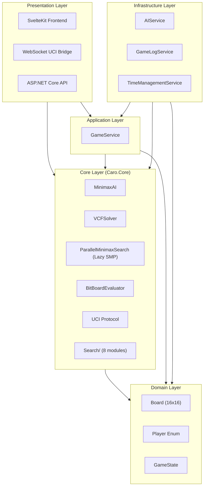

# Caro AI PvP

A full-strength Caro (Gomoku variant) AI, built with .NET 10, SvelteKit 2.49+ with Svelte 5 Runes.

---

## Overview

- **Full-strength AI** - Lazy SMP parallel search at maximum strength
- **UCI Protocol Support** - Standalone engine compatible with UCI chess GUIs
- **Clean Architecture** - Separated Domain, Application, and Infrastructure layers
- **Real-time AI PvP** - WebSocket UCI bridge for engine communication
- **Mobile-first UX** - Ghost stone positioning and haptic feedback
- **Comprehensive automated tests** - Including adversarial concurrency tests

**Testing:**
- Self-play validation with statistical analysis and color-swapping
- Comprehensive test runners with configurable time controls

**Game Rules (Caro/Gomoku variant):**
- 16x16 board (256 intersections)
- Open Rule: Red's second move must be at least 3 intersections away from first
- Win: Exactly 5 in a row (6+ or blocked ends don't count)
- Time Control: 1+0 (Bullet), 3+2 (Blitz), 7+5 (Rapid), 15+10 (Classical)

---

## Features

### AI Engine

Full-strength engine with 100-500x speedup over naive minimax:

| Category | Feature | Description |
|----------|---------|-------------|
| **Search** | Lazy SMP Parallel | Multi-threaded search with TT work sharing |
| | Principal Variation Search | Alpha-beta with null-window searches |
| | Aspiration Windows | Narrowed bounds near root |
| | Quiescence Search | Prevents horizon blunders |
| | Adaptive LMR | Dynamic depth reduction by position factors |
| | VCF Solver | Pre-search for forcing win sequences |
| | Threat Space Search | Tactical move generation |
| **Transposition Table** | Multi-Entry Clusters | 3 entries per bucket, 32-byte aligned |
| | Depth-Age Replacement | Smart entry eviction formula |
| | Evaluation Cache | Static eval stored with entries |
| **Move Ordering** | Staged Picker | TT → Block → Win → Threat → Killer/Counter → Quiet |
| | Hash Move | TT move searched unconditionally first |
| | Must Block | Mandatory defense against opponent's open four |
| | Winning Moves | Creates open four or double threat |
| | Threat Create | Creates open three or broken four |
| | Killer/Counter | Cutoff moves + opponent response patterns |
| | Continuation History | 6-ply move pair scoring |
| | Butterfly History | Long-term move statistics |
| **Evaluation** | BitKey Pattern System | O(1) pattern lookup with bit rotation |
| | Pattern4 Classification | 4-direction combined threat detection |
| **Time Control** | PID Time Management | Control theory for allocation |
| | Structured Logging | Async file-based logging with rotation |

### Game Modes

Three game modes selectable before the first move:

| Mode | Description |
|------|-------------|
| **Player vs Player** | Two humans on the same device |
| **Player vs AI** | Human vs engine (choose which side AI plays) |
| **AI vs AI** | Engine plays both sides (spectator mode) |

### Time Controls

Fisher time controls with increment:

| Control | Initial Time | Increment |
|---------|-------------|-----------|
| Bullet | 1 min | 0 sec |
| Blitz | 3 min | 2 sec |
| Rapid | 7 min | 5 sec |
| Classical | 15 min | 10 sec |

### ELO Rating System

Local ELO rating with persistent leaderboard:

- Default rating: 1500 (K-factor: 32)
- Player registration with name entry
- Top-10 leaderboard with win/loss tracking and win rate
- Ratings persisted in `localStorage`

### UX Features

| Feature | Description |
|---------|-------------|
| **Move History** | Scrollable move log with player highlighting |
| **Undo** | Server-side undo support via `POST /api/game/{id}/undo` |
| **Sound Effects** | Synthesized stone placement (A4/C5 tones) and victory arpeggios via Web Audio API |
| **Sound Toggle** | Mute/unmute button; muted by default (browser autoplay policy) |
| **Haptic Feedback** | Vibration on valid (10ms) and invalid (30-50-30ms) moves |
| **Ghost Stone** | Touch-device positioning preview |
| **Winning Line** | Animated highlight on game-winning five-in-a-row |
| **AI Thinking Indicator** | Spinner displayed while engine computes |
| **Timer Display** | Per-player countdown timers with timeout handling |

### Engine Configuration

The engine runs at full strength with all optimizations enabled:

| Parameter | Value |
|-----------|-------|
| Threads | max(5, (logical_cores / 2) - 1) |
| Time Budget | 100% |
| Search Radius | 7 (15x15 area) |
| Error Rate | 0% |
| Parallel Search | Enabled (Lazy SMP) |
| Pondering | Enabled |
| VCF Solver | Enabled |

- No depth-based logic -- search runs until time expires via iterative deepening
- Depth emerges naturally from hardware capability and time budget
- Pondering provides free precomputation during opponent's turn

### Performance Statistics

See [STATS.md](STATS.md) for performance metrics.

To run your own benchmarks:
```bash
cd backend/src/Caro.UCIMockClient && dotnet run -- --games 4 --time 180 --inc 2
```

### UCI Protocol

Universal Chess Interface (UCI) protocol compatibility for standalone engine usage:

- **Standalone console engine** - Run as separate process like Stockfish
- **Standard UCI commands** - uci, isready, ucinewgame, position, go, stop, quit, setoption
- **Engine options** - Threads, Hash, Ponder
- **WebSocket bridge** - Frontend can connect directly to UCI engine
- **Algebraic notation** - Double-letter coordinates aa-dd (columns), 1-16 (rows)

**Run standalone UCI engine:**
```bash
dotnet run --project backend/src/Caro.UCI
```

**Run UCI Mock Client (engine vs engine testing):**
```bash
cd backend/src/Caro.UCIMockClient && dotnet run -- --games 4 --time 180 --inc 2
```

**Example UCI session:**
```
> uci
< id name Caro AI
< id author Caro AI Project
< option name Threads type spin default auto min 1 max 32
< option name Hash type spin default 256 min 32 max 4096
< option name Ponder type check default true
< uciok
> position startpos moves bd8
> go movetime 2000
< info depth 2 nodes 13524 time 1590 pv ca9
< bestmove ca9
```

### Documentation Guide

| Document | Purpose | When to Read |
|----------|---------|--------------|
| **README.md** (this file) | Project overview, getting started, architecture summary | First - start here |
| **ENGINE_FEATURES.md** | AI engine architecture (search, evaluation, TT, move ordering, source layout) | Understanding how the AI works |
| **backend/tests/README.md** | Test organization and running instructions | Running tests |
| **AGENTS.md** | Development protocols and coding standards | Contributing code |

**Documentation Matrix:**

```
README.md (Entry Point)
    ├── Getting Started → Quick start commands
    ├── Architecture → Clean Architecture diagram
    ├── Features → AI, UCI
    └── Testing → Test projects overview
        │
        └──→ ENGINE_FEATURES.md (Deep Dive)
                ├── Search Architecture → PVS, LMR, Quiescence
                ├── Transposition Table → Clusters, Lockless hashing
                ├── Move Ordering → Stages, History, Killers
                ├── Evaluation → BitKey, Pattern4, Scoring
                └── Time Management → PID controller
```

**Newcomer Onboarding Path:**

1. **Start:** README.md → Getting Started (run the app)
2. **Understand:** Architecture section + Features tables
3. **Deep dive:** ENGINE_FEATURES.md for AI details
4. **Contribute:** AGENTS.md for coding standards

### Test Projects

Separate test projects for focused testing:

```bash
# Unit tests (fast, no integration tests)
cd backend/tests/Caro.Core.Tests && dotnet test

# Integration tests (opt-in, full AI searches - slower)
cd backend/tests/Caro.Core.IntegrationTests && dotnet test
```

| Project | Focus |
|---------|-------|
| Caro.Core.Tests | Unit tests (algorithms, evaluators, immutable state) |
| Caro.Core.IntegrationTests | AI search integration (full depth searches, performance benchmarks, concurrency stress) |
| Caro.Core.Domain.Tests | Entities (Board, Cell, Player, GameState, Position) |
| Caro.Core.Application.Tests | Services, interfaces, DTOs, mappers |
| Caro.Core.Infrastructure.Tests | AI algorithms, external concerns |

**Note:** Run `dotnet test` in Caro.Core.Tests for fast unit test feedback. IntegrationTests are excluded from default test runs (marked as `<IsTestProject>false</IsTestProject>`).

---

## Architecture

Clean Architecture with three core layers:


```mermaid
graph TB
    subgraph Presentation["Presentation Layer"]
        SvelteKit["SvelteKit Frontend"]
        WSUCI["WebSocket UCI Bridge"]
        API["ASP.NET Core API"]
    end

    subgraph Application["Application Layer"]
        GameService["GameService"]
    end

    subgraph Core["Core Layer (Caro.Core)"]
        MinimaxAI["MinimaxAI"]
        VCFSolver["VCFSolver"]
        ParallelSearch["ParallelMinimaxSearch (Lazy SMP)"]
        Evaluator["BitBoardEvaluator"]
        UCIProtocol["UCI Protocol"]
        SearchModule["Search/ (8 modules)"]
    end

    subgraph Domain["Domain Layer"]
        Board["Board (16x16)"]
        Player["Player Enum"]
        GameState["GameState"]
    end

    subgraph Infrastructure["Infrastructure Layer"]
        AIService["AIService"]
        GameLogService["GameLogService"]
        TimeManagementService["TimeManagementService"]
    end

    Presentation --> Application
    Presentation --> Core
    Core --> Domain
    Application --> Core
    Application --> Domain
    Infrastructure --> Core
    Infrastructure --> Application
    Infrastructure --> Domain
```

**Clean Architecture Projects:**

| Project | Purpose | Dependencies |
|---------|---------|--------------|
| `Caro.Core.Domain` | Core entities, value objects | None |
| `Caro.Core.Application` | Interfaces, application services | Domain, Core |
| `Caro.Core` | Game logic, AI engine, UCI protocol | Domain |
| `Caro.Core.Infrastructure` | Service implementations, external concerns | Domain, Application, Core |

**Immutable Domain Model:**

All domain entities are fully immutable for thread safety:
- `Cell` - `readonly record struct` with `Player` property
- `GameState` - `sealed record` with `ImmutableStack<Board>` for undo history
- `Board` - Immutable via `PlaceStone()` returning new instances
- Operations return new state: `WithMove()`, `WithGameOver()`, `UndoMove()`

**Infrastructure Projects:**

| Project | Purpose |
|---------|---------|
| `Caro.Api` | Web API, WebSocket UCI bridge |
| `Caro.UCI` | Standalone UCI console engine |
| `Caro.UCIMockClient` | UCI protocol testing tool (engine vs engine) |

### Component Flow

**Move Request Flow:**
1. Frontend sends move via REST API → GameService
2. GameService calls `MinimaxAI.GetBestMove()`
3. Parallel search spawns N threads (based on logical core count)
4. Master thread selects best result, helpers explore with TT sharing

**Transposition Table Sharding:**
- 16 segments with independent hash-based distribution
- `shardIndex = (hash >> 32) & shardMask`
- Reduces cache coherency traffic for parallel threads

**Uniform TT Write Policy:**
- All threads (master and helpers) share identical write logic
- Depth-age replacement strategy handles entry quality naturally
- Helper threads populate TT from different tree regions for master to reuse

### Key Architectural Decisions

**Search-Based Threat Handling:**
- Threat blocks added to candidate list, not returned immediately
- Search evaluates offensive vs defensive options together
- Maintains strategic initiative instead of reactive blocking
- Prevents "strength inversion" (weaker AI exploiting predictable behavior)

**Ponder Hit Handling:**
- MinimaxAI supports pondering internally (enabled by default)
- `AIService.StartPonderingAsync` wires through to MinimaxAI's pondering subsystem
- `HasPonderHitResult` checks for valid hit before new search
- TT shared between ponder and main search for efficiency

**Detailed Technical Documentation:** See `ENGINE_FEATURES.md` for comprehensive coverage of search algorithms, transposition tables, move ordering, evaluation, and time management.

---

## Concurrency

Production-grade concurrency following .NET 10 best practices:

| Pattern | Purpose |
|---------|---------|
| Channel-based queues | No fire-and-forget exceptions |
| Per-game locks | 100+ concurrent games |
| CancellationTokenSource | Coordinated search cancellation |
| TT sharding (16 segments) | Reduced cache contention |
| Publisher-Subscriber | AI telemetry without callbacks |

**Testing:** 29 adversarial concurrency tests in Caro.Core.IntegrationTests validate thread-safety under high contention.

---

## Performance

| Parameter | Value |
|-----------|-------|
| Threads | max(5, (N/2)-1) where N = logical cores |
| Time Budget | 100% |

**Depth varies by host machine** - calculated dynamically from NPS and time budget. Higher-spec machines achieve greater depth naturally.

---

## Tech Stack

**Frontend:** SvelteKit 2.49+ with Svelte 5 Runes, TypeScript 5.9, TailwindCSS 4.1, Vitest 4.0, Playwright 1.57

**Backend:** .NET 10, ASP.NET Core 10, System.Threading.Channels, SQLite + FTS5, xUnit 2.9.2 with xUnit Runner 3.1.4, Moq 4.20.72, FluentAssertions 7.0.0-8.8.0

**AI:** Custom Minimax, alpha-beta pruning, Zobrist hashing, BitBoard, VCF pre-search solver, Lazy SMP, Hash Move-first ordering. Search code decomposed into `GameLogic/Search/` modules with centralized constants in `Configuration/`.

**Config:** Backend constants in `Caro.Core.Domain/Configuration/` (7 files). Frontend config in `src/lib/config/` (api, audio, e2e, game, haptic, rating, uci, ui).

---

## Testing

| Project | Focus |
|---------|-------|
| Caro.Core.Tests | Unit tests (algorithms, evaluators, immutable state, test helpers, AI improvements, symmetry) |
| Caro.Core.IntegrationTests | AI search integration (full depth searches, performance benchmarks, 29 concurrency stress tests) |
| Caro.Core.Domain.Tests | Entities (Board, Cell, Player, GameState, Position) |
| Caro.Core.Application.Tests | Services, interfaces, DTOs, Mappers |
| Caro.Core.Infrastructure.Tests | AI algorithms, external concerns |
| Frontend Unit (Vitest) | Store logic, utility functions, game types |
| Frontend E2E (Playwright) | End-to-end gameplay |

### Frontend E2E Tests

Playwright end-to-end tests covering core gameplay mechanics:

- Basic Mechanics (move placement, open rule)
- Sound Effects (valid/invalid moves)
- Move History (tracking, display)
- Winning Line Animation
- Timer Functionality (Fisher time control)
- Regression Tests (edge cases)

Run E2E tests:
```bash
cd frontend && npm run test:e2e
```

---

## Getting Started

```bash
# Clone
git clone https://github.com/lavantien/caro-ai-pvp.git
cd caro-ai-pvp

# Backend
cd backend && dotnet restore && dotnet build
cd src/Caro.Api && dotnet run

# Frontend (new terminal)
cd frontend && npm install
npm run dev
```

Backend: http://localhost:5207 | Frontend: http://localhost:5173

---

## Roadmap

| Feature | Description | Status |
|---------|-------------|--------|
| SignalR Real-Time Multiplayer | Live game synchronization between human players via SignalR hub | Planned |

---

## License

MIT

---

Built with SvelteKit + .NET 10
