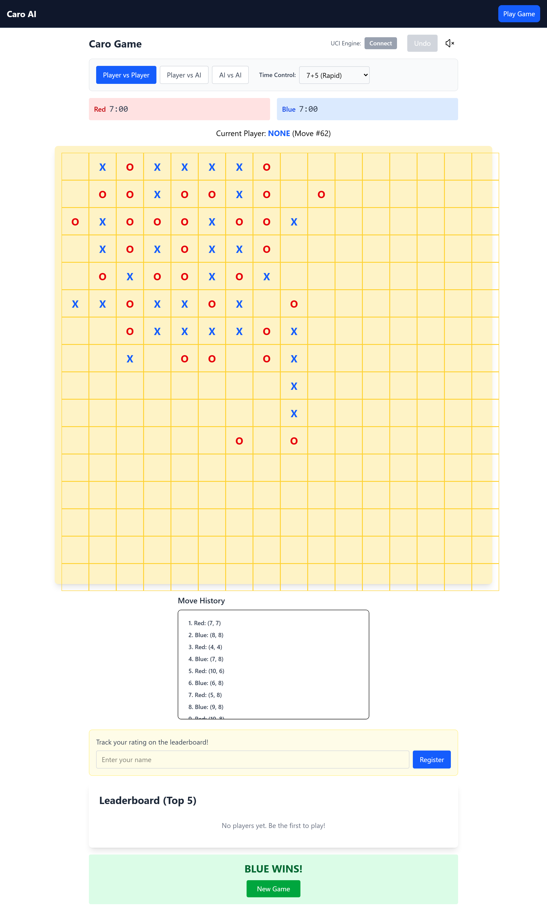
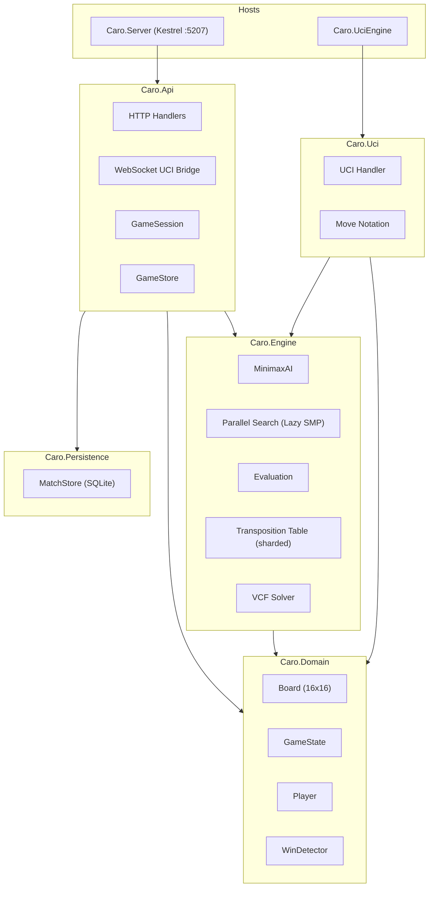

# Caro AI PvP

**Test Coverage:**


A full-strength Caro (Gomoku variant) AI, built with C# 14 / .NET 10, SvelteKit 2.49+ with Svelte 5 Runes.

Features hardware-agnostic difficulty levels (L1 Novice through L5 Grandmaster) for balanced play across machines.




---

## Overview

- **Full-strength AI** - Lazy SMP parallel search at maximum strength
- **UCI Protocol Support** - Standalone engine compatible with UCI chess GUIs
- **.NET solution architecture** - Project-per-concern layout (`Caro.Domain` through `Caro.Server`) with enforced dependency flow
- **Real-time AI PvP** - WebSocket UCI bridge for engine communication
- **Mobile-first UX** - Responsive board, compact timer strips, ghost stone positioning and haptic feedback
- **Comprehensive automated tests** - Including adversarial concurrency tests

**Testing:**
- Self-play validation with seeded opening randomization, color-swapping, per-color and per-reason breakdowns, and 95% Wilson score intervals
- Time controls are enforced: games can be lost on the clock

**Game Rules (Caro/Gomoku variant):**
- 16x16 board (256 intersections)
- Open Rule: Red's second move must be at least 3 intersections away from first
- Win: Exactly 5 in a row (6+ or blocked ends don't count)
- Time Control: 1+0, 3+0, 3+2, 7+5, 10+0, 15+10; running out of clock loses the game

---

## Features

### AI Engine

| Category | Feature | Description |
|----------|---------|-------------|
| **Search** | Lazy SMP Parallel | Long-running worker tasks with per-search dispatch |
| | Principal Variation Search | Alpha-beta with null-window searches |
| | Aspiration Windows | Narrowed bounds near root |
| | Quiescence Search | Four-forcing extensions only (threes are not forcing) |
| | Adaptive LMR | Dynamic depth reduction by position factors |
| | VCF Solver | Pre-search for forcing win sequences (20% of allocated time) |
| **Transposition Table** | Sharded locks | 16 segments with per-shard `ReaderWriterLockSlim` |
| | Depth-Age Replacement | Smart entry eviction formula |
| **Move Ordering** | Staged Picker | TT -> Win -> Block -> Threat -> Killer/Counter -> Quiet |
| | Hash Move | TT move searched unconditionally first |
| | Must Block | Mandatory defense against opponent's five-completions |
| | Winning Moves | Creates open four or double threat |
| | Threat Create | Creates open three or broken four |
| | Killer/Counter | Cutoff moves + opponent response patterns |
| | Continuation History | Previous-move pair scoring |
| | Butterfly History | Long-term move statistics |
| **Evaluation** | Gap-Aware Patterns | 11-cell line windows classify split fours (.XX.XX.) and broken threes like their straight equivalents |
| **Time Control** | Phase-Aware Allocation | Divisor-based budget with clock safety floors |
| | Flag Adjudication | Server-side loss on time |
| | Structured Logging | log/slog with async file-based rotation |

### Game Modes

Three game modes selectable before the first move:

| Mode | Description |
|------|-------------|
| **Player vs Player** | Two humans on the same device |
| **Player vs AI** | Human vs engine (choose which side AI plays) |
| **AI vs AI** | Engine plays both sides (spectator mode) |

### Time Controls

Fisher time controls with increment:

| Control | Initial Time | Increment |
|---------|-------------|-----------|
| Bullet | 1 min | 0 sec |
| Blitz | 3 min | 0 sec |
| Blitz | 3 min | 2 sec |
| Rapid | 7 min | 5 sec |
| Rapid | 10 min | 0 sec |
| Classical | 15 min | 10 sec |

### UX Features

| Feature | Description |
|---------|-------------|
| **Board Coordinates** | Column labels (a-p) and row numbers (1-16) around the board edges |
| **Move Notation** | Horizontal scrolling algebraic notation (e.g. 1.i9 2.h8) |
| **Open Rule Highlight** | Dimmed overlay on invalid cells during Red's 2nd move (Chebyshev distance < 3) |
| **Bot Difficulty Labels** | AI level shown in timer strips (e.g. "AI (Grandmaster)") |
| **Undo** | Server-side undo support via `POST /api/games/{id}/undo` |
| **Game Cleanup** | Explicit `DELETE /api/games/{id}` + 5-min cleanup sweep of finished games + 30-min abandoned-game timeout + max 4 concurrent games |
| **Sound Effects** | Synthesized stone placement (A4/C5 tones) and victory arpeggios via Web Audio API |
| **Sound Toggle** | Mute/unmute button in nav bar; muted by default (browser autoplay policy) |
| **Haptic Feedback** | Vibration on valid (10ms) and invalid (30-50-30ms) moves |
| **Ghost Stone** | Touch-device positioning preview |
| **Winning Line** | Animated highlight on game-winning five-in-a-row |
| **AI Thinking Indicator** | Spinner displayed while engine computes |
| **Timer Strips** | Compact per-player countdown strips above and below board |
| **Game Settings** | Collapsible settings panel (mode, time control, AI side, difficulty) |
| **Game Result Banner** | Top slide-down banner announcing winner, board stays visible |

### Engine Configuration

The engine supports 5 difficulty levels. Levels are strength-based first (depth caps, solver and parallel gating) with the time fraction as a secondary cap, so L(k) is stronger than L(k-1) on any host:

| Level | Name | Depth Cap | Time Budget | Threads | VCF Solver | Pondering | TT Size |
|-------|------|-----------|-------------|------------|------------|-----------|---------|
| 1 | Novice | 2 | 5% | 1 | No | No | 64MB |
| 2 | Beginner | 4 | 15% | 1 | No | No | 64MB |
| 3 | Intermediate | 6 | 40% | 2 | Yes | No | 256MB |
| 4 | Advanced | 10 | 70% | Pow2((N-2)/2)/2 | Yes | No | 1GB |
| 5 | Grandmaster | 50 | 100% | Pow2((N-2)/2) | Yes | Yes | 1GB |

- Depth caps make level differences strength differences, not clock-management differences
- VCF solver and parallel search unlock at higher levels
- Pondering (searching on the opponent's clock) is L5-only
- Per-player difficulty: red and blue can play at different levels independently
- Level 5 = full-strength engine with all optimizations
- Thread count for L4 is half of L5 (next power of 2 down)

### Performance Statistics

See [STATS.md](STATS.md) for performance metrics.

To run your own benchmarks:
```bash
node scripts/run-tournament.mjs --games 4 --red 5 --blue 5 --tc 3+2
```

### UCI Protocol

Universal Chess Interface (UCI) protocol compatibility for standalone engine usage:

- **Standalone console engine** - Run as separate process like Stockfish
- **Standard UCI commands** - uci, isready, ucinewgame, position, go, stop, quit, setoption
- **Engine options** - Threads, Hash, Skill Level (mapped to the difficulty profiles)
- **Non-blocking search** - `stop` interrupts the running search and `bestmove` follows immediately
- **WebSocket bridge** - Frontend can connect directly to UCI engine
- **Double-letter notation** - UCI engine format: two-character coordinates (a-p for row and column, e.g., bd = row 1, col 3)
- **Display notation** - Frontend move history uses simple algebraic (column a-p + row 1-16, e.g., i9)

**Run standalone UCI engine:**
```bash
dotnet run --project backend/src/Caro.UciEngine
```

**Example UCI session:**
```
> uci
< id name Caro AI
< id author Caro AI Project
< option name Threads type spin default 4 min 1 max 64
< option name Hash type spin default 256 min 32 max 4096
< option name Skill Level type spin default 5 min 1 max 5
< uciok
> position startpos moves ii
> go movetime 2000
< bestmove hi
```

### Documentation Guide

| Document | Purpose | When to Read |
|----------|---------|--------------|
| **README.md** (this file) | Project overview, getting started, architecture summary | First - start here |
| **ENGINE_FEATURES.md** | AI engine architecture (search, evaluation, TT, move ordering, source layout) | Understanding how the AI works |
| **CSHARP_ONBOARDING.md** | C# 14 / .NET 10 idioms, project conventions, testing patterns | Contributing code |
| **GO_ONBOARDING.md** | Archived onboarding guide for the Go 1.26 era | Historical reference |

**Documentation Matrix:**

```
README.md (Entry Point)
    |-- Getting Started -> Quick start commands
    |-- Architecture -> Package layout diagram
    |-- Features -> AI, UCI
    +-- Testing -> Test packages overview
        |
        +--> ENGINE_FEATURES.md (Deep Dive)
        |       |-- Search Architecture -> PVS, LMR, Quiescence
        |       |-- Transposition Table -> Shards, RWMutex
        |       |-- Move Ordering -> Stages, History, Killers
        |       |-- Evaluation -> Line windows, Pattern4, Scoring
        |       +-- Time Management -> Phase-aware allocation
        |
        +--> CSHARP_ONBOARDING.md (Contributing)
                |-- C# 14 Features -> primary constructors, records, spans
                |-- Project Structure -> src/ projects
                |-- Testing Patterns -> xUnit, Theory data, in-test server
                +-- Concurrency -> tasks, locks, cancellation tokens
```

**Newcomer Onboarding Path:**

1. **Start:** README.md -> Getting Started (run the app)
2. **Understand:** Architecture section + Features tables
3. **Deep dive:** ENGINE_FEATURES.md for AI details
4. **Contribute:** CSHARP_ONBOARDING.md for coding standards

### Test Packages

```bash
# All tests
cd backend && dotnet test Caro.sln

# Specific projects
dotnet test tests/Caro.Domain.Tests
dotnet test tests/Caro.Engine.Tests
dotnet test tests/Caro.Api.Tests
```

| Project | Focus |
|---------|-------|
| Caro.Domain.Tests | Domain entities (Board, GameState, Player, Position, WinDetector) |
| Caro.Engine.Tests | AI search, evaluation, TT, VCF, move ordering, concurrency stress |
| Caro.Uci.Tests | UCI command parsing, notation conversion |
| Caro.Api.Tests | HTTP handlers, WebSocket wiring, session management |
| Caro.Persistence.Tests | Structured match persistence (SQLite) |

---

## Architecture

.NET solution layout with clear dependency flow:


```mermaid
graph TB
    subgraph Hosts["Hosts"]
        Server["Caro.Server (Kestrel :5207)"]
        EngineCli["Caro.UciEngine"]
    end

    subgraph API["Caro.Api"]
        Handlers["HTTP Handlers"]
        WebSocket["WebSocket UCI Bridge"]
        Session["GameSession"]
        Store["GameStore"]
    end

    subgraph EnginePkg["Caro.Engine"]
        Minimax["MinimaxAI"]
        Search["Parallel Search (Lazy SMP)"]
        Evaluator["Evaluation"]
        TT["Transposition Table (sharded)"]
        VCF["VCF Solver"]
    end

    subgraph DomainPkg["Caro.Domain"]
        Board["Board (16x16)"]
        Game["GameState"]
        Player["Player"]
        Win["WinDetector"]
    end

    subgraph UCIPkg["Caro.Uci"]
        UCIHandler["UCI Handler"]
        Notation["Move Notation"]
    end

    subgraph PersistencePkg["Caro.Persistence"]
        MatchStore["MatchStore (SQLite)"]
    end

    Server --> API
    EngineCli --> UCIPkg
    API --> EnginePkg
    API --> DomainPkg
    EnginePkg --> DomainPkg
    UCIPkg --> EnginePkg
    UCIPkg --> DomainPkg
    API --> PersistencePkg
```

**Project Dependencies:**

| Project | Purpose | Dependencies |
|---------|---------|--------------|
| `Caro.Domain` | Core entities, value objects, game rules | None |
| `Caro.Engine` | AI engine, search, evaluation, TT | Domain |
| `Caro.Uci` | UCI protocol handler | Engine, Domain |
| `Caro.Api` | HTTP/WebSocket API, game sessions | Engine, Domain, Uci, Persistence |
| `Caro.Persistence` | Structured match persistence (SQLite) | Microsoft.Data.Sqlite only |

**Immutable Domain Model:**

All domain entities are immutable for thread safety:
- `Cell` - readonly record struct with `Player` field
- `GameState` - immutable class with array-based undo history; all methods return new instances
- `Board` - Immutable via `PlaceStone()` returning new instances with O(1) bitboard/hash update
- Operations return new state: `WithMove()`, `WithGameOver()`, `UndoMove()`

### Component Flow

**Move Request Flow:**
1. Frontend sends move via REST API -> GameSession
2. GameSession extracts immutable board snapshot under its lock
3. MinimaxAI.GetBestMove() runs outside the lock with a CancellationToken
4. Parallel search dispatches to long-running worker tasks (all-equal workers)
5. Best result selected by deepest completed depth; ties broken by score

### Key Architectural Decisions

**Search-Based Threat Handling:**
- Threat blocks added to candidate list, not returned immediately
- Search evaluates offensive vs defensive options together
- Maintains strategic initiative instead of reactive blocking
- Prevents "strength inversion" (weaker AI exploiting predictable behavior)

**Pondering (L5):**
- Grandmaster bots predict the opponent's reply from their own search and
  ponder it in the background during the opponent's turn
- The pondered move is never played directly: every move comes from a full
  budgeted search over the TT the ponder warmed, so pondering adds depth
  without trading search quality for time
- Hits are recorded for stats (`[PONDER]` statline tag,
  `ponder_depth`/`ponder_nodes` columns)
- The ponder window is capped by the opponent's remaining clock, so it
  scales with the time control; `CARO_DISABLE_PONDER=1` disables pondering
  process-wide

**Per-Player AI Isolation:**
- Each player in a game gets its own MinimaxAI instance
- Separate TT, heuristics, VCF solver, and worker set per AI
- Zero state sharing between red and blue AI instances
- Ensures no cross-contamination in AI vs AI matches

**Detailed Technical Documentation:** See `ENGINE_FEATURES.md` for comprehensive coverage of search algorithms, transposition tables, move ordering, evaluation, and time management.

---

## Concurrency

Concurrency patterns (C#):

| Pattern | Purpose |
|---------|---------|
| Long-running worker tasks | Per-search dispatch with `ConcurrentBag` result collection |
| Per-game lock | Up to 4 concurrent games, independently locked |
| CancellationToken propagation | HTTP request cancellation reaches AI search |
| Sharded TT (16 segments) | Parallel transposition table access under `ReaderWriterLockSlim` |
| Interlocked counters | Node and TT statistics without locks |

**Testing:** Adversarial concurrency tests in Caro.Engine.Tests validate thread-safety under high contention.

---

## Performance

| Parameter | Value |
|-----------|-------|
| Threads | Largest power of 2 <= (ProcessorCount-2)/2 for L5 |
| Time Budget | 100% (L5), scales down per difficulty level |
| GC | Server GC |
| Heap Limit | 2GB hard limit (runtimeconfig) |

Depth varies by host machine -- calculated dynamically from NPS and time budget. Higher-spec machines achieve greater depth naturally.

---

## Tech Stack

**Frontend:** SvelteKit 2.49+ with Svelte 5 Runes, TypeScript 5.9, TailwindCSS 4.1, Vitest 4.0, Playwright 1.57

**Backend:** C# 14 / .NET 10, ASP.NET Core minimal APIs on Kestrel, ASP.NET Core WebSockets, Microsoft.Extensions.Logging, Microsoft.Data.Sqlite

**AI:** Custom minimax, alpha-beta pruning, Zobrist hashing, BitBoard, VCF pre-search solver, Lazy SMP with long-running worker tasks, Hash Move-first ordering.

**Persistence:** SQLite via Microsoft.Data.Sqlite (pure managed, no native dependencies)

**Config:** Backend configuration in `Caro.Domain/Constants.cs` and `Caro.Engine/Difficulty.cs`. Frontend config in `src/lib/config/` (api, audio, e2e, game, haptic, rating, uci, ui).

---

## Testing

| Project | Focus |
|---------|-------|
| Caro.Domain.Tests | Domain entities, value objects, win detection, Zobrist hashing |
| Caro.Engine.Tests | AI search integration, evaluation, TT, VCF, move ordering, concurrency stress |
| Caro.Uci.Tests | UCI command parsing, move notation conversion |
| Caro.Api.Tests | HTTP handlers, WebSocket wiring, session management |
| Caro.Persistence.Tests | Structured match persistence (SQLite) |
| Frontend Unit (Vitest) | Store logic, utility functions, game types |
| Frontend E2E (Playwright) | End-to-end gameplay |

### Frontend E2E Tests

Playwright end-to-end tests covering core gameplay mechanics:

- Basic Mechanics (move placement, open rule)
- Sound Effects (valid/invalid moves)
- Move History (tracking, display)
- Winning Line Animation
- Timer Functionality (Fisher time control)
- Regression Tests (edge cases)

Run E2E tests:
```bash
cd frontend && npm run test:e2e
```

---

## Getting Started

```bash
# Clone
git clone https://github.com/lavantien/caro-ai-pvp.git
cd caro-ai-pvp

# Backend
dotnet run --project backend/src/Caro.Server

# Frontend (new terminal)
cd frontend && npm install
npm run dev
```

Backend: http://localhost:5207 | Frontend: http://localhost:5173

### Scripts

| Script | Purpose |
|--------|---------|
| `node scripts/dev.mjs` | Boot backend + frontend, open browser |
| `node scripts/capture-screenshot.mjs` | Full E2E: AI vs AI match, screenshot, update README |
| `node scripts/simulate-match.mjs` | AI vs AI match via HTTP API with per-player difficulty (`--red N --blue N`) |
| `node scripts/run-tournament.mjs` | Self-contained N-game tournament with color swap and aggregate stats (`--games N --red N --blue N --tc TIME`) |

### Coverage

```bash
make coverage           # Run both backend and frontend coverage, update badges
make backend-coverage   # Backend only (dotnet test + coverlet)
make frontend-coverage  # Frontend only (Vitest v8 coverage)
```

---

## Roadmap

| Feature | Description | Status |
|---------|-------------|--------|
| WebSocket Real-Time Multiplayer | Live game synchronization between human players via WebSocket | Planned |

---

## License

MIT

---

Built with SvelteKit + C# 14 / .NET 10
