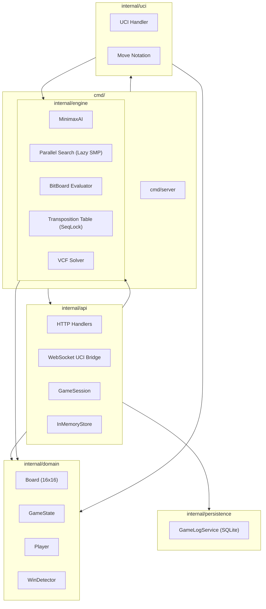

# Caro AI PvP

A full-strength Caro (Gomoku variant) AI, built with Go 1.26, SvelteKit 2.49+ with Svelte 5 Runes.

Features hardware-agnostic difficulty levels (L1 Novice through L5 Grandmaster) for balanced play across machines.


---

## Overview

- **Full-strength AI** - Lazy SMP parallel search at maximum strength
- **UCI Protocol Support** - Standalone engine compatible with UCI chess GUIs
- **Go-idiomatic Architecture** - `internal/` package layout with clear separation of concerns
- **Real-time AI PvP** - WebSocket UCI bridge for engine communication
- **Mobile-first UX** - Responsive board, compact timer strips, ghost stone positioning and haptic feedback
- **Comprehensive automated tests** - Including adversarial concurrency tests

**Testing:**
- Self-play validation with statistical analysis and color-swapping
- Comprehensive test runners with configurable time controls

**Game Rules (Caro/Gomoku variant):**
- 16x16 board (256 intersections)
- Open Rule: Red's second move must be at least 3 intersections away from first
- Win: Exactly 5 in a row (6+ or blocked ends don't count)
- Time Control: 1+0 (Bullet), 3+2 (Blitz), 7+5 (Rapid), 15+10 (Classical)

---

## Features

### AI Engine

Full-strength engine with 100-500x speedup over naive minimax:

| Category | Feature | Description |
|----------|---------|-------------|
| **Search** | Lazy SMP Parallel | Channel-based goroutine pool with per-search dispatch |
| | Principal Variation Search | Alpha-beta with null-window searches |
| | Aspiration Windows | Narrowed bounds near root |
| | Quiescence Search | Prevents horizon blunders |
| | Adaptive LMR | Dynamic depth reduction by position factors |
| | VCF Solver | Pre-search for forcing win sequences (20% of allocated time) |
| | Threat Space Search | Tactical move generation |
| **Transposition Table** | Sharded SeqLock | 16 segments with atomic version counters |
| | Depth-Age Replacement | Smart entry eviction formula |
| | Evaluation Cache | Static eval stored with entries |
| **Move Ordering** | Staged Picker | TT -> Block -> Win -> Threat -> Killer/Counter -> Quiet |
| | Hash Move | TT move searched unconditionally first |
| | Must Block | Mandatory defense against opponent's open four |
| | Winning Moves | Creates open four or double threat |
| | Threat Create | Creates open three or broken four |
| | Killer/Counter | Cutoff moves + opponent response patterns |
| | Continuation History | 6-ply move pair scoring |
| | Butterfly History | Long-term move statistics |
| **Evaluation** | BitKey Pattern System | O(1) pattern lookup with bit rotation |
| | Pattern4 Classification | 4-direction combined threat detection |
| | SIMD Evaluation | Vectorized pattern detection via experimental simd/archsimd |
| **Time Control** | PID Time Management | Control theory for allocation |
| | Structured Logging | log/slog with async file-based rotation |

### Game Modes

Three game modes selectable before the first move:

| Mode | Description |
|------|-------------|
| **Player vs Player** | Two humans on the same device |
| **Player vs AI** | Human vs engine (choose which side AI plays) |
| **AI vs AI** | Engine plays both sides (spectator mode) |

### Time Controls

Fisher time controls with increment:

| Control | Initial Time | Increment |
|---------|-------------|-----------|
| Bullet | 1 min | 0 sec |
| Blitz | 3 min | 2 sec |
| Rapid | 7 min | 5 sec |
| Classical | 15 min | 10 sec |

### UX Features

| Feature | Description |
|---------|-------------|
| **Board Coordinates** | Column labels (a-p) and row numbers (1-16) around the board edges |
| **Move Notation** | Horizontal scrolling algebraic notation (e.g. 1.i9 2.h8) |
| **Open Rule Highlight** | Dimmed overlay on invalid cells during Red's 2nd move (Chebyshev distance < 3) |
| **Bot Difficulty Labels** | AI level shown in timer strips (e.g. "AI (Grandmaster)") |
| **Undo** | Server-side undo support via `POST /api/games/{id}/undo` |
| **Game Cleanup** | Explicit `DELETE /api/games/{id}` + automatic 5-min eviction + 30-min abandoned timeout + max 4 concurrent games |
| **Sound Effects** | Synthesized stone placement (A4/C5 tones) and victory arpeggios via Web Audio API |
| **Sound Toggle** | Mute/unmute button in nav bar; muted by default (browser autoplay policy) |
| **Haptic Feedback** | Vibration on valid (10ms) and invalid (30-50-30ms) moves |
| **Ghost Stone** | Touch-device positioning preview |
| **Winning Line** | Animated highlight on game-winning five-in-a-row |
| **AI Thinking Indicator** | Spinner displayed while engine computes |
| **Timer Strips** | Compact per-player countdown strips above and below board |
| **Game Settings** | Collapsible settings panel (mode, time control, AI side, difficulty) |
| **Game Result Banner** | Top slide-down banner announcing winner, board stays visible |

### Engine Configuration

The engine supports 5 difficulty levels, hardware-agnostic via time fraction scaling:

| Level | Name | Time Budget | Goroutines | VCF Solver | Pondering |
|-------|------|-------------|------------|------------|-----------|
| 1 | Novice | 5% | 1 | No | No |
| 2 | Beginner | 15% | 1 | No | No |
| 3 | Intermediate | 40% | 2 | Yes | No |
| 4 | Advanced | 70% | Pow2((N-2)/2)/2 | Yes | No |
| 5 | Grandmaster | 100% | Pow2((N-2)/2) | Yes | Yes |

- Time fraction scales search time (post-PID), making difficulty machine-independent
- VCF solver and parallel search unlock at higher levels
- Per-player difficulty: red and blue can play at different levels independently
- Level 5 = full-strength engine with all optimizations
- Goroutine count for L4 is half of L5 (next power of 2 down)

### Performance Statistics

See [STATS.md](STATS.md) for performance metrics.

To run your own benchmarks:
```bash
node scripts/run-tournament.mjs --games 4 --red 5 --blue 5 --tc 3+2
```

### UCI Protocol

Universal Chess Interface (UCI) protocol compatibility for standalone engine usage:

- **Standalone console engine** - Run as separate process like Stockfish
- **Standard UCI commands** - uci, isready, ucinewgame, position, go, stop, quit, setoption
- **Engine options** - Threads, Hash, Ponder, Skill Level
- **WebSocket bridge** - Frontend can connect directly to UCI engine
- **Double-letter notation** - UCI engine format: two-character coordinates (a-p for row and column, e.g., bd = row 1, col 3)
- **Display notation** - Frontend move history uses simple algebraic (column a-p + row 1-16, e.g., i9)

**Run standalone UCI engine:**
```bash
cd backend && go run ./cmd/engine
```

**Example UCI session:**
```
> uci
< id name Caro AI
< id author Caro AI Project
< option name Threads type spin default 4 min 1 max 64
< option name Hash type spin default 64 min 32 max 4096
< option name Ponder type check default false
< option name Skill Level type spin default 5 min 1 max 5
< uciok
> position startpos moves ii
> go movetime 2000
< bestmove hi
```

### Documentation Guide

| Document | Purpose | When to Read |
|----------|---------|--------------|
| **README.md** (this file) | Project overview, getting started, architecture summary | First - start here |
| **ENGINE_FEATURES.md** | AI engine architecture (search, evaluation, TT, move ordering, source layout) | Understanding how the AI works |
| **GO_ONBOARDING.md** | Go 1.26 idioms, project conventions, testing patterns | Contributing code |
| **AGENTS.md** | Development protocols and coding standards | Contributing code |

**Documentation Matrix:**

```
README.md (Entry Point)
    |-- Getting Started -> Quick start commands
    |-- Architecture -> Package layout diagram
    |-- Features -> AI, UCI
    +-- Testing -> Test packages overview
        |
        +--> ENGINE_FEATURES.md (Deep Dive)
        |       |-- Search Architecture -> PVS, LMR, Quiescence
        |       |-- Transposition Table -> Shards, SeqLock
        |       |-- Move Ordering -> Stages, History, Killers
        |       |-- Evaluation -> BitKey, Pattern4, Scoring
        |       +-- Time Management -> PID controller
        |
        +--> GO_ONBOARDING.md (Contributing)
                |-- Go 1.26 Features -> Green Tea GC, errors.AsType, simd
                |-- Project Structure -> internal/ packages
                |-- Testing Patterns -> testing, testify, race detector
                +-- Concurrency -> goroutines, channels, context
```

**Newcomer Onboarding Path:**

1. **Start:** README.md -> Getting Started (run the app)
2. **Understand:** Architecture section + Features tables
3. **Deep dive:** ENGINE_FEATURES.md for AI details
4. **Contribute:** GO_ONBOARDING.md for coding standards

### Test Packages

```bash
# All tests with race detector
cd backend && CGO_ENABLED=1 go test -tags "sqlite_fts5" -race ./...

# Specific packages
go test ./internal/domain/...
go test ./internal/engine/...
go test ./internal/api/...
```

| Package | Focus |
|---------|-------|
| internal/domain | Domain entities (Board, GameState, Player, Position, WinDetector) |
| internal/engine | AI search, evaluation, TT, VCF, move ordering, concurrency stress |
| internal/uci | UCI command parsing, notation conversion |
| internal/api | HTTP handlers, WebSocket, session management |
| internal/persistence | SQLite game log CRUD |

---

## Architecture

Go-idiomatic package layout with clear dependency flow:


```mermaid
graph TB
    subgraph Commands["cmd/"]
        Server["cmd/server"]
        Engine["cmd/engine"]
    end

    subgraph API["internal/api"]
        Handlers["HTTP Handlers"]
        WebSocket["WebSocket UCI Bridge"]
        Session["GameSession"]
        Store["InMemoryStore"]
    end

    subgraph Engine["internal/engine"]
        Minimax["MinimaxAI"]
        Search["Parallel Search (Lazy SMP)"]
        Evaluator["BitBoard Evaluator"]
        TT["Transposition Table (SeqLock)"]
        VCF["VCF Solver"]
    end

    subgraph Domain["internal/domain"]
        Board["Board (16x16)"]
        Game["GameState"]
        Player["Player"]
        Win["WinDetector"]
    end

    subgraph UCI["internal/uci"]
        UCIHandler["UCI Handler"]
        Notation["Move Notation"]
    end

    subgraph Persistence["internal/persistence"]
        GameLog["GameLogService (SQLite)"]
    end

    Commands --> API
    Commands --> UCI
    API --> Engine
    API --> Domain
    Engine --> Domain
    UCI --> Engine
    UCI --> Domain
    API --> Persistence
```

**Package Dependencies:**

| Package | Purpose | Dependencies |
|---------|---------|--------------|
| `internal/domain` | Core entities, value objects, game rules | None (stdlib only) |
| `internal/engine` | AI engine, search, evaluation, TT | domain |
| `internal/uci` | UCI protocol handler | engine, domain |
| `internal/api` | HTTP/WebSocket API, game sessions | engine, domain, persistence |
| `internal/persistence` | SQLite game log storage | domain |

**Immutable Domain Model:**

All domain entities are immutable for thread safety:
- `Cell` - struct with `Player` field
- `GameState` - struct with slice-based undo history; all methods return new instances
- `Board` - Immutable via `PlaceStone()` returning new instances with O(1) bitboard/hash update
- Operations return new state: `WithMove()`, `WithGameOver()`, `UndoMove()`

### Component Flow

**Move Request Flow:**
1. Frontend sends move via REST API -> GameSession
2. GameSession extracts immutable board snapshot under mutex
3. MinimaxAI.GetBestMove() called outside mutex with context.Context
4. Parallel search dispatches to goroutine pool (channel-based)
5. Master goroutine selects best result, helpers explore with TT sharing

**Transposition Table Sharding:**
- 16 segments with independent hash-based distribution
- `shardIndex = (hash >> 32) & 0xF`
- SeqLock pattern with atomic version counters (no mutexes)
- Reduces cache coherency traffic for parallel goroutines

**TT Write Policy:**
- Master goroutine writes at all depths
- Helper goroutines write only at depth >= 3 (quality filter)
- Depth-age replacement strategy handles entry quality naturally

### Key Architectural Decisions

**Search-Based Threat Handling:**
- Threat blocks added to candidate list, not returned immediately
- Search evaluates offensive vs defensive options together
- Maintains strategic initiative instead of reactive blocking
- Prevents "strength inversion" (weaker AI exploiting predictable behavior)

**Ponder Hit Handling:**
- MinimaxAI supports pondering internally (enabled by default)
- TT shared between ponder and main search (single MinimaxAI instance)
- Context cancellation terminates ponder search cleanly
- GetBestMove checks for ponder hit before starting new search

**Per-Player AI Isolation:**
- Each player in a game gets its own MinimaxAI instance
- Separate TT, heuristics, VCF cache, and goroutine pool per AI
- Zero state sharing between red and blue AI instances
- Ensures no cross-contamination in AI vs AI matches

**Detailed Technical Documentation:** See `ENGINE_FEATURES.md` for comprehensive coverage of search algorithms, transposition tables, move ordering, evaluation, and time management.

---

## Concurrency

Go-native concurrency patterns:

| Pattern | Purpose |
|---------|---------|
| Channel-based worker pool | Per-search goroutine dispatch with result collection |
| Per-game sync.Mutex | Up to 4 concurrent games, independently locked |
| context.Context propagation | HTTP request cancellation reaches AI search |
| Sharded SeqLock TT (16 segments) | Lock-free parallel transposition table access |
| sync.Pool | SearchBoard instance reuse to reduce GC pressure |
| Goroutine leak detection | Debug builds with GOEXPERIMENT=goroutineleakprofile |

**Testing:** Adversarial concurrency tests in internal/engine validate thread-safety under high contention.

---

## Performance

| Parameter | Value |
|-----------|-------|
| Goroutines | Largest power of 2 <= (GOMAXPROCS-2)/2 for L5 |
| Time Budget | 100% (L5), scales down per difficulty level |
| GC | Green Tea GC (Go 1.26 default, 10-40% overhead reduction) |
| Heap Limit | 2GB (debug.SetMemoryLimit) |

Depth varies by host machine -- calculated dynamically from NPS and time budget. Higher-spec machines achieve greater depth naturally.

---

## Tech Stack

**Frontend:** SvelteKit 2.49+ with Svelte 5 Runes, TypeScript 5.9, TailwindCSS 4.1, Vitest 4.0, Playwright 1.57

**Backend:** Go 1.26, net/http (ServeMux with method matching), gorilla/websocket, log/slog, CGO_ENABLED=1 (SQLite), stretchr/testify

**AI:** Custom minimax, alpha-beta pruning, Zobrist hashing, BitBoard, VCF pre-search solver, Lazy SMP with channel-based goroutine pool, Hash Move-first ordering. SIMD evaluation via experimental simd/archsimd.

**Persistence:** SQLite + FTS5 via mattn/go-sqlite3

**Config:** Backend configuration in `internal/domain/constants.go` and `internal/engine/difficulty.go`. Frontend config in `src/lib/config/` (api, audio, e2e, game, haptic, rating, uci, ui).

---

## Testing

| Package | Focus |
|---------|-------|
| internal/domain | Domain entities, value objects, win detection, Zobrist hashing |
| internal/engine | AI search integration, evaluation, TT, VCF, move ordering, concurrency stress |
| internal/uci | UCI command parsing, move notation conversion |
| internal/api | HTTP handlers, WebSocket, session management |
| internal/persistence | SQLite game log CRUD |
| Frontend Unit (Vitest) | Store logic, utility functions, game types |
| Frontend E2E (Playwright) | End-to-end gameplay |

### Frontend E2E Tests

Playwright end-to-end tests covering core gameplay mechanics:

- Basic Mechanics (move placement, open rule)
- Sound Effects (valid/invalid moves)
- Move History (tracking, display)
- Winning Line Animation
- Timer Functionality (Fisher time control)
- Regression Tests (edge cases)

Run E2E tests:
```bash
cd frontend && npm run test:e2e
```

---

## Getting Started

```bash
# Clone
git clone https://github.com/lavantien/caro-ai-pvp.git
cd caro-ai-pvp

# Backend (requires CGO for SQLite)
cd backend && go build ./...
go run ./cmd/server

# Frontend (new terminal)
cd frontend && npm install
npm run dev
```

Backend: http://localhost:5207 | Frontend: http://localhost:5173

### Scripts

| Script | Purpose |
|--------|---------|
| `node scripts/dev.mjs` | Boot backend + frontend, open browser |
| `node scripts/capture-screenshot.mjs` | Full E2E: AI vs AI match, screenshot, update README |
| `node scripts/simulate-match.mjs` | AI vs AI match via HTTP API with per-player difficulty (`--red N --blue N`) |
| `node scripts/run-tournament.mjs` | Self-contained N-game tournament with color swap and aggregate stats (`--games N --red N --blue N --tc TIME`) |

---

## Roadmap

| Feature | Description | Status |
|---------|-------------|--------|
| WebSocket Real-Time Multiplayer | Live game synchronization between human players via WebSocket | Planned |

---

## License

MIT

---

Built with SvelteKit + Go 1.26
