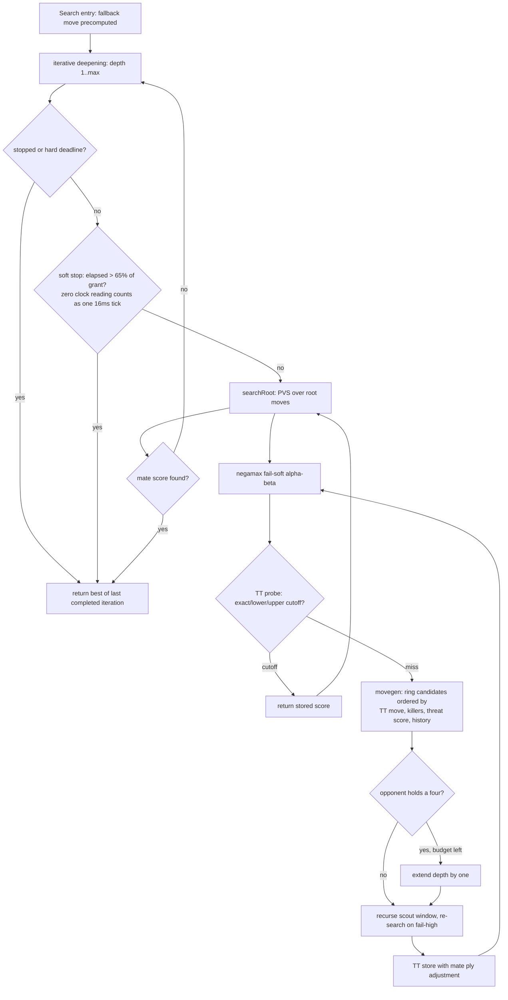
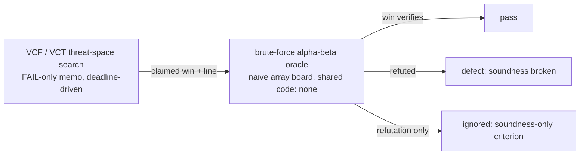
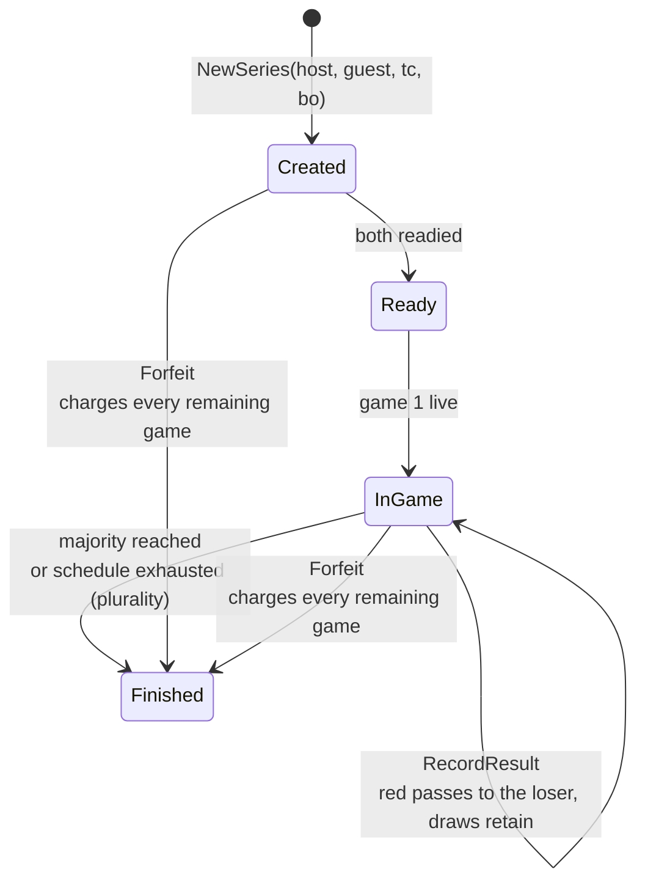
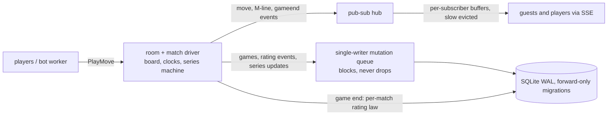

# caro-ai-pvp

[](https://github.com/lavantien/caro-ai-pvp/actions/workflows/ci.yml) [](https://github.com/lavantien/caro-ai-pvp/actions/workflows/ci.yml)

Mobile-first web arena for a custom 16x16 caro variant: exact continuous five wins, overlines never win, both-ends close-blocked lines are dead, and red's second move needs Chebyshev distance >= 3 from the first. Play from a phone browser against a person or an increment-safe bot on server-hosted rooms, watch live rooms as a guest, step through match history with a playback board, and run bot vs bot tournaments on the same room surface with per-move engine telemetry and a decay-scaled rating. The v0.20 behavior contract is scenario 1 in [first-cause.md](first-cause.md).

## contents

1. [grounding](#grounding)
2. [status](#status)
3. [build and verify](#build-and-verify)
4. [repository layout](#repository-layout)
5. [diagrams](#diagrams)
6. [implemented design](#implemented-design)

## grounding

- [first-cause.md](first-cause.md): the founding spec, rules, hardware budget, and v0.20 scenarios.
- [docs/plans/first-cause-rebuild.md](docs/plans/first-cause-rebuild.md): milestone plan for the rebuild, updated as milestones land.
- ref/: offline chessprogramming.org and gomocup grounding, browser-sourced.

## status

- v0.1 (M0..M4): rules core at 100% with zero surviving mutants, init-computed pattern tables, zero-alloc PVS+ID+TT search, lazy SMP tiers, VCF/VCT solvers with a brute-force soundness oracle.
- v0.2 (M5): increment-safe time manager, one tuned PID gain set per time control, soft-stop wiring with the Windows clock-quantum guard, mutation gate green at 1573/1573 over rules+engine+clock with 79 challenge-audited equivalence allowances.
- v0.3 (M6a part 1): server foundation, SQLite WAL store with forward-only self-migration, per-match rating law, series state machine (loser-takes-red, forfeit-as-losses), single-writer mutation queue, room stats pub-sub hub, argon2id login-or-create, zero-alloc M-line emitter.

## build and verify

Requires go 1.27.1+, gcc, GNU make, with CGO enabled.

```
make doctor          # toolchain check: go >= 1.27.1, CGO, gcc
make ci              # fmt-check, vet, build, race tests, coverage gates
make mutate          # in-house mutation gate over the core packages
make mutate-resume LOG=prior-run.log PARALLEL=8 CHALLENGE=1
make bench           # engine, clock, rules benchmarks with allocs
make fuzz            # rules differential fuzz target
```

Coverage gates: 95% overall, 100% on internal/rules, internal/engine, and internal/clock.

## repository layout

```
cmd/caro          entrypoint (ports, firewall)
cmd/covergate     coverage gate over go cover profiles
cmd/mutate        in-house mutation gate (parallel, resume, challenge audit)
internal/config   single constants hub
internal/rules    board, legality, win detection (M1)
internal/pattern  exhaustive line-pattern tables (M2)
internal/engine   search core, SMP tiers (M3)
internal/vcf      VCF/VCT solvers (M4)
internal/clock    increment-safe time manager, per-TC PID (M5)
internal/server   store, auth, series and rating, write queue, rooms (M6a)
playground/       git-tracked R&D ground
```

## diagrams

Search pipeline, one pass per completed iteration. The soft stop is consulted at iteration heads only, and only completed iterations become the answer.


```mermaid
flowchart TD
    A[Search entry: fallback move precomputed] --> B[iterative deepening: depth 1..max]
    B --> C{stopped or hard deadline?}
    C -- yes --> Z[return best of last completed iteration]
    C -- no --> D{soft stop: elapsed > 65% of grant?<br/>zero clock reading counts as one 16ms tick}
    D -- yes --> Z
    D -- no --> E[searchRoot: PVS over root moves]
    E --> F[negamax fail-soft alpha-beta]
    F --> G{TT probe: exact/lower/upper cutoff?}
    G -- cutoff --> H[return stored score]
    G -- miss --> I[movegen: ring candidates ordered by<br/>TT move, killers, threat score, history]
    I --> J{opponent holds a four?}
    J -- yes, budget left --> K[extend depth by one]
    J -- no --> L[recurse scout window, re-search on fail-high]
    K --> L
    L --> M[TT store with mate ply adjustment]
    M --> F
    H --> E
    E --> N{mate score found?}
    N -- yes --> Z
    N -- no --> B
```

Lazy SMP wraps the same pipeline: one persistent locked-thread worker per core, parked between searches, all sharing one lockless direct-mapped transposition table; a worker's proven immediate win halts its siblings through a shared flag folded into their deadline.

Threat-solver soundness harness. The solvers generate only threat moves (fours for VCF, threes and fours for VCT) from the init-computed pattern tables; a test-only brute-force oracle over the independent naive board cross-checks every claimed win, and that fuzz runs in CI permanently.


```mermaid
flowchart LR
    S[VCF / VCT threat-space search<br/>FAIL-only memo, deadline-driven] -- claimed win + line --> O[brute-force alpha-beta oracle<br/>naive array board, shared code: none]
    O -- win verifies --> P[pass]
    O -- refuted --> X[defect: soundness broken]
    O -- refutation only --> Q[ignored: soundness-only criterion]
```

Series state machine inside every room. Host takes red first; the loser of a decisive game takes red next; a draw retains red; quitting books a loss for every remaining game.


```mermaid
stateDiagram-v2
    [*] --> Created: NewSeries(host, guest, tc, bo)
    Created --> Ready: both readied
    Ready --> InGame: game 1 live
    InGame --> InGame: RecordResult<br/>red passes to the loser, draws retain
    InGame --> Finished: majority reached<br/>or schedule exhausted (plurality)
    Created --> Finished: Forfeit<br/>charges every remaining game
    InGame --> Finished: Forfeit<br/>charges every remaining game
```

Room data path. Gameplay never blocks on the disk: moves apply in memory, mutations queue to the single SQLite writer, and telemetry fans out to every subscriber.


```mermaid
flowchart LR
    U[players / bot worker] -- PlayMove --> R[room + match driver<br/>board, clocks, series machine]
    R -- move, M-line, gameend events --> H[pub-sub hub]
    H -- per-subscriber buffers, slow evicted --> G[guests and players via SSE]
    R -- games, rating events, series updates --> W[single-writer mutation queue<br/>blocks, never drops]
    W --> D[(SQLite WAL, forward-only migrations)]
    R -- game end: per-match rating law --> D
```

The tournament conductor diagram lands with M7.

## implemented design

Rules run on bitboards, 4x uint64 per color over 256 cells, with zobrist keys from a splitmix64 stream and an independent naive oracle transcribed from the spec sentence; the differential harnesses swept every 9-cell window per direction in both board regions and the committed fuzz corpus has millions of clean executions. Make and Unmake cost 3.7 ns, win detection on the last move 13.4 ns, zero allocations anywhere in the package.

The pattern tables are computed at process start from the rules package's own win predicate, 4^9 entries per direction in about 52 ms, so the tables cannot drift from the rules; lookups cost 0.26 ns. The threat taxonomy (win-in-1, four, open four, three) is derived mechanically from win-in-1 counts because folk renju patterns do not transfer to exact-5-with-overline-nullified rules.

The engine is fail-soft PVS with iterative deepening, a lockless direct-mapped transposition table with mate-score ply adjustment, killer and history ordering, and a forced-four defense extension; no quiescence, no LMR, no null move, and the hot path allocates nothing (0 B/op searches at 1, 2, and 4 workers). Lazy SMP keeps one persistent locked-thread worker per core parked between searches over the shared table, roughly 5 to 6 Mnps at 4 workers. Tiers are resource-only: easy 1 core with no table and no solvers, medium 2 cores with 256 MiB and VCF, hard 4 cores with 1 GiB and VCF plus VCT. The VCF/VCT solvers search threat moves only, from the pattern tables, and a test-only brute-force alpha-beta oracle over the naive board verifies every claimed win; that soundness fuzz runs in CI permanently.

The time manager grants per-move budgets as feedforward (spendable remainder over expected moves left plus an increment share) steered by one PID gain set per time control against the planned drain trajectory, clamped so the floor always funds a minimum move: a fully drained 1+0 clock still moves forever and a timeout can never decide a game. The soft stop refuses new iterations past 65% of the grant, treating a zero clock reading as one 16 ms Windows tick.

The server persists to embedded SQLite in WAL mode through a single-writer mutation queue (writes block, never drop) behind forward-only startup migrations, hashes passwords with argon2id at 64 MiB and 2 passes with per-user parameters and timing-flat login-or-create, rates every match at +30*K and -30*K with K = 10^((R_loser-R_winner)/D) and D = 3000 on an upset or 500+2.5*R_loser clamped otherwise, and runs each best-of series (bo3/5/7/11 over 1+0, 2+1, 3+2) as an explicit state machine: host takes red first, the loser takes red next, a draw retains red, and quitting books a loss for every remaining game. Bot telemetry rides a room-keyed pub-sub hub as zero-alloc M-lines.

The mutation gate is in-house, go/parser and AST rewrites only: parallel workers over isolated module copies with serial confirmation of every survivor, resume that replays prior kills after host failures, an equivalence allowlist whose every entry is challenge-audited by running the suite under the allowlisted mutant, and a self-pruning unused-entry alarm. Current state: 1573/1573 mutants over rules, engine, and clock with 0 survivors and 79 proven allowances.
