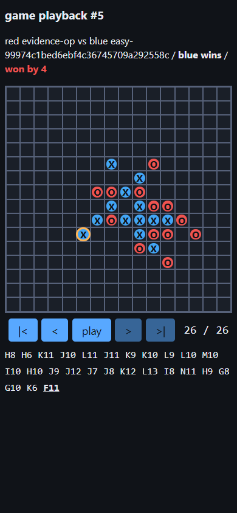

# caro-ai-pvp

[](https://github.com/lavantien/caro-ai-pvp/actions/workflows/ci.yml) [](https://github.com/lavantien/caro-ai-pvp/actions/workflows/ci.yml)

Mobile-first web arena for a custom 16x16 caro variant: exact continuous five wins, overlines never win, both-ends close-blocked lines are dead, and red's second move needs Chebyshev distance >= 3 from the first. Play from a phone browser against a person or an increment-safe bot on server-hosted rooms, watch live rooms as a guest, step through match history with a playback board, and run bot vs bot tournaments on the same room surface with per-move engine telemetry and a decay-scaled rating. The v0.20 behavior contract is scenario 1 in [first-cause.md](first-cause.md).

## contents

1. [grounding](#grounding)
2. [screenshots](#screenshots)
3. [build and verify](#build-and-verify)
4. [repository layout](#repository-layout)
5. [diagrams](#diagrams)
6. [implemented design](#implemented-design)
7. [status](#status)

## grounding

- [first-cause.md](first-cause.md): the founding spec, rules, hardware budget, and v0.20 scenarios.
- [docs/plans/first-cause-rebuild.md](docs/plans/first-cause-rebuild.md): milestone plan for the rebuild, updated as milestones land.
- ref/: offline chessprogramming.org and gomocup grounding, browser-sourced.

## screenshots

The whole app flow as 390px dark mobile captures, primary presentation. Login-or-create (an unknown name registers, the seeded admin row holds its name):


Logged-in home with the rooms grid, the create-room form (time control, best-of, opponent tier from the config hub), and the banner headlining a live tournament while one is driven:


Live room mid-game on the player's side: turn call-out, tabular clocks ticking between syncs, the playable mask dimming everything outside the rules-legal ring on red's second move, the tap ghost, the M-line bot log with depth, nodes, nps, TT hit rate, score and PV, the running move history and the forfeit control:


The retired room renders an honest terminal state:


Match history with per-game score lines and the playback board stepping through a finished bot game:



Tournament setup, admin-only: the config-bounded roster, tiers, time control, best-of, start rating and parallelism, with the run-gate close form for undriven runs:


While the run drives, its page carries a live board per ongoing bot series (mini stones in play order, score from red's side, the card links the room's own page), all public including guests:


The finished run page with the frozen leaderboard:


The mobile pass audited every surface at 390x844: long room-id and bot-name tokens wrap or clamp instead of overflowing, controls hit the 44px touch floor under pointer:coarse, the board offers only the spaces the rules allow, the retired room renders an honest terminal state, and the tournament leaderboard scrolls inside its own wrap.

## build and verify

Requires go 1.27.1+, a C toolchain (gcc or llvm/clang), GNU make, with CGO enabled.

```
make doctor          # toolchain check: go >= 1.27.1, CGO, gcc
make ci              # fmt-check, vet, build, race tests, coverage gates
make mutate          # in-house mutation gate over the core packages
make mutate-resume LOG=prior-run.log PARALLEL=8 CHALLENGE=1
make bench           # engine, clock, rules benchmarks with allocs
make fuzz            # rules differential fuzz target
make diagrams        # render the dark PNG diagrams from the mermaid sources
make logstats          # evidence report over the newest logs/tourny run
make serve             # serve on the configured port, db under db/
```

Coverage gates: 95% overall, 100% on internal/rules, internal/engine, and internal/clock. The working tree keeps its artifacts placed: databases under db/, tournament logs under logs/tourny/, nothing database- or log-shaped in the root.

## repository layout

```
cmd/caro          entrypoint (ports, firewall)
cmd/covergate     coverage gate over go cover profiles
cmd/mutate        in-house mutation gate (parallel, resume, challenge audit)
internal/config   single constants hub
internal/rules    board, legality, win detection (M1)
internal/pattern  exhaustive line-pattern tables (M2)
internal/engine   search core, SMP tiers (M3)
internal/vcf      VCF/VCT solvers (M4)
internal/clock    increment-safe time manager, per-TC PID (M5)
internal/server   store, auth, series and rating, write queue, rooms, htmx ui (M6)
internal/tourney  round robin, conductor, tournament store and logs (M7)
playground/       git-tracked R&D ground
docs/             rebuild plan, diagram sources and renders, screenshots
```

## diagrams

Search pipeline, one pass per completed iteration. The soft stop is consulted at iteration heads only, and only completed iterations become the answer.


Lazy SMP wraps the same pipeline: one persistent locked-thread worker per core, parked between searches, all sharing one lockless direct-mapped transposition table; a worker's proven immediate win halts its siblings through a shared flag folded into their deadline.

Threat-solver soundness harness. The solvers generate only threat moves (fours for VCF, threes and fours for VCT) from the init-computed pattern tables; a test-only brute-force oracle over the independent naive board cross-checks every claimed win, and that fuzz runs in CI permanently.


Series state machine inside every room. Host takes red first; the loser of a decisive game takes red next; a draw retains red; quitting books a loss for every remaining game.


Room data path. Gameplay never blocks on the disk: moves apply in memory, mutations queue to the single SQLite writer, and telemetry fans out to every subscriber.


The tournament conductor. Every series rides the same room surface a human match does; the conductor subscribes before the room can retire, reconciles each finished game against the room's authoritative move list, and fails the whole run on any divergence.


The machine-wide core budget is held by the run gate: one ongoing run at a time, per-run parallelism bounded by the tier cores, and an undriven run (stalled or failed) closed explicitly from its page before another can start. Starting runs and closing them is the seeded admin account's alone; every page, the setup list, the run boards, and the home's live-run banner read public, guest included.

Page surface. The shell and room pages are server-rendered html/template with vendored htmx 4; page routes mount beside the JSON API and win on their patterns, everything else falls to the shell.


The pure client functions (tap-to-preview selection, the M-line UI filter) ship as byte-pinned twins: the same source is pinned between markers in the served JS and asserted byte-equal by Go tests, so the browser and the test suite cannot drift.

## implemented design

Rules run on bitboards, 4x uint64 per color over 256 cells, with zobrist keys from a splitmix64 stream and an independent naive oracle transcribed from the spec sentence; the differential harnesses swept every 9-cell window per direction in both board regions and the committed fuzz corpus has millions of clean executions. Make and Unmake cost 3.7 ns, win detection on the last move 13.4 ns, zero allocations anywhere in the package.

The pattern tables are computed at process start from the rules package's own win predicate, 4^9 entries per direction in about 52 ms, so the tables cannot drift from the rules; lookups cost 0.26 ns. The threat taxonomy (win-in-1, four, open four, three) is derived mechanically from win-in-1 counts because folk renju patterns do not transfer to exact-5-with-overline-nullified rules.

The engine is fail-soft PVS with iterative deepening, a lockless direct-mapped transposition table with mate-score ply adjustment, killer and history ordering, and a selective forced-four defense extension whose nodes expand only cells whose window interaction reaches the four class (own win-in-1 and the opponent's block cells both qualify, so the restriction preserves node value while collapsing the extension storm); no quiescence, no LMR, no null move, and the hot path allocates nothing (0 B/op searches at 1, 2, and 4 workers). A search that completes no iteration answers with the best-ordered candidate, never the enumeration scan order. Lazy SMP keeps one persistent locked-thread worker per core parked between searches over the shared table, roughly 5 to 6 Mnps at 4 workers. Tiers are resource-only: easy 1 core with no table and no solvers, medium 2 cores with 32 MiB and VCF, hard 4 cores with 128 MiB and VCF plus VCT. The VCF/VCT solvers run in front of the tier's standard search, each pass under half the move grant plus a node budget: a proof ends the move on the solver's line tagged [VCF] or [VCT] in the M-line with mate-distance scoring, a miss hands the unspent remainder to the untagged search. Solvers search threat moves only, from the pattern tables, and a test-only brute-force alpha-beta oracle over the naive board verifies every claimed win; that soundness fuzz runs in CI permanently.

The time manager grants per-move budgets as feedforward (spendable remainder over expected moves left plus an increment share) steered by one PID gain set per time control against the planned drain trajectory, clamped so the floor always funds a minimum move: a fully drained 1+0 clock still moves forever and a timeout can never decide a game. The soft stop refuses new iterations past 65% of the grant, treating a zero clock reading as one 16 ms Windows tick.

The server persists to embedded SQLite in WAL mode behind forward-only startup migrations and a single-writer mutation queue (writes block, never drop). One game completion is one transaction: the game row, both rating events, and the series finish commit or roll back together, so the zero-sum rating ledger cannot tear. Passwords hash with argon2id at 64 MiB and 2 passes, per-user parameters, timing-flat login-or-create. Every match rates at +30*K and -30*K with K = 10^((R_loser-R_winner)/D) and D = 3000 on an upset or 500+2.5*R_loser clamped otherwise, applied per match on pre-match ratings, and each best-of series (bo3/5/7/11 over 1+0, 2+1, 3+2) runs as an explicit state machine: host takes red first, the loser takes red next, a draw retains red, and quitting books a loss for every remaining game. Bot engines are ephemeral per game and owned by one worker goroutine each; a forfeit or shutdown racing a search discards the stale answer instead of closing the engine under it. History score lines count the row's players, not stone colors, so red rotation never misattributes a win. Human-vs-bot matches persist through the same unit: each tier seats a reserved, unloginable AI account, every bot move stores its rendered M-line as a game_stats row inside the completion transaction, W-L-D and level count bot games while ratings stay pvp-only with zero rating events on any bot seat, and history and playback open bot games for the human with the bot seat named <difficulty>-<roomid> (schema v5 games.bot_name). The transport is JSON plus SSE with guest observability, subscribe-before-liveness stream setup, and a drain-then-backstop stop path on SIGINT or SIGTERM. Bot telemetry rides the room-keyed pub-sub hub as zero-alloc M-lines.

The mutation gate is in-house, go/parser and AST rewrites only: parallel workers over isolated module copies with serial confirmation of every survivor, resume that replays prior kills after host failures, an equivalence allowlist whose every entry is challenge-audited by running the suite under the allowlisted mutant, and a self-pruning unused-entry alarm. Current state: 1573/1573 mutants over rules, engine, and clock with 0 survivors and 79 proven allowances.

The UI is server-rendered pages over the same session cookie the API mints: the shell (login-or-create, home with stats and the rooms grid, history with move previews) and the room and playback pages mount beside the JSON transport, page patterns winning over the root catch-all. Dark mode is the primary presentation across every page, defined once as a custom-properties palette whose contrast pairs are machine-checked by playground/darkcontrast. A room page rehydrates the whole board server-side so a mid-game reload misses nothing, then lives off the SSE stream (htmx hx-sse first, a plain EventSource taking over when htmx stops reconnecting) with a one-second detail poll as the safety net and a client-side clock tick between syncs. Coarse pointers get a two-tap flow, select then confirm, with a hover ghost for fine pointers. The bot log line is the raw zero-alloc M-line with ebf, hf and fh1 stripped at the page boundary per the spec. Playback reads one finished game row straight from the store, visible only to its two players, and steps by toggling stone visibility only. The two pure client functions are byte-pinned twins asserted from Go.

Tournaments run bot-versus-bot on the exact room surface human matches use: each pairing meets twice with host and guest seats swapped (2 series, 6 games per meet) so every participant holds each color equally, the bot series alternating red after every game rather than the loser-takes-red rotation of human play. Participants register under unique names (easy-1, easy-2, medium-1, medium-2, hard-1, hard-2 on the default roster) and every log line, verdict, and summary names them. Each run owns a timestamped folder logs/tourny/<timestamp>-<label>/ holding the per-series txt logs (every M-line plus one summary line per finished game) and a summary.txt with the final rating table, series won, and W-L-D per participant. The conductor subscribes before the room can retire and writes every game to the schema v3 tournament tables as one transaction. The per-match rating law runs in the tournament's own space from a configurable start rating, standings derive from the game rows so nothing can drift, and the close writes a frozen snapshot. Every finished game is reconciled against the room's own authoritative move list, so a lost or duplicated event anywhere fails the run instead of corrupting a record; a replay validator and the room's terminal verdict act as second and third nets. One run holds the machine at a time: the core budget check plus the ongoing-run gate keep concurrent starts from oversubscribing the engines, and a crashed run is closed explicitly from its page. The first official gates ran clean at 1+0 and 3+2 but on second-unit clocks (see docs/evidence/investigation-2026-10-04.md), so their strength conclusions are void; the corrected-clock gates and the full 2+1 UI tournament are the strength evidence of record.

## status

- v0.1 (M0..M4): rules core at 100% with zero surviving mutants, init-computed pattern tables, zero-alloc PVS+ID+TT search, lazy SMP tiers, VCF/VCT solvers with a brute-force soundness oracle.
- v0.2 (M5): increment-safe time manager, one tuned PID gain set per time control, soft-stop wiring with the Windows clock-quantum guard, mutation gate green at 1573/1573 over rules+engine+clock with 79 challenge-audited equivalence allowances.
- v0.3 (M6a part 1): server foundation, SQLite WAL store with forward-only self-migration, per-match rating law, series state machine (loser-takes-red, forfeit-as-losses), single-writer mutation queue, room stats pub-sub hub, argon2id login-or-create, zero-alloc M-line emitter.
- v0.4 (M6a part 2): full server surface. Rooms with live match driver (human and bot play, per-game engine ephemerality, clock-law budgets, M-line telemetry), JSON + SSE transport with guest observability, serve and migrate commands with drain-then-backstop shutdown, game completion as one transaction per unit (game row, rating pair, series finish), per-player history score lines, schema v2 player indexes, property fuzz for the series and rating laws, blind adversarial pair run with all 10 confirmed findings fixed.
- v0.5 (M6b part 1): htmx 4 shell. Login-or-create page, home with name, rating, W-L-D, level and the live rooms grid (SSE-free partial polling), create-room form driven by the config hub (time controls, best-of lengths, bot tiers), logout, history list with per-game score lines, turn counts, move previews and playback links.
- v0.6 (M6b part 2): room and playback pages over the same rooms and store. Server-rendered 256-cell board with mid-stream reload rehydration, hx-sse push with an EventSource fallback, join button for open human seats, ready and forfeit handshake, tap-to-preview ghost stones on coarse pointers, large tabular clocks ticking client-side between syncs, move history, bot log rendering the spec M-line with ebf, hf and fh1 filtered out, playback board with first, prev, next, last and autoplay stepping. Browser-verified against Implications 1.1, 1.3, 1.4 and 1.5 with isolated contexts per user.
- v0.7 (M7 part 1): tournament core and conductor. Bot-vs-bot rooms on the same surface, twice-pair round robin with the per-match rating law in a separate tournament space, schema v3 tournament tables, per-series txt logs, leaderboard with a frozen close snapshot, headless smoke and full drivers behind caro tourney and make targets, semaphore-bounded parallelism, and a machine-wide run gate. Root-fixed a real concurrency defect: deferred read-then-write SQLite transactions upgrade into BUSY_SNAPSHOT under parallel writers, closed by immediate transactions in the DSN with a 30-parallel regression test.
- v0.8 (M7 part 2): tournament UI and official gates. Setup page (config-bounded roster, tiers, time control, best-of, start rating, parallelism), run page with a live leaderboard on partial polling, past runs, stalled-run close. Official smoke gates green at 1+0 and 3+2 (30 series each, zero-sum exact), the full 2+1 UI tournament settled 30 series and 69 games with the tier ladder holding and no cross-tier strength inversion. Blind adversarial pair: 3 confirmed findings (per-run core budget, an even-length missed-move-prefix hole in the replay net, missing series-seat validation), all fixed red-green.
- v0.9 (M8): release candidate. Screenshots, completed diagram set, bot seat naming unified, fuzz corpora committed. make ci 96.0% overall, core 100%.
- v0.20 (MVP): re-opened. The first cut verified every scenario item of the founding spec, scenario 1 through the browser e2e and scenario 2 through the official gates, but the milestone is a hard filter on physical evidence and the tag will be re-cut when the chain completes. Landed since the reopen: one trace line per finished game in every series log, the conductor dispatch-after-cancel fix, dark PNG diagrams behind make diagrams, per-move stat persistence for player-facing matches (schema v4 game_stats, human-vs-bot series recorded in full with ratings unmoved, reserved unloginable AI accounts seating the bot, history and playback opening bot games), dark mode as the primary web presentation (one custom-properties palette hub, WCAG-checked by playground/darkcontrast), and the series-log evidence analyzer behind make logstats. A formal investigation of the gate logs (docs/evidence/investigation-2026-10-04.md) root-caused the anomalies and closed them: minute-unit time controls (the gates had run on seconds), the selective forced-4 restriction plus best-ordered fallback replacing the extension storm and the A1-scan d=0 drift, tier solver wiring behind the [VCF]/[VCT] tags with medium 32 MiB and hard 128 MiB tables, swap-host-guest meets with named participants under per-run logs/tourny folders with a summary table, and <difficulty>-<roomid> bot naming (schema v5). Landed with the tournament UI close-out: admin-gated tournament creation with the seeded demo credential, public run pages carrying a live board per ongoing bot series, the home live-run banner, the run-gate close form covering failed drives beside stalled ones, horizontal dark diagrams behind make diagrams, and the full app-flow screenshot set recut as 390px dark mobile captures. In flight: corrected-clock evidence runs at all three gates, tag re-cut at the evidence-complete commit.
