# caro-ai-pvp

[](https://github.com/lavantien/caro-ai-pvp/actions/workflows/ci.yml) [](https://github.com/lavantien/caro-ai-pvp/actions/workflows/ci.yml) [](https://github.com/lavantien/caro-ai-pvp/actions/workflows/ci.yml)

Mobile-first web arena for a custom 16x16 caro variant: exact continuous five wins, overlines never win, both-ends close-blocked lines are dead, and red's second move needs Chebyshev distance >= 3 from the first. Play from a phone browser against a person or an increment-safe bot on server-hosted rooms, watch live rooms as a guest, step through match history with a playback board, and run bot vs bot tournaments on the same room surface with per-move engine telemetry and a decay-scaled rating. The behavior contract is scenario 1 in [first-cause.md](first-cause.md).

## contents

1. [variant ruleset](#variant-ruleset)
2. [ui/ux features](#uiux-features)
3. [screenshots](#screenshots)
4. [grounding](#grounding)
5. [build and verify](#build-and-verify)
6. [repository layout](#repository-layout)
7. [diagrams](#diagrams)
8. [implemented design](#implemented-design)
9. [status](#status)
10. [roadmap v0.21 to v0.30](#roadmap-v021-to-v030)

## variant ruleset

The game is a 16x16 freestyle caro variant with four rules on top of place-a-stone, alternate-turns play: exactly five in a row wins, a line of six or more (an overline) never wins, a line close-blocked at both ends by adjacent opponent stones is dead even when it holds five, and red's second move must sit at Chebyshev distance 3 or more from red's first stone. Red moves first, the first legal five ends the game, a full board draws. Matches run as best-of 3, 5, 7, or 11 games over the 1+0, 2+1, 3+2, and 10+5 time controls, with the loser of a decisive game taking red next and a draw retaining red.

Engine tiers are resource-only shapes of one search; this table is the living spec every strength wave rewrites in place.

| tier | threads | tt | vcf | vct | book | ponder |
| --- | --- | --- | --- | --- | --- | --- |
| easy | 1 | none | no | no | - | - |
| medium | 2 | 32 MiB | yes | no | - | - |
| hard | 4 | 128 MiB | yes | yes | - | - |

A series log opens with its pairing bookends and one M-line per bot move, closes each game with its verdict and the series with its tally. Real lines from a 10+5 hard-tier series, with `[BOOK]` and `[PONDER]` illustrative until those spec columns fill:

```
run 1 series 1
pairing hard-1 (hard) vs hard-2 (hard)
tc 10+5 bo3
M1, Red, H8, d=11, n=83.1m, nps=3.69m, ebf=5.2, tt=9%, hf=99%, fh1=90%, s=-300, thr=4, t=22.50, alloc=22.50, pv=H8 H6
M7, Red, F8, d=12, n=79.39m, nps=3.45m, ebf=4.5, tt=10%, hf=98%, fh1=92%, s=+3000, thr=4, t=22.98, alloc=22.98, pv=F8 F5 G8 E8 I8 J8 I7 J6 I6 I5 J7 J4 K3 G4
M15, Red, D8, d=9, n=177.09k, nps=60.67k, ebf=3.8, tt=0%, hf=0%, fh1=0%, s=M9, thr=4, t=2.92, alloc=23.55, [VCT], pv=D8 B10 E8 I8 E5 E9 F5 I5 D5
M31, Red, E9, d=7, n=129, nps=64.54k, ebf=2.0, tt=0%, hf=0%, fh1=0%, s=M7, thr=4, t=0.00, alloc=27.09, [VCF], pv=E9 E12 F10 B10 C7 G11 B6
M37, Red, B6, d=1, n=1, nps=1k, ebf=0.0, tt=0%, hf=0%, fh1=0%, s=M1, thr=4, t=0.00, alloc=36.52, [VCF], pv=B6
M1, Red, H8, d=0, n=0, nps=0, ebf=0.0, tt=0%, hf=0%, fh1=0%, s=+0, thr=4, t=0.00, alloc=22.50, [BOOK], pv=H8
M12, Red, H10, d=16, n=18m, nps=2.8m, ebf=2.0, tt=44%, hf=78%, fh1=91%, s=-25, thr=4, t=0.01, alloc=4.00, [PONDER], pv=H10 I9 J8 K7 J10
game 1: hard-1 (red) beat hard-2 (blue), 37 moves, won by 4
series hard-1 2-1
```

Notation: `d` search depth, `n` nodes, `nps` nodes per second, `ebf` branching factor, `tt` transposition hit rate, `hf` table occupancy, `fh1` first-move fail-high rate, `s` score in thousands from the mover's side or M# for a solver-proven mate in #, `thr` worker threads, `t` actual wall spent on the move, `alloc` the clock's budget draw for the move, `pv` the principal variation. The trailing tag names the producer: empty for a normal search, `[VCF]` and `[VCT]` for threat-solver proofs, `[BOOK]` for an opening-book reply, `[PONDER]` for an answer adopted from a ponder search run on the opponent's clock. A game verdict names the winner with its seats, the move count, and the winning shape (an open four here), and the series line carries the final tally.

Time controls 1+0, 2+1, 3+2, 10+5 each run the same PID-steered budget controller, the first three on bench-tuned gain rows and 10+5 on the 3+2 gains held provisionally: per-move grants spread the spendable remainder over expected moves left plus an increment share, steered against a planned drain trajectory, floored so a drained clock still funds minimum moves and a timeout can never decide a game.

## ui/ux features

The ui/ux table is the living surface inventory, rebuilt against finished engine behavior when the overhaul lands.

| surface | capabilities | access |
| --- | --- | --- |
| login | login-or-create with timing-flat argon2id, seeded demo admin | public |
| home | player stats, live rooms grid, create-room form (time control, best-of, tier), live-run banner | public |
| room | 256-cell live board, rules-legal playable mask, tap ghost, tabular ticking clocks, bot M-line log, move history, ready and forfeit handshake | players; live stream public |
| terminal room | honest terminal state, mid-game reload rehydrates | public |
| history | per-game score lines, turn counts, move previews | signed-in players |
| playback | first, prev, next, last, autoplay stepping through a finished game | the game's two players |
| tournament | admin setup with config-bounded roster, live board per series, frozen leaderboard, stalled-run close | public read, admin drives |
| presentation | dark-first token layer (color ramps, type and space scales, two type voices: human prose and mono machine data), shared card, chip, field and button recipes, amber reserved for live-attention data marks, accent-strong focus rings, 3:1 contrast floor on state-carrying boundaries, reduced-motion respected, 44px touch floor, two-tap select-then-confirm on coarse pointers | all |
| install | PWA manifest with generated icon set, in-shell install action, offline fallback page; the service worker caches the static shell only and never answers api calls, the event stream, or live room and tournament state | all |

## screenshots

The whole app flow as 390px dark mobile captures, primary presentation. The set is staged through playground/shots behind make shots: the production pages over a seeded store and scripted tournament snapshots, with live rooms driven move by move and no search ever running, so captures never contend with the strength gates for the machine. The bot-room M-line log mid-game, the driven-run live boards and the finished leaderboard of a real run refresh at the wave close. Login-or-create (an unknown name registers, the seeded admin row holds its name):

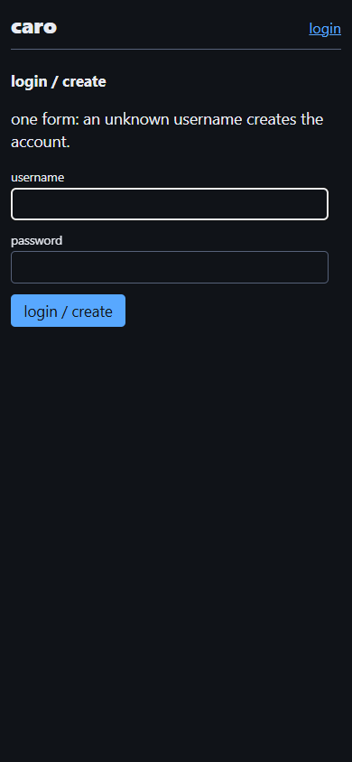

Logged-in home with the rooms grid, the create-room form (time control, best-of, opponent tier from the config hub), and the banner headlining a live tournament while one is driven:

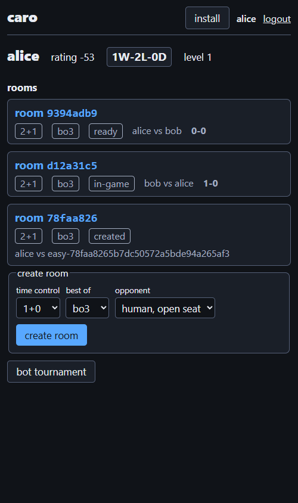

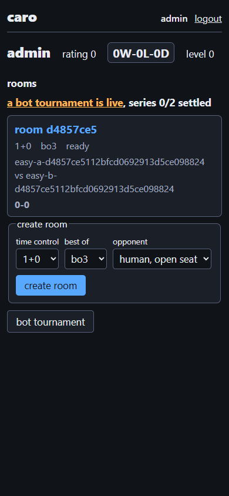

Live room mid-game on the player's side: turn call-out, tabular clocks ticking between syncs, the running move history and the forfeit control:

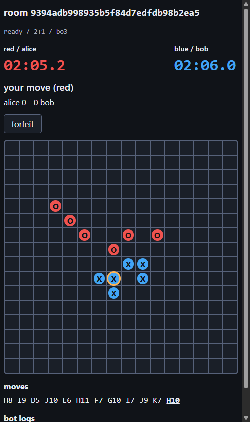

A finished series holds its verdict on the open page after the room retires:

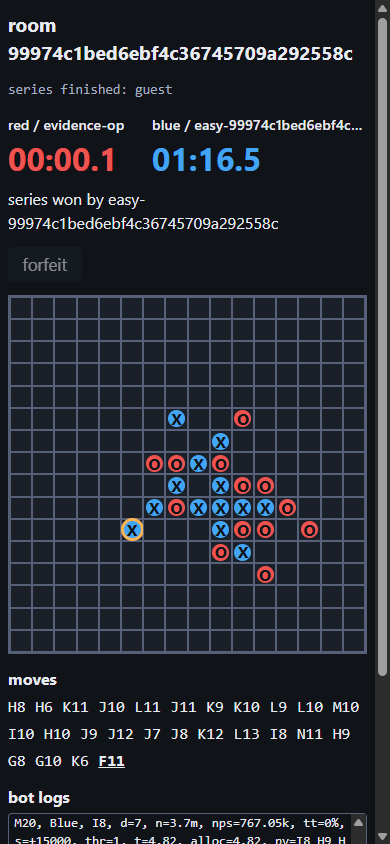

Match history with per-game score lines and move previews:

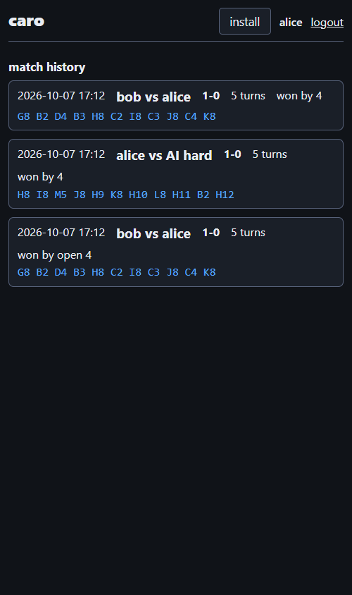

The playback board stepping through a finished bot game, first to last with autoplay:

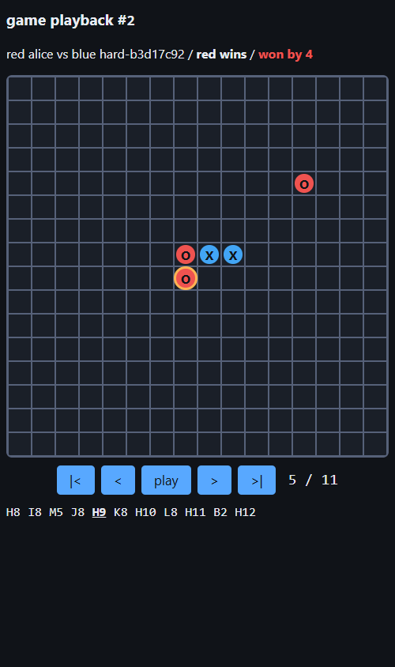

Tournament setup, admin-only: the config-bounded roster, tiers, time control, best-of, start rating and parallelism, with the run-gate close form for undriven runs:

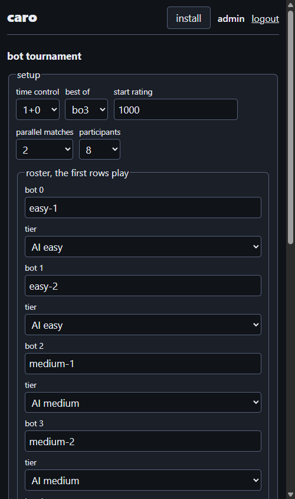

While the run drives, its page carries a live board per ongoing bot series (mini stones in play order, score from red's side, the card links the room's own page), all public including guests:

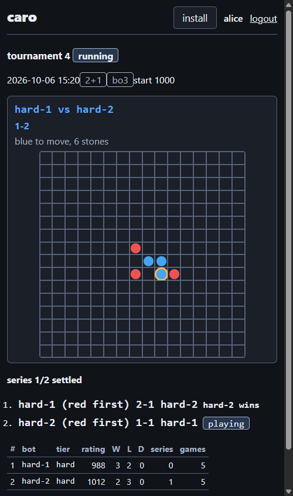

The finished run page with the frozen leaderboard:

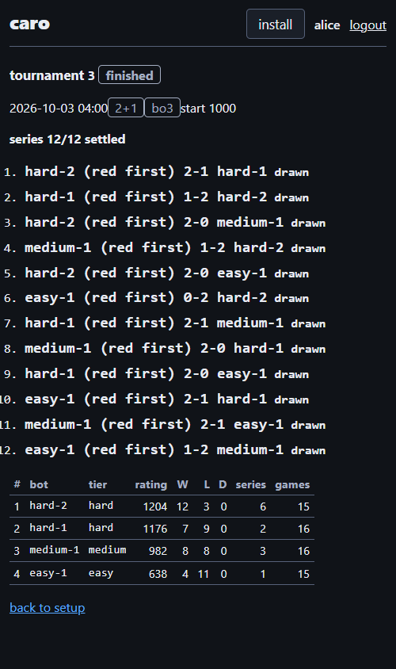

The mobile pass audited every surface at 390x844: long room-id and bot-name tokens wrap or clamp instead of overflowing, controls hit the 44px touch floor under pointer:coarse, the board offers only the spaces the rules allow, a finished series holds its verdict on the open page, and the tournament leaderboard scrolls inside its own wrap.

## grounding

- [first-cause.md](first-cause.md): the founding spec, rules, hardware budget, and match scenarios.
- [docs/plans/first-cause-rebuild.md](docs/plans/first-cause-rebuild.md): milestone plan for the rebuild, updated as milestones land.
- ref/: offline chessprogramming.org and gomocup grounding, browser-sourced.

## build and verify

Requires go 1.27.1+, a C toolchain (gcc or llvm/clang), GNU make, with CGO enabled.

```
make doctor          # toolchain check: go >= 1.27.1, CGO, gcc
make ci              # fmt-check, vet, build, race tests, coverage gates
make mutate-smoke    # rules-core mutation gate (runs in CI on every push)
make mutate-full LABEL=vX PARALLEL=6 CHALLENGE=1  # whole gate, auto-resumes host crashes
make mutate-resume LOG=prior-run.log PARALLEL=8 CHALLENGE=1
make bench           # engine, clock, rules benchmarks with allocs
make fuzz            # rules differential fuzz target
make clocktune       # PID gain sweep for one time control, artifact under playground/clocktune/out/
make diagrams        # render the dark PNG diagrams from the mermaid sources
make logstats          # evidence report over the newest logs/tourny run
make db-checkpoint     # fold every db/*.db write-ahead log into its main file
make serve             # serve on the configured port, db under db/
```

Coverage gates: 95% overall, 100% on internal/rules, internal/engine, and internal/clock. The working tree keeps its artifacts placed: databases under db/, tournament logs under logs/tourny/, nothing database- or log-shaped in the root.

## repository layout

```
cmd/caro          entrypoint (ports, firewall)
cmd/covergate     coverage gate over go cover profiles
cmd/mutate        in-house mutation gate (parallel, resume, challenge audit)
internal/config   single constants hub
internal/rules    board, legality, win detection (M1)
internal/pattern  exhaustive line-pattern tables (M2)
internal/engine   search core, SMP tiers (M3)
internal/vcf      VCF/VCT solvers (M4)
internal/clock    increment-safe time manager, per-TC PID (M5)
internal/server   store, auth, series and rating, write queue, rooms, htmx ui (M6)
internal/tourney  round robin, conductor, tournament store and logs (M7)
playground/       git-tracked R&D ground
docs/             rebuild plan, diagram sources and renders, screenshots
```

## diagrams

Search pipeline, one pass per completed iteration. The soft stop is consulted at iteration heads only, and only completed iterations become the answer.

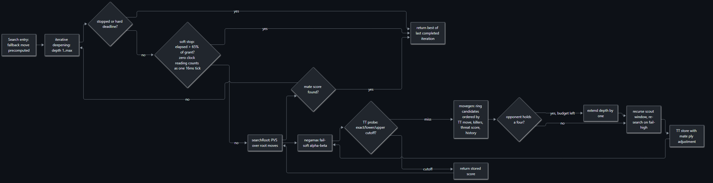

Lazy SMP wraps the same pipeline: one persistent locked-thread worker per core, parked between searches, all sharing one lockless direct-mapped transposition table; a worker's proven immediate win halts its siblings through a shared flag folded into their deadline.

Threat-solver soundness harness. The solvers generate only threat moves (fours for VCF, threes and fours for VCT) from the init-computed pattern tables; a test-only brute-force oracle over the independent naive board cross-checks every claimed win, and that fuzz runs in CI permanently.

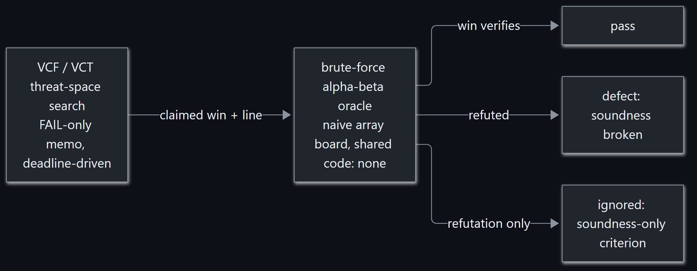

Series state machine inside every room. Host takes red first; the loser of a decisive game takes red next; a draw retains red; quitting books a loss for every remaining game.

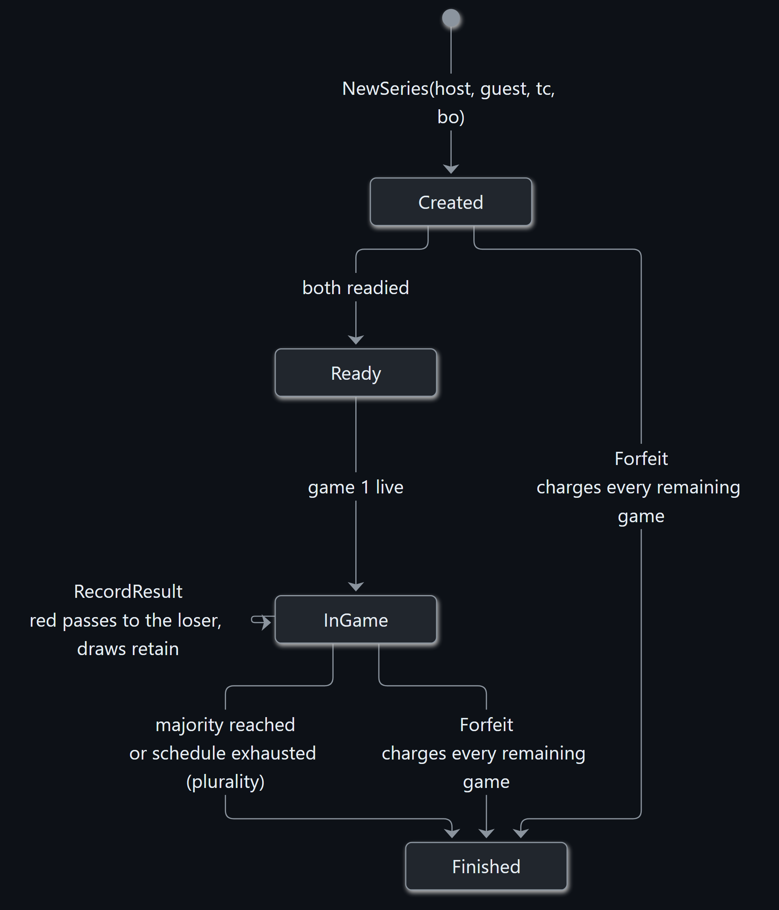

Room data path. Gameplay never blocks on the disk: moves apply in memory, mutations queue to the single SQLite writer, and telemetry fans out to every subscriber.

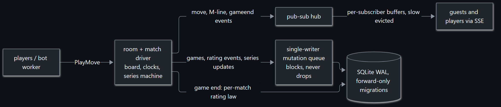

The tournament conductor. Every series rides the same room surface a human match does; the conductor subscribes before the room can retire, reconciles each finished game against the room's authoritative move list, and fails the whole run on any divergence.

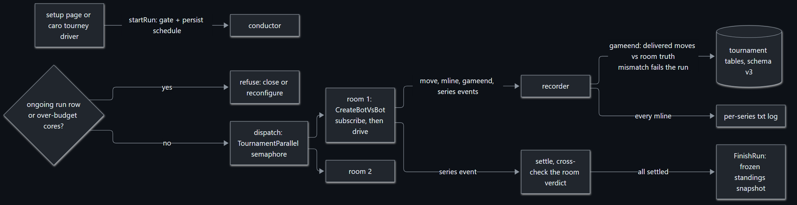

The machine-wide core budget is held by the run gate: one ongoing run at a time, per-run parallelism bounded by the tier cores, and an undriven run (stalled or failed) closed explicitly from its page before another can start. Starting runs and closing them is the seeded admin account's alone; every page, the setup list, the run boards, and the home's live-run banner read public, guest included.

Page surface. The shell and room pages are server-rendered html/template with vendored htmx 4; page routes mount beside the JSON API and win on their patterns, everything else falls to the shell.

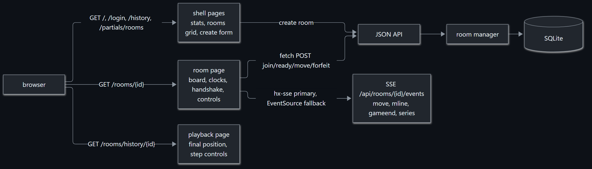

The pure client functions (tap-to-preview selection, the M-line UI filter) ship as byte-pinned twins: the same source is pinned between markers in the served JS and asserted byte-equal by Go tests, so the browser and the test suite cannot drift.

## implemented design

Rules run on bitboards, 4x uint64 per color over 256 cells, with zobrist keys from a splitmix64 stream and an independent naive oracle transcribed from the spec sentence; the differential harnesses swept every 9-cell window per direction in both board regions and the committed fuzz corpus has millions of clean executions. Make and Unmake cost 3.7 ns, win detection on the last move 13.4 ns, zero allocations anywhere in the package.

The pattern tables are computed at process start from the rules package's own win predicate, 4^9 entries per direction in about 52 ms, so the tables cannot drift from the rules; lookups cost 0.26 ns. The threat taxonomy (win-in-1, four, open four, three) is derived mechanically from win-in-1 counts because folk renju patterns do not transfer to exact-5-with-overline-nullified rules.

The engine is fail-soft PVS with iterative deepening, a lockless direct-mapped transposition table with mate-score ply adjustment, killer and history ordering, and a selective forced-four defense extension whose nodes expand only cells whose window interaction reaches the four class (own win-in-1 and the opponent's block cells both qualify, so the restriction preserves node value while collapsing the extension storm); no quiescence, no LMR, no null move, and the hot path allocates nothing (0 B/op searches at 1, 2, and 4 workers). A search that completes no iteration answers with the best-ordered candidate, never the enumeration scan order. Lazy SMP keeps one persistent locked-thread worker per core parked between searches over the shared table, roughly 5 to 6 Mnps at 4 workers. Tiers are resource-only: easy 1 core with no table and no solvers, medium 2 cores with 32 MiB and VCF, hard 4 cores with 128 MiB and VCF plus VCT. The VCF/VCT solvers run in front of the tier's standard search, each pass capped at half of what remains of the move grant plus a node budget: a proof ends the move on the solver's line tagged [VCF] or [VCT] in the M-line with mate-distance scoring, a miss hands the unspent remainder to the untagged search, which the compounding cap keeps at least a quarter of the grant so a miss always leaves a funded search behind, and a grant under SolverMinGrantMs skips the passes whole so a drained clock's move floor funds the search rather than two slices of nothing. Solvers search threat moves only, from the pattern tables, and a test-only brute-force alpha-beta oracle over the naive board verifies every claimed win; that soundness fuzz runs in CI permanently.

The time manager grants per-move budgets as feedforward (spendable remainder over expected moves left plus an increment share) steered by a PID gain set per time control against the planned drain trajectory, with 10+5 provisionally riding the 3+2 gains because the 10+5 tracking objective is structurally flat, clamped so the floor always funds a minimum move: a fully drained 1+0 clock still moves forever and a timeout can never decide a game. Past the expected move count the grant dumps the spendable remainder, so the gains only steer inside the expected window. The soft stop refuses new iterations past 65% of the grant, treating a zero clock reading as one 16 ms Windows tick.

The server persists to embedded SQLite in WAL mode behind forward-only startup migrations and a single-writer mutation queue (writes block, never drop). One game completion is one transaction: the game row, both rating events, and the series finish commit or roll back together, so the zero-sum rating ledger cannot tear. Passwords hash with argon2id at 64 MiB and 2 passes, per-user parameters, timing-flat login-or-create. Every match rates at +30*K and -30*K with K = 10^((R_loser-R_winner)/D) and D = 3000 on an upset or 500+2.5*R_loser clamped otherwise, applied per match on pre-match ratings, and each best-of series (bo3/5/7/11 over 1+0, 2+1, 3+2, 10+5) runs as an explicit state machine: host takes red first, the loser takes red next, a draw retains red, and quitting books a loss for every remaining game. Bot engines are ephemeral per game and owned by one worker goroutine each; a forfeit or shutdown racing a search discards the stale answer instead of closing the engine under it. History score lines count the row's players, not stone colors, so red rotation never misattributes a win. Human-vs-bot matches persist through the same unit: each tier seats a reserved, unloginable AI account, every bot move stores its rendered M-line as a game_stats row inside the completion transaction, W-L-D and level count bot games while ratings stay pvp-only with zero rating events on any bot seat, and history and playback open bot games for the human with the bot seat named <difficulty>-<roomid> (schema v5 games.bot_name). The transport is JSON plus SSE with guest observability, subscribe-before-liveness stream setup, and a drain-then-backstop stop path on SIGINT or SIGTERM. Bot telemetry rides the room-keyed pub-sub hub as zero-alloc M-lines.

The mutation gate is in-house, go/parser and AST rewrites only: parallel workers over isolated module copies with serial confirmation of every survivor, resume that replays prior kills after host failures, an equivalence allowlist whose every entry is challenge-audited by running the suite under the allowlisted mutant, and a self-pruning unused-entry alarm. Current state: 1573/1573 mutants over rules, engine, and clock with 0 survivors and 79 proven allowances.

The UI is server-rendered pages over the same session cookie the API mints: the shell (login-or-create, home with stats and the rooms grid, history with move previews) and the room and playback pages mount beside the JSON transport, page patterns winning over the root catch-all. Dark mode is the primary presentation across every page, defined once as a custom-properties palette whose contrast pairs are machine-checked by playground/darkcontrast. A room page rehydrates the whole board server-side so a mid-game reload misses nothing, then lives off the SSE stream (htmx hx-sse first, a plain EventSource taking over when htmx stops reconnecting) with a one-second detail poll as the safety net and a client-side clock tick between syncs. Coarse pointers get a two-tap flow, select then confirm, with a hover ghost for fine pointers. The bot log line is the raw zero-alloc M-line with ebf, hf and fh1 stripped at the page boundary per the spec. Playback reads one finished game row straight from the store, visible only to its two players, and steps by toggling stone visibility only. The two pure client functions are byte-pinned twins asserted from Go.

Tournaments run bot-versus-bot on the exact room surface human matches use: each pairing meets twice with host and guest seats swapped (2 series, 6 games per meet) so every participant holds each color equally, the bot series alternating red after every game rather than the loser-takes-red rotation of human play. Participants register under unique names (easy-1, easy-2, medium-1, medium-2, hard-1, hard-2 on the default roster) and every log line, verdict, and summary names them. Each run owns a timestamped folder logs/tourny/<timestamp>-<label>/ holding the per-series txt logs (every M-line plus one summary line per finished game) and a summary.txt with the final rating table, series won, and W-L-D per participant. The conductor subscribes before the room can retire and writes every game to the schema v3 tournament tables as one transaction. The per-match rating law runs in the tournament's own space from a configurable start rating, standings derive from the game rows so nothing can drift, and the close writes a frozen snapshot. Every finished game is reconciled against the room's own authoritative move list, so a lost or duplicated event anywhere fails the run instead of corrupting a record; a replay validator and the room's terminal verdict act as second and third nets. One run holds the machine at a time: the core budget check plus the ongoing-run gate keep concurrent starts from oversubscribing the engines. A run interrupted by any termination shape (SIGINT, a killed process, a machine cut) resumes from its own persisted state behind make tourney-resume: the run's label rides its row (schema v7) so the resume reopens the interrupted run's own log folder, settled series stand as evidence and are never replayed, an interrupted series' partial games are scrubbed and the series replayed whole (one series file always holds exactly one series' record), and the summary lands once at the finish; the live drive holds the run behind a claimed heartbeat lease on its row (schema v8), so a resume or a hand close refuses while any drive's claim is fresh and takes over only a stale one, and a zombie drive's late writes fail the store's claim fence instead of interleaving a second record (both arms refuse pre-v8 legacy runs whose folder was never persisted, and both run from the repo root, the log root is cwd-relative); a stalled run nobody wants to continue is abandoned instead through the page's close form or make tourney-close. The first official gates ran clean at 1+0 and 3+2 but on second-unit clocks (see docs/evidence/investigation-2026-10-04.md), so their strength conclusions are void; the corrected-clock full 2+1 gate is the strength evidence of record: 30 series and 71 games settled with an exact rating zero-sum (logs/tourny/20261006-065341-full, db/gates-v020.db), though it predates the solver budget compounding fix and its verdict of three cross-tier inversions with medium-2 topping the table carries that contamination. The corrected-clock smoke pair ran on the fixed wiring and splits by time control: 3+2 holds the ladder exactly (hard-2 first at 1308, zero inversions, logs/tourny/20261006-112631-smoke32) while 1+0 inverts it (both mediums above both hards and easy-2 above hard-1, 489 fallback-candidate moves where the inner search completed no iteration, logs/tourny/20261006-102230-smoke10). The solver floor gate closed the fast-clock starvation: grants under SolverMinGrantMs skip the passes whole and fund the standard search, and the 1+0 rerun on that wiring shows zero fallback-candidate moves where the first run showed 489, hard-2 topping the table at 1296, and a hard-versus-medium game record of an even 7-7, parity rather than dominance at the fastest control, while hard-1 alone still ranks under both mediums (logs/tourny/20261006-164544-smoke10). The full 2+1 rerun on the same wiring is the strength evidence of record and the ladder holds with zero cross-tier inversions (hard-2 1199, hard-1 1169, both mediums 1138, easies below, logs/tourny/20261006-174554-full), hard-1 beating hard-2 in their mutual meet, which reads the 1+0 hard-1 gap as fast-clock variance and satisfies the spec's inversion check on corrected clocks.

## status

- v0.1 (M0..M4): rules core at 100% with zero surviving mutants, init-computed pattern tables, zero-alloc PVS+ID+TT search, lazy SMP tiers, VCF/VCT solvers with a brute-force soundness oracle.
- v0.2 (M5): increment-safe time manager, one tuned PID gain set per time control, soft-stop wiring with the Windows clock-quantum guard, mutation gate green at 1573/1573 over rules+engine+clock with 79 challenge-audited equivalence allowances.
- v0.3 (M6a part 1): server foundation, SQLite WAL store with forward-only self-migration, per-match rating law, series state machine (loser-takes-red, forfeit-as-losses), single-writer mutation queue, room stats pub-sub hub, argon2id login-or-create, zero-alloc M-line emitter.
- v0.4 (M6a part 2): full server surface. Rooms with live match driver (human and bot play, per-game engine ephemerality, clock-law budgets, M-line telemetry), JSON + SSE transport with guest observability, serve and migrate commands with drain-then-backstop shutdown, game completion as one transaction per unit (game row, rating pair, series finish), per-player history score lines, schema v2 player indexes, property fuzz for the series and rating laws, blind adversarial pair run with all 10 confirmed findings fixed.
- v0.5 (M6b part 1): htmx 4 shell. Login-or-create page, home with name, rating, W-L-D, level and the live rooms grid (SSE-free partial polling), create-room form driven by the config hub (time controls, best-of lengths, bot tiers), logout, history list with per-game score lines, turn counts, move previews and playback links.
- v0.6 (M6b part 2): room and playback pages over the same rooms and store. Server-rendered 256-cell board with mid-stream reload rehydration, hx-sse push with an EventSource fallback, join button for open human seats, ready and forfeit handshake, tap-to-preview ghost stones on coarse pointers, large tabular clocks ticking client-side between syncs, move history, bot log rendering the spec M-line with ebf, hf and fh1 filtered out, playback board with first, prev, next, last and autoplay stepping. Browser-verified against Implications 1.1, 1.3, 1.4 and 1.5 with isolated contexts per user.
- v0.7 (M7 part 1): tournament core and conductor. Bot-vs-bot rooms on the same surface, twice-pair round robin with the per-match rating law in a separate tournament space, schema v3 tournament tables, per-series txt logs, leaderboard with a frozen close snapshot, headless smoke and full drivers behind caro tourney and make targets, semaphore-bounded parallelism, and a machine-wide run gate. Root-fixed a real concurrency defect: deferred read-then-write SQLite transactions upgrade into BUSY_SNAPSHOT under parallel writers, closed by immediate transactions in the DSN with a 30-parallel regression test.
- v0.8 (M7 part 2): tournament UI and official gates. Setup page (config-bounded roster, tiers, time control, best-of, start rating, parallelism), run page with a live leaderboard on partial polling, past runs, stalled-run close. Official smoke gates green at 1+0 and 3+2 (30 series each, zero-sum exact), the full 2+1 UI tournament settled 30 series and 69 games with the tier ladder holding and no cross-tier strength inversion. Blind adversarial pair: 3 confirmed findings (per-run core budget, an even-length missed-move-prefix hole in the replay net, missing series-seat validation), all fixed red-green.
- v0.9 (M8): release candidate. Screenshots, completed diagram set, bot seat naming unified, fuzz corpora committed. make ci 96.0% overall, core 100%.
- v0.10 (MVP reopen, instrumentation): one trace line per finished game in every series log, the conductor dispatch-after-cancel fix, dark PNG diagrams behind make diagrams, and the series-log evidence analyzer behind make logstats.
- v0.11 (player-facing record, dark mode): per-move stat persistence for player-facing matches (schema v4 game_stats, human-vs-bot series recorded in full with ratings unmoved, reserved unloginable AI accounts seating the bot, history and playback opening bot games) and dark mode as the primary web presentation (one custom-properties palette hub, WCAG-checked by playground/darkcontrast).
- v0.12 (gate-log investigation closed): the formal investigation of the gate logs (docs/evidence/investigation-2026-10-04.md) root-caused the anomalies and closed them: minute-unit time controls (the gates had run on seconds), the selective forced-4 restriction plus best-ordered fallback replacing the extension storm and the A1-scan d=0 drift, tier solver wiring behind the [VCF]/[VCT] tags with medium 32 MiB and hard 128 MiB tables, swap-host-guest meets with named participants under per-run logs/tourny folders with a summary table, and <difficulty>-<roomid> bot naming (schema v5).
- v0.13 (tournament UI close-out): admin-gated tournament creation with the seeded demo credential, public run pages carrying a live board per ongoing bot series, the home live-run banner, the run-gate close form covering failed drives beside stalled ones, horizontal dark diagrams, and the full app-flow screenshot set recut as 390px dark mobile captures. Bot-vs-bot seats carry their roster identities through every surface (a same-tier pairing renders its two instances, never one stamp twice), and the coverage badges split into global and core, colored from the config hub's own thresholds.
- v0.14 (mutation pipeline hardened, full gate): after two host crashes (root cause: per-mutant compiles had grown the shared Go build cache to 28 GB) every gate builds in a run-private cache, a post-run residue check fails on leaked temp copies, make mutate-full drives host crashes to a definitive verdict by auto-resuming, and CI runs a rules-core smoke gate on every push. The full gate closed at 1596/1596 run, 1521 killed, 0 survived, 75 allowed, every allowance challenge-audited; the CI race suite caught and closed the CloseStalled drive-lag window and the coverage badges weathered their first three publisher defects.
- v0.15 (run recovery): schema v7 persists each run's log label on its row, an interrupted series scrubs to its created state and replays whole (one series file holds exactly one series' record), the conductor resumes an interrupted run (settled series never replay, the summary lands once), and caro tourney resume/close drive both arms headlessly. The adversarial pair on the wave hardened it: schema v8's drive lease (a claimed, beaten, staleness-expiring fence on the run row) keeps a second drive, a resume, or a close away from a live run while a dead process's claim frees itself, the pre-v7 label shape closes as legacy instead of splitting evidence, the close-out writes the summary before the row flips so no crash window can strand a finished run without it, and the suite timeouts sit sized for wall-clock bound runs on shared runners.
- v0.16 (corrected-clock full gate): the full 2+1 gate rerun on corrected clocks settled 30 series and 71 games with an exact zero-sum and a clean parse ledger (4220 attributed M-lines, no unfinished series, no fold mismatches). Its verdict is honest inversions, medium-2 first at 10/10 series above both hards, so tier strength does not yet match the difficulty specs and that calibration stays open. The evidence landed under db/ with make db-checkpoint folding every killed process's orphaned WAL into its main file.
- v0.17 (corrected-clock smoke pair): both smokes ran on the fixed solver wiring with exact zero-sums and clean parse ledgers. 3+2 holds the tier ladder exactly (hard-2 first at 1308, zero inversions); 1+0 inverts it (both mediums above both hards, 489 fallback-candidate lines). The full 2+1 gate predates the fix, so its evidence keeps the pre-fix caveat.
- v0.18 (fast-clock calibration, round 1): the floor-grant gate (db2eb1c, adversarially hardened: pinned constant, quantum-clearing at-gate slice, boundary and grant-less deadline tests) reran the 1+0 smoke with zero starved moves against the first run's 489. hard-2 first at 1296 and the cross-tier hard-versus-medium record even at 7-7, but hard-1 still under both mediums, so the within-tier gap and the parity question stay open.
- v0.19 (corrected-clock full gate, fixed wiring): the 2+1 full rerun settled 30 series and 66 games with an exact zero-sum, a clean parse ledger, and zero cross-tier inversions: hard-2 1199, hard-1 1169, medium-1 and medium-2 at 1138, easies below. The spec's inversion check passes on corrected clocks, and hard-1 taking its mutual meet from hard-2 reads the 1+0 hard-1 gap as fast-clock variance. The remaining pre-v0.20 work is the inversion research program (capability perturbation matrix, self-play noise floor, red-first measurement) and the engine mutation re-gate.
- v0.20 (final issueless finished MVP): the inversion research program closed with three arena phases (playground/arena, capability-perturbed engines over the shipped clock law): the self-play noise floor is nil between identical engines at 1+0 (40 of 40 red wins, so first-move advantage fully decides the fastest control), the capability matrix shows solver passes add nothing measurable at 1+0 in any configuration (hard vs its no-solver ablation 6-6, medium plus VCT losing 3-8 to plain medium, easy granted VCF dead even with plain easy) while thread count survives as the only separation (hard beats medium 8-4, medium beats both easies), and the ladder measured where resolution exists holds exactly on 2+1 and 3+2. The engine mutation re-gate closed at 1596/1596 run, 1521 killed, 0 survived, 75 challenge-audited allowances. No shipped tier constant moved: 1+0 sits below the capability ladder's resolution, and the difficulty specs stand as measured on the slower controls.
- v0.21 (10+5 time control): the 4th time control ships with the tuning seam (NewGameClockWithGains drives benches over the real GameClock) and the zero-fill trap closer (every ClockPID row must be authored non-zero, the len-parity check alone passes a zero row). The clocktune sweep found the 10+5 tracking objective structurally flat at increment controls (the half-increment surplus banks per move, ranking is monotone in Kp, and past the expected move count the grant dumps the spendable remainder), so 10+5 rides the 3+2 gains provisionally on game evidence rather than a corner cell on a flat objective. The adversarial pair closed 10 findings across clocktune gating and axis guards, config and README honesty, the clock floor assertion, the smoke105 pairing pin, the series TC display, and the mutation-allowance re-key after the seam moved clock.go. Evidence: the 20-game hard,hard arena floor at 10+5 settled 18 red-first wins, 2 draws at the 256-move cap, and 0 blue-first wins, so the first mover decides identical engines at 10+5 exactly as at 1+0 and this band is the reference for the v0.22 TT round, and the smoke105 tournament smoke settled both red-first series 2-1 (hard-1 1001, hard-2 999, logs/tourny/20261007-164757-smoke105, db/smoke105-v021.db). The clock mutation label re-gated at 67/67 with challenge-audited allowances, a playground-modules build step closes the nested-module blind spot in CI, and the GPU offload assessment closed on measured floors as not beneficial (playground/gpuoffload).
- v0.22 (TT round skipped by decision): the preregistered arena TT round was terminated before comparison data existed, 1 of 96 games run (a pair-1 floor game), with the difficulty specs assumed as a working hypothesis: the shipped ladder stands (easy 1 core no table, medium 2 cores 32 MiB, hard 4 cores 128 MiB), the re-scale does not ship, and no tier constant moved. The skip, the banked bands, and the reopen trigger (a cross-tier inversion or a table-wrap pathology in any later gate) are recorded in playground/arena/out/v022-phaseA-preregistration.md, and the roadmap block carries the deferral.

## roadmap v0.21 to v0.30

The post-MVP waves, committed after the v0.20 gate closes. Every tier change rides the research law the inversion program established: capability perturbation in the arena, self-play noise floors, and a ladder re-gate before any strength-bearing constant ships.

Master tier: a fourth difficulty above hard at 8 threads, a 2 GiB table, full VCF plus VCT, an opening book over the first 16 plies, and pondering on the opponent's time. The book needs a computable definition of optimal before it can claim one: entries backed by solver proofs or deep self-play agreement, built offline in playground with the artifact committed, never a hand-curated list. The arena's phase A measurement (40 of 40 red wins between identical 1+0 engines) is the case for the book: at fast clocks the opening decides the game. Pondering predicts the opponent's reply from the PV, searches that continuation while the opponent thinks, adopts the tree on a hit and re-searches from scratch on a miss, with the shared table keeping even misses warm; book replies land instantly, so they buy the widest ponder windows. Ponder budgets are machine time under an external stop, never the seat's own clock.

Tier resource re-scale, deferred 2026-10-07 by decision: the preregistered TT round was terminated before comparison data existed (1 of 96 games run, a pair-1 floor game), the shipped sizes stand as a working hypothesis, and no tier constant moved. The skip and its reopen trigger (a cross-tier inversion or a table-wrap pathology in any later gate) are recorded in playground/arena/out/v022-phaseA-preregistration.md. The standing measurement that would feed a reopened round: at 3+2 the median hard move wraps the 128 MiB table 1.5x, the p95 move 4x, with the hit rate flat at 13-16% across every oversubscription ratio. Master still ships at 8 threads and a 2 GiB table as its own literal, independent of the deferred ladder resize.

Concurrency and memory: the machine-wide core budget (MachineCores in the config hub, sized per machine, a budget decision rather than a hardware reading) caps live searches, and pondering makes master hold its threads through the opponent's turn, so a master-versus-master game wants twice master's thread count running continuously. The conductor's admission control becomes seat-aware (rounds holding a master run at reduced parallelism, a global thread budget across rooms and ponder lanes), and the tournament's worst-case table footprint with master seated (2x2 GiB plus the tiers below, about 4.4 GiB) stays inside the RAM/4 machine cap, which the same admission controller must hold.

UI/UX overhaul: the mobile-first dark surface gets a full design pass once the engine work above it is final, so the v0.20 screenshots and flows are re-captured against finished behavior, not a moving target.
